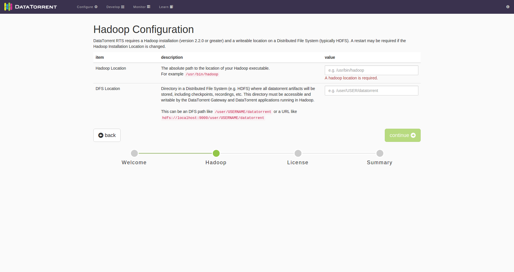
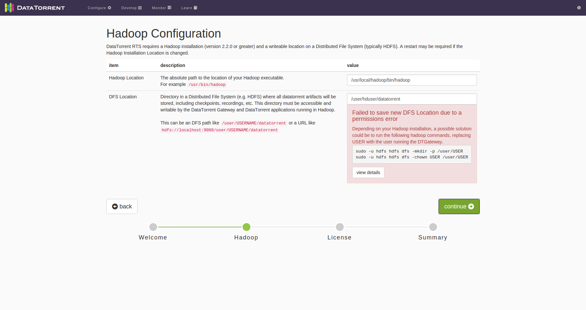
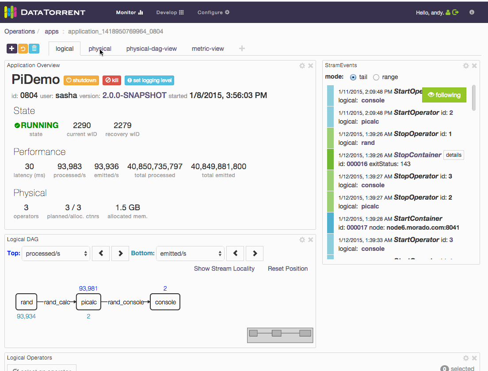
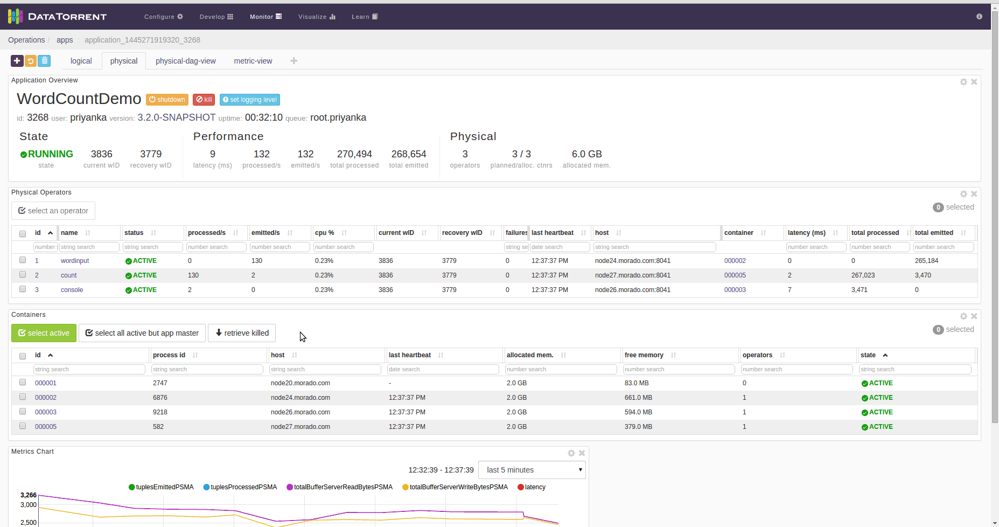

#Troubleshooting / FAQs / HOWTO


##Download
  

1.  Where can I get DataTorrent RTS software OR package for Community /
    Enterprise edition?

    DataTorrent products are available for download at following location:
    
    [https://www.datatorrent.com/download/](https://www.datatorrent.com/download)
    
    DataTorrent RTS has 2 platform editions for download:
    
    -   Community Edition:
    
        It is a packaged version of Apache Apex and enables developers to
        quickly develop their big data streaming and batch projects.
        
        You can get download link after filling information at the below
        location:
        
        [http://web.datatorrent.com/DataTorrent-RTS-Community-Edition-Download.html](http://web.datatorrent.com/DataTorrent-RTS-Community-Edition-Download.html)
  
    
    -   Enterprise Edition:
    
        This edition is designed for enterprise production deployment and
        includes data analytics, GUI-based app assembly and data visualization.
        
        You can get download link after filling information at the below
        location:
        
        [http://web.datatorrent.com/DataTorrent-RTS-Enteprise-Edition-Download.html](http://web.datatorrent.com/DataTorrent-RTS-Enteprise-Edition-Download.html)


1.  What are DataTorrent RTS package contents of Community / Enterprise
    edition ?

    Package contents for Community edition:
    
    -   Apache Apex (incubating)
    -   DataTorrent Demo Applications
    -   DataTorrent dtManage
    -   DataTorrent dtIngest
    
    Package contents for Enterprise edition:
    
    -   Apache Apex (incubating)
    -   DataTorrent Demo Applications
    -   DataTorrent Operator Library
    -   DataTorrent Enterprise Security
    -   DataTorrent dtManage
    -   DataTorrent dtIngest
    -   DataTorrent dtAssemble
    -   DataTorrent dtDashboard

1.  Where can I find the Standard edition installer?

    You can use the download link for Enterprise edition as the package is
    same for both editions. But, you have to apply the license to enable the
    Standard edition. You can upgrade the license by using dtManage.
    Licenses are available in 2 types : evaluation and production.

1.  What is the difference between DataTorrent RTS editions?

    Please refer to [DataTorrent RTS editions
    overview](https://www.datatorrent.com/product/edition-overview/)

1.  How do I confirm the package downloaded correctly?

    You can verify the downloaded DataTorrent RTS package by comparing with
    MD5 sum. The command to get md5 sum of downloaded package:
    
    ```# md5sum <DT_RTS_Package>```
    
    Compare the result with \<TODO\> Not available on website
    ([WEB-243](https://datatorrent.atlassian.net/browse/WEB-243))

1.  How do I download the DataTorrent RTS package using CLI?

    Use following curl command to download DataTorrent RTS package:
    
    ```# curl -LSO <DT_RTS_download_link>```
    
    We recommend to use ‘curl’ instead of ‘wget’ to get the package
    downloaded without corruption

1.  What are the prerequisites of DataTorrent RTS ?

    DataTorrent RTS platform has following Hadoop cluster
    requirements:
    
    -   Operating system supported by Hadoop distribution
    -   Hadoop (2.2 or above) cluster with HDFS, YARN configured. Make sure
        hadoop executable available in PATH variable
    -   Java 7 or 8 as supported by Hadoop distribution
    -   Minimum of 8G RAM available on the Hadoop cluster
    -   Permissions to create HDFS directory for DataTorrent user
    -   Google Chrome, Firefox, or Safari to access dtManage (DataTorrent UI
        console)

1.  Where can I start from after downloading DataTorrent RTS?

  -   After successful download of DataTorrent RTS, make sure all
      prerequisites are satisfied.
  -   You will need to install DataTorrent RTS on hadoop cluster using the
      downloaded installer. For more details, you can refer to
      [installation
      guide](https://www.google.com/url?q=https://www.datatorrent.com/docs/README.html&sa=D&usg=AFQjCNEiGC32cS9VRtxcG2H0KuNbn6Ohag)
  -   Once installation done, you can configure and monitor applications
      by using dtManage(DataTorrent console)

1.  What are the supported Hadoop distribution by DataTorrent RTS?

  DataTorrent RTS is a Hadoop 2.x native application and is fully
  integrated with YARN and HDFS providing tight integration with any
  Apache Hadoop 2.x based distribution.

    <table>
    <col width="50%" />
    <col width="50%" />
    <tbody>
    <tr class="odd">
    <td align="left"><p>Hadoop Distribution</p></td>
    <td align="left"><p>Supported Version</p></td>
    </tr>
    <tr class="even">
    <td align="left"><p>Amazon EMR</p></td>
    <td align="left"><p>Hadoop 2.4 and higher</p></td>
    </tr>
    <tr class="odd">
    <td align="left"><p>Apache Hadoop</p></td>
    <td align="left"><p>Hadoop 2.2 and higher</p></td>
    </tr>
    <tr class="even">
    <td align="left"><p>Cloudera</p></td>
    <td align="left"><p>CDH 5.0 and higher</p></td>
    </tr>
    <tr class="odd">
    <td align="left"><p>Hortonworks</p></td>
    <td align="left"><p>HDP 2.0 and higher</p></td>
    </tr>
    <tr class="even">
    <td align="left"><p>MapR</p></td>
    <td align="left"><p>4.0 and higher</p></td>
    </tr>
    <tr class="odd">
    <td align="left"><p>Microsoft</p></td>
    <td align="left"><p>HDInsight</p></td>
    </tr>
    <tr class="even">
    <td align="left"><p>Pivotal</p></td>
    <td align="left"><p>2.1 and higher</p></td>
    </tr>
    </tbody>
    </table>

1.  What is Datatorrent Sandbox?

    DataTorrent Sandbox is a ready to use appliance provides tutorials, demo
    applications and dtManage (Web console) to let new user get started
    quickly with DataTorrent RTS. It is fully functional single node Hadoop
    cluster running in a virtual machine. It is freely available as a
    VirtualBox VM.

1.  Where do I get sandbox download link?

    You can get download link after filling information at the below location:
    
    [http://web.datatorrent.com/DataTorrent-RTS-Sandbox-Edition-Download.html](http://web.datatorrent.com/DataTorrent-RTS-Sandbox-Edition-Download.html)

1.  What are the system requirements for sandbox deployment?

    The DataTorrent RTS Sandbox is a complete, stand-alone, instance of the
    Enterprise Edition as a single-node Hadoop cluster on your local
    machine. Following are prerequisites for DataTorrent RTS:
    
    -   Oracle VirtualBox 4.3 or later; Oracle VirtualBox is
        available[ ](https://www.virtualbox.org/)[here](https://www.virtualbox.org/)
    -   Memory size should be greater than 6 GB
    -   VT-x/AMD-V hardware acceleration (Hardware Virtualization) should be
        enabled in your machine. You can verify this in BIOS settings

1.  What are the DataTorrent RTS package content details in sandbox?

    -   Ubuntu+Apache Hadoop 2.2
    -   Apache Apex (incubating)
    -   Apache Apex-Malhar (incubating) Operator Library
    -   DataTorrent Demo Applications
    -   DataTorrent Operator Library
    -   DataTorrent Enterprise Security
    -   DataTorrent dtManage
    -   DataTorrent dtIngest
    -   DataTorrent dtAssemble
    -   DataTorrent dtDashboard

1.  What is expected time for sandbox ova?

    DataTorrent sandbox’s size is more than 1.5 GB so download time depends
    on the network bandwidth availability.  

1.  Where do I get dtingest app?

    You can get download link after filling information at the below location:

    [http://web.datatorrent.com/DataTorrent-dtIngest-Download.html](http://web.datatorrent.com/DataTorrent-dtIngest-Download.html)

1.  What are the dtingest package contents?

    dtIngest package comprises of DataTorrent RTS bits. The contents are same as DataTorrent RTS package.

1.  What are the prerequisites of dtIngest?

    DataTorrent RTS 3.x and above. Please refer [dtIngest tutorial](http://docs.datatorrent.com/dtingest/) for more details

1.  Where can I start from after downloading dtingest?

    -   dtIngest package is a complete set of DataTorrent RTS platform,
        hence no separate RTS package is required to download.
    -   Make sure all prerequisites are satisfied before dtIngest
        installation.
    -   You need to install DataTorrent RTS platform on hadoop cluster using
        the downloaded installer. Please refer to DT RTS [installation
        guide](https://www.datatorrent.com/docs/README.html)
    -   DT RTS serves dtIngest as an application. So after DT RTS
        installation and configuration, you can configure and launch the
        ingestion application from dtManage (DataTorrent console). Please
        refer to [dtIngest tutorial](http://docs.datatorrent.com/dtingest/) for
        more details.

1.  How do I get specific DT version ?

    You can find archive list of various DT RTS versions at the end of the
    page on the download link forwarded over mail by DataTorrent.

1.  Where can I make request for new license?

    Please follow the instructions mentioned at [License Upgrade](https://www.datatorrent.com/license-upgrade/)

1.  Where do I find documentation links?

    Please refer to online documentation:  [DataTorrent Documentation](http://docs.datatorrent.com/)

1.  Where can I get Apache Apex related information?

    You can refer Apex page for more details: [Apache Apex](http://apex.apache.org)

1.  Do you need help?

    You can contact us at[ ](https://www.datatorrent.com/contact&)[https://www.datatorrent.com/contact](https://www.datatorrent.com/contact)

# Installation

  There are multiple installations available e.g. Sandbox Edition,
  Community Edition, Enterprise Edition, dtIngest. Supported operating
  systems are which support Hadoop platform (tested on CentOS 6.x and
  Ubuntu 12.04).
  
  Following document focuses mainly on Enterprise Edition on Ubuntu 12.04.

##Prerequisites:

1. Minimum hardware requirements, what happens if certain minimum configuration requirement has not been met?

    a.  What happens if minimum RAM requirement is not met?
    
        Symptoms & errors:
        Troubleshooting:

1. Minimum software requirements, what happens if certain minimum configuration requirement has not been met?

    a.  What happens if java is not installed?

        *Symptoms & errors*: “Error: java executable not found. Please ensure java
          or hadoop are installed and available in PATH environment variable
          before proceeding with this installation.”

        *Troubleshooting*: Install java (6 or 7) from package manager of Linux Distribution and try running installer again.

    b.  What happens if Hadoop is not installed?

          *Symptoms & errors*: Installation will be successful, however Hadoop
          Configuration page in UI (e.g. http://localhost:9090) will expect hadoop
          binary (/usr/bin/hadoop) & DFS location.

    

      *Troubleshooting*: Install Hadoop \> 2.2.0 and set these configuration parameters.

   c.  How do I check if Hadoop is installed and running correctly?

        $ hadoop version 
                Hadoop 2.4.0
                Subversion [http://svn.apache.org/repos/asf/hadoop/common](http://svn.apache.org/repos/asf/hadoop/common) -r
                1583262
                Compiled by jenkins on 2014-03-31T08:29Z
                Compiled with protoc 2.5.0
                From source with checksum 375b2832a6641759c6eaf6e3e998147
                This command was run using
                /usr/local/hadoop/share/hadoop/common/hadoop-common-2.4.0.jar

          $ jps
      
          10211 NameNode
          10772 ResourceManager
          10427 DataNode
          14691 Jps
          10995 NodeManager

###Installation:


1.  What happens if the downloaded file is corrupted?

  **Symptoms & errors**: MD5 checksum mismatch error should be seen on
    console: “Verifying archive integrity...Error in MD5 checksums: \<MD5
    checksum\> is different from \<MD5 checksum\>”.
    
    **Troubleshooting**: Downloaded installer could be corrupt, please download
    the installer binary again and try installing.

1.  Why do I see following permissions errors?

    **Symptoms & errors**: Following error message will be seen on screen
    
    
    
    **Troubleshooting**: There are different possibilities here:
    
    - Specified directory does not exist on DFS
    - Specified directory does not have permissions to user with which DataTorrent is installed or dtGateway is running.

     ```$ hadoop dfs -ls /user/<USER>/datatorrent 
        $ hadoop dfs -mkdir /user/<USER>/datatorrent  
        $ hadoop dfs -chown <USER> /user/<USER>/datatorrent```

#Upgrade

1.  License agent behavior on upgrade from 2.0 to 3.0 (Some one had faced issue, his application was getting launched continuously because of license agent)


#Configuration
 
#Programming

  1.  Scope of hadoop dependencies (use provided scope, don’t bundle any hadoop jar)
  2.  I am getting this message in STRAM logs. Is anything wrong in my
        code?

      ``` 2015-10-09 04:31:06,749 INFO
      com.datatorrent.stram.StreamingContainerManager: Heartbeat for unknown
      operator 3 (container container\_1443694550865\_0150\_01\_000007) ```

#Debugging


1.  How to remote debug gateway service?

    Update hadoop OPTS variable by running,

    ```export HADOOP_OPTS="-agentlib:jdwp=transport=dt_socket,server=y,suspend=y,address=5432 $HADOOP_OPTS``

1.  How to setup DEBUG level while running an application

Solution: Add the property :

            <property\>
             <name>dt.application.<APP-NAME>.attr.DEBUG</name>
             <value>true</value> 
            </property>

1.  My gateway is throwing following exception. How should I solve it.

          ERROR YARN Resource Manager has problem: java.net.ConnectException: Call
          From myexample.com/192.168.3.21 to 0.0.0.0:8032 failed on connection
          exception: java.net.ConnectException: Connection refused; For more
          details
          see:[http://wiki.apache.org/hadoop/ConnectionRefused](http://wiki.apache.org/hadoop/ConnectionRefused) at
          sun.reflect.GeneratedConstructorAccessor27.newInstance(Unknown Source)
          at
          sun.reflect.DelegatingConstructorAccessorImpl.newInstance(DelegatingConstructorAccessorImpl.java:45)
          at

Check if the host where gateway is running has yarn-site.xml file. You
need to have all hadoop configuration files accessible to dtgateway for
it to run successfully.

# How to set custom log4j properties for an app package

# Log analysis

### How to check stram logs

  You can get stram logs from yarn logs or from DT Console.  
  1. use command ```yarn logs -applicationId <applicationId>```, first
  container logs  are stram logs.  
   2. On dt console, select first container from the Containers List
  widget (default location of this widget is in the “physical” dashboard).
  The first container is numbered 000001. Then click the logs dropdown and
  select the log you want to look at.  

### How to check application logs

  On dt console, select a container from the Containers List widget
  (default location of this widget is in the “physical” dashboard). Then
  click the logs dropdown and select the log you want to look at.
  
  

### How to check killed operator’s state

  1. On dt console, click on “retrieve killed” button of container List.
  Containers List widget’s default location is on the “physical”
  dashboard. Then select the appropriate container of killed operator and
  check the state.
  
    

1. How to search for particular any application or container?

  In applications or containers table there is search text box. You can
  type in application name or container number to locate particular
  application or container.

1. Difference between stdout vs stderr vs dt.log files

2. I am unable to see logs what should I do?  
    - Check license?

3.How do I search within logs?
    Once you navigate to logs page,  
    1. Download log file to search using your preferred editor  
    2. use “grep” option and provide the search range “within specified
    range” or “over entire log”

# Application Launch

1.  Connection Refused Exception

2.  ClassNotFound Exception

3. Application goes from accepted state to Finished(FAILED) state

  Check if your application name conflicts with any of the already running
  applications in your cluster. Apex do not allow two application with
  same names run simultaneously.  
  Your STRAM logs will have following error:  
  “Forced shutdown due to Application master failed due to application
  \<appId\> with duplicate application name \<appName\> by the same user
  \<user name\> is already started.”  

1. ConstraintViolationException while application launch

  Check if all @NotNull properties of application are set. Apex operator
  properties are meant to configure parameter to operators. Some of the
  properties are must have, marked as @NotNull, to use an operator. If you
  don’t set any of such @NotNull properties application launch will fail
  and stram will throw ConstraintViolationException.    

1. Launching apa vs jar

2. DAG validation failed

3. Multiple gateways running simultaneously, app not launched.

4. HDFS in safe mode

#  Application State

1. Application stays in accepted state

2. Some containers do not get resources (specially in case of repartition)

3. Small memory set to operator causes operator kill continuously.

4. Why is the number of events same/different at input and output port of each operator?

#  Events

### How to check container failures

In StramEvents list (default location of this widget is in the “logical”
dashboard), look for event “StopContainer”. Click on “details” button in
front of event to get details of container failure.

### How to debug

### How to search within events

You can search events in specified time range. Select “range” mode in
StramEvents widget. Then select from and to timestamp and hit the search
button.

### tail vs range mode

tail mode allows you to see events as they come in while range mode
allows you to search for events by time range.

### What is “following” button in events pane

When we enable “following” button the stram events list will
automatically scroll to bottom when new events come in.

# Stop an application

  1.  Shutdown vs kill option
  2.  Why shutdown doesn’t work? (if some containers are not running)
  3.  Can I kill multiple applications at same time?
  4.  Killing containers vs killing application
  5.  Stram failures (during define partitions)
  6.  Thread local + partition parallel configuration
  7.  What to do when downstream operators are slow than the input
      operators.
  8.  I am seeing high latency, what to do?
  9.  appConf in ADT (inside apa file) vs conf option in dtcli
  10. Application keeps restarting (has happened once due to license agent
      during upgrade)
  11. Operator getting killed after every 60 secs (Timeout issue)
  12. How to change commit frequency
  13. Difference between exactly once, at least once and at most once
  14. Thread local vs container local vs node local
  15. Setting operator memory
  
    a.  Bufferserver memory

    b.  Stram memory
    
  
  1.  Cluster nodes not able to access edge node where Gateway is running
  2.  Developers not sure when to process incoming tuples in end window or
      when to do it in process function of operator
  3.  How partitioning works
  
    a.  How the data is partitioned between different partitions.

    b.  How to use stream-codec
    
    c.  Data on which ports is partitioned? By default default partitioner
        partitions data on first port.
        
    d.  How to enable stream-codec on multiple ports. (Join operator?? where
        both input-ports needs to receive same set of keys).
        
  1.  pom dependency management, exclusions etc. eg: Malhar library and
      contrib, Hive (includes hadoop dependencies, we need to explicitly
      exclude), Jersey(we work only with 1.9 version) etc
  2.  All non-transient members of the operator object need to be
      serializable. All members that are not serializable cannot be saved
      during checkpoint and must be declared transient (e.g. connection
      objects). This is such a common problem that we need to dedicate a
      section to it.
  3.  Exactly once processing mode. Commit operation is supposed to be
      done at endWindow. This is only best-effort exactly once and not
      100% guaranteed exactly once because operators may go down after
      endWindow and before checkpointing finishes.
  4.  How to check checkpoint size. (large checkpoint size cause
      instability in the DAG).
  5.  How to add custom metrics and metric aggregator.
  6.  Example of how to implement dynamic partitioning.
