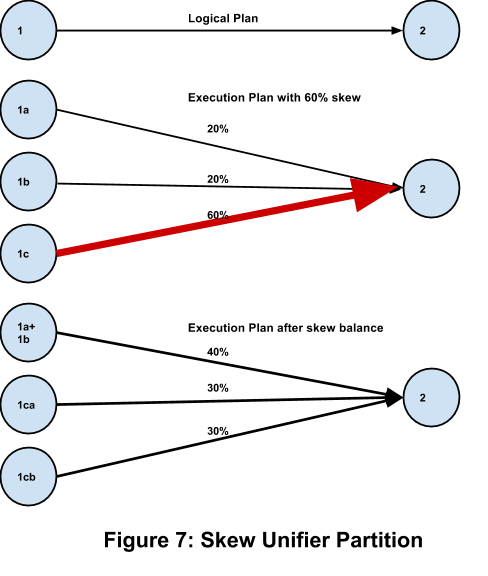
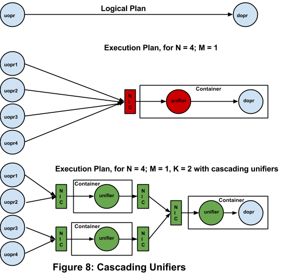

Application Developer Guide
===========================

Real-time big data processing is not only important but has become
critical for businesses which depend on accurate and timely analysis of
their business data. A few businesses have yielded to very expensive
solutions like building an in-house, real-time analytics infrastructure
supported by an internal development team, or buying expensive
proprietary software. A large number of businesses are dealing with the
requirement just by trying to make Hadoop do their batch jobs in smaller
iterations. Over the last few years, Hadoop has become ubiquitous in the
big data processing space, replacing expensive proprietary hardware and
software solutions for massive data processing with very cost-effective,
fault-tolerant, open-sourced, and commodity-hardware-based solutions.
While Hadoop has been a game changer for companies, it is primarily a
batch-oriented system, and does not yet have a viable option for
real-time data processing.  Most companies with real-time data
processing end up having to build customized solutions in addition to
their Hadoop infrastructure.

 

The DataTorrent platform is designed to process massive amounts of
real-time events natively in Hadoop. This can be event ingestion,
processing, and aggregation for real-time data analytics, or can be
real-time business logic decisioning such as cell tower load balancing,
real-time ads bidding, or fraud detection.  The platform has the ability
to repair itself in real-time (without data loss) if hardware fails, and
adapt to changes in load by adding and removing computing resources
automatically.


DataTorrent is a native Hadoop application. It runs as a YARN
(Hadoop 2.x) application and leverages Hadoop as a distributed operating
system. All the basic distributed operating system capabilities of
Hadoop like resource allocation (Resource Manager, distributed file system (HDFS),
multi-tenancy, security, fault-tolerance, scalability, etc.
are supported natively in all streaming applications.  Just as Hadoop
for map-reduce handles all the details of the application allowing you
to only focus on writing the application (the mapper and reducer
functions), the platform handles all the details of streaming execution,
allowing you to only focus on your business logic. Using the platform
removes the need to maintain separate clusters for real-time
applications.


In the platform, building a streaming application can be extremely
easy and intuitive.  The application is represented as a Directed
Acyclic Graph (DAG) of computation units called *Operators* interconnected
by the data-flow edges called  *Streams*. The operators process input
streams and produce output streams. A library of common operators is
provided to enable quick application development.  In case the desired
processing is not available in the Operator Library, one can easily
write a custom operator. We refer those interested in creating their own
operators to the [Operator Development Guide](operator_development.md).

Running A Test Application
=======================================

This chapter will help you with a quick start on running an
application. If you are starting with the platform for the first time,
it would be informative to open an existing application and see it run.
Do the following steps to run the PI demo, which computes the value of
PI  in a simple
manner:

1.  Open up platform files in your IDE (for example NetBeans, or Eclipse)
2.  Open Demos project
3.  Open Test Packages and run ApplicationTest.java in pi package
4.  See the results in your system console


Congratulations, you just ran your first real-time streaming demo
:) This demo is very simple and has four operators. The first operator
emits random integers between 0 to 30, 000. The second operator receives
these coefficients and emits a hashmap with x and y values each time it
receives two values. The third operator takes these values and computes
x\*\*2+y\*\*2. The last operator counts how many computed values from
the previous operator were less than or equal to 30, 000\*\*2. Assuming
this count is N, then PI is computed as N/number of values received.
Here is the code snippet for the PI application. This code populates the
DAG. Do not worry about what each line does, we will cover these
concepts later in this document.


```java
// Generates random numbers
RandomEventGenerator rand = dag.addOperator("rand", new RandomEventGenerator());
rand.setMinvalue(0);
rand.setMaxvalue(30000);

// Generates a round robin HashMap of "x" and "y"
RoundRobinHashMap<String,Object> rrhm = dag.addOperator("rrhm", new RoundRobinHashMap<String, Object>());
rrhm.setKeys(new String[] { "x", "y" });

// Calculates pi from x and y
JavaScriptOperator calc = dag.addOperator("picalc", new Script());
calc.setPassThru(false);
calc.put("i",0);
calc.put("count",0);
calc.addSetupScript("function pi() { if (x*x+y*y <= "+maxValue*maxValue+") { i++; } count++; return i / count * 4; }");
calc.setInvoke("pi");
dag.addStream("rand_rrhm", rand.integer_data, rrhm.data);
dag.addStream("rrhm_calc", rrhm.map, calc.inBindings);

// puts results on system console
ConsoleOutputOperator console = dag.addOperator("console", new ConsoleOutputOperator());
dag.addStream("rand_console",calc.result, console.input);
```


You can review the other demos and see what they do. The examples
given in the Demos project cover various features of the platform and we
strongly encourage you to read these to familiarize yourself with the
platform. In the remaining part of this document we will go through
details needed for you to develop and run streaming applications in
Malhar.

Test Application: Yahoo! Finance Quotes
----------------------------------------------------

The PI application was to
get you started. It is a basic application and does not fully illustrate
the features of the platform. For the purpose of describing concepts, we
will consider the test application shown in Figure 1. The application
downloads tick data from  [Yahoo! Finance](http://finance.yahoo.com)  and computes the
following for four tickers, namely [IBM](http://finance.yahoo.com/q?s=IBM),
[GOOG](http://finance.yahoo.com/q?s=GOOG), [YHOO](http://finance.yahoo.com/q?s=YHOO).

1.  Quote: Consisting of last trade price, last trade time, and
    total volume for the day
2.  Per-minute chart data: Highest trade price, lowest trade
    price, and volume during that minute
3.  Simple Moving Average: trade price over 5 minutes


Total volume must ensure that all trade volume for that day is
added, i.e. data loss would result in wrong results. Charting data needs
all the trades in the same minute to go to the same slot, and then on it
starts afresh, so again data loss would result in wrong results. The
aggregation for charting data is done over 1 minute. Simple moving
average computes the average price over a 5 minute sliding window; it
too would produce wrong results if there is data loss. Figure 1 shows
the application with no partitioning.


The operator StockTickerInput: StockTickerInput[ ](http://docs.google.com/../apidocs/com/datatorrent/demos/yahoofinance/StockTickInput.html)is
the input operator that reads live data from Yahoo! Finance once per
interval (user configurable in milliseconds), and emits the price, the
incremental volume, and the last trade time of each stock symbol, thus
emulating real ticks from the exchange.  We utilize the Yahoo! Finance
CSV web service interface.  For example:


```
$ GET 'http://download.finance.yahoo.com/d/quotes.csv?s=IBM,GOOG,AAPL,YHOO&f=sl1vt1'
"IBM",203.966,1513041,"1:43pm"
"GOOG",762.68,1879741,"1:43pm"
"AAPL",444.3385,11738366,"1:43pm"
"YHOO",19.3681,14707163,"1:43pm"
```


Among all the operators in Figure 1, StockTickerInput is the only
operator that requires extra code because it contains a custom mechanism
to get the input data.  Other operators are used unchanged from the
Malhar library.


Here is the class implementation for StockTickInput:


```java
package com.datatorrent.demos.yahoofinance;

import au.com.bytecode.opencsv.CSVReader;
import com.datatorrent.annotation.OutputPortFieldAnnotation;
import com.datatorrent.api.Context.OperatorContext;
import com.datatorrent.api.DefaultOutputPort;
import com.datatorrent.api.InputOperator;
import com.datatorrent.lib.util.KeyValPair;
import java.io.IOException;
import java.io.InputStream;
import java.io.InputStreamReader;
import java.util.*;
import org.apache.commons.httpclient.HttpClient;
import org.apache.commons.httpclient.HttpStatus;
import org.apache.commons.httpclient.cookie.CookiePolicy;
import org.apache.commons.httpclient.methods.GetMethod;
import org.apache.commons.httpclient.params.DefaultHttpParams;
import org.slf4j.Logger;
import org.slf4j.LoggerFactory;

/**
 * This operator sends price, volume and time into separate ports and calculates incremental volume.
 */
public class StockTickInput implements InputOperator
{
  private static final Logger logger = LoggerFactory.getLogger(StockTickInput.class);
  /**
   * Timeout interval for reading from server. 0 or negative indicates no timeout.
   */
  public int readIntervalMillis = 500;
  /**
   * The URL of the web service resource for the POST request.
   */
  private String url;
  public String[] symbols;
  private transient HttpClient client;
  private transient GetMethod method;
  private HashMap<String, Long> lastVolume = new HashMap<String, Long>();
  private boolean outputEvenIfZeroVolume = false;
  /**
   * The output port to emit price.
   */
  @OutputPortFieldAnnotation(optional = true)
  public final transient DefaultOutputPort<KeyValPair<String, Double>> price = new DefaultOutputPort<KeyValPair<String, Double>>();
  /**
   * The output port to emit incremental volume.
   */
  @OutputPortFieldAnnotation(optional = true)
  public final transient DefaultOutputPort<KeyValPair<String, Long>> volume = new DefaultOutputPort<KeyValPair<String, Long>>();
  /**
   * The output port to emit last traded time.
   */
  @OutputPortFieldAnnotation(optional = true)
  public final transient DefaultOutputPort<KeyValPair<String, String>> time = new DefaultOutputPort<KeyValPair<String, String>>();

  /**
   * Prepare URL from symbols and parameters. URL will be something like: http://download.finance.yahoo.com/d/quotes.csv?s=IBM,GOOG,AAPL,YHOO&f=sl1vt1
   *
   * @return the URL
   */
  private String prepareURL()
  {
    String str = "http://download.finance.yahoo.com/d/quotes.csv?s=";
    for (int i = 0; i < symbols.length; i++) {
      if (i != 0) {
        str += ",";
      }
      str += symbols[i];
    }
    str += "&f=sl1vt1&e=.csv";
    return str;
  }

  @Override
  public void setup(OperatorContext context)
  {
    url = prepareURL();
    client = new HttpClient();
    method = new GetMethod(url);
    DefaultHttpParams.getDefaultParams().setParameter("http.protocol.cookie-policy", CookiePolicy.BROWSER_COMPATIBILITY);
  }

  @Override
  public void teardown()
  {
  }

  @Override
  public void emitTuples()
  {

    try {
      int statusCode = client.executeMethod(method);
      if (statusCode != HttpStatus.SC_OK) {
        System.err.println("Method failed: " + method.getStatusLine());
      }
      else {
        InputStream istream = method.getResponseBodyAsStream();
        // Process response
        InputStreamReader isr = new InputStreamReader(istream);
        CSVReader reader = new CSVReader(isr);
        List<String[]> myEntries = reader.readAll();
        for (String[] stringArr: myEntries) {
          ArrayList<String> tuple = new ArrayList<String>(Arrays.asList(stringArr));
          if (tuple.size() != 4) {
            return;
          }
          // input csv is <Symbol>,<Price>,<Volume>,<Time>
          String symbol = tuple.get(0);
          double currentPrice = Double.valueOf(tuple.get(1));
          long currentVolume = Long.valueOf(tuple.get(2));
          String timeStamp = tuple.get(3);
          long vol = currentVolume;
          // Sends total volume in first tick, and incremental volume afterwards.
          if (lastVolume.containsKey(symbol)) {
            vol -= lastVolume.get(symbol);
          }

          if (vol > 0 || outputEvenIfZeroVolume) {
            price.emit(new KeyValPair<String, Double>(symbol, currentPrice));
            volume.emit(new KeyValPair<String, Long>(symbol, vol));
            time.emit(new KeyValPair<String, String>(symbol, timeStamp));
            lastVolume.put(symbol, currentVolume);
          }
        }
      }
      Thread.sleep(readIntervalMillis);
    }
    catch (InterruptedException ex) {
      logger.debug(ex.toString());
    }
    catch (IOException ex) {
      logger.debug(ex.toString());
    }
  }

  @Override
  public void beginWindow(long windowId)
  {
  }

  @Override
  public void endWindow()
  {
  }

  public void setOutputEvenIfZeroVolume(boolean outputEvenIfZeroVolume)
  {
	   this.outputEvenIfZeroVolume = outputEvenIfZeroVolume;
  }

}
```


The operator has three output ports that emit the price of the
stock, the volume of the stock and the last trade time of the stock,
declared as public member variables price, volume and  time of the class.  The tuple of the
price output port is a key-value
pair with the stock symbol being the key, and the price being the value.
 The tuple of the volume output
port is a key value pair with the stock symbol being the key, and the
incremental volume being the value.  The tuple of the  time output port is a key value pair with the
stock symbol being the key, and the last trade time being the
value.


Important: Since operators will be
serialized, all input and output ports need to be declared transient
because they are stateless and should not be serialized.


The method setup(OperatorContext)
contains the code that is necessary for setting up the HTTP
client for querying Yahoo! Finance.


Method emitTuples() contains
the code that reads from Yahoo! Finance, and emits the data to the
output ports of the operator.  emitTuples() will be called one or more times
within one application window as long as time is allowed within the
window.


Note that we want to emulate the tick input stream by having
incremental volume data with Yahoo! Finance data.  We therefore subtract
the previous volume from the current volume to emulate incremental
volume for each tick.


The operator
DailyVolume: This operator
reads from the input port, which contains the incremental volume tuples
from StockTickInput, and
aggregates the data to provide the cumulative volume.  It uses the
library class  SumKeyVal&lt;K,V&gt; provided in math package.  In this case,
SumKeyVal&lt;String,Long&gt;, where K is the stock symbol, V is the
aggregated volume, with cumulative
set to true. (Otherwise if  cumulativewas set to false, SumKeyVal would
provide the sum for the application window.)  Malhar provides a number
of built-in operators for simple operations like this so that
application developers do not have to write them.  More examples to
follow. This operator assumes that the application restarts before the
market opens every day.


The operator Quote:
This operator has three input ports, which are price (from
StockTickInput), daily_vol (from
Daily Volume), and time (from
 StockTickInput).  This operator
just consolidates the three data items and and emits the consolidated
data.  It utilizes the class ConsolidatorKeyVal&lt;K&gt; from the
stream package.


The operator HighLow: This operator reads from the input port,
which contains the price tuples from StockTickInput, and provides the high and the
low price within the application window.  It utilizes the library class
 RangeKeyVal&lt;K,V&gt; provided
in the math package. In this case,
RangeKeyVal&lt;String,Double&gt;.


The operator MinuteVolume:
This operator reads from the input port, which contains the
volume tuples from StockTickInput,
and aggregates the data to provide the sum of the volume within one
minute.  Like the operator  DailyVolume, this operator also uses
SumKeyVal&lt;String,Long&gt;, but
with cumulative set to false.  The
Application Window is set to one minute. We will explain how to set this
later.


The operator Chart:
This operator is very similar to the operator Quote, except that it takes inputs from
High Low and  Minute Vol and outputs the consolidated tuples
to the output port.


The operator PriceSMA:
SMA stands for - Simple Moving Average. It reads from the
input port, which contains the price tuples from StockTickInput, and
provides the moving average price of the stock.  It utilizes
SimpleMovingAverage&lt;String,Double&gt;, which is provided in the
 multiwindow package.
SimpleMovingAverage keeps track of the data of the previous N
application windows in a sliding manner.  For each end window event, it
provides the average of the data in those application windows.


The operator Console:
This operator just outputs the input tuples to the console
(or stdout).  In this example, there are four console operators, which connect to the output
of  Quote, Chart, PriceSMA and VolumeSMA.  In
practice, they should be replaced by operators that use the data to
produce visualization artifacts like charts.


Connecting the operators together and constructing the
DAG: Now that we know the
operators used, we will create the DAG, set the streaming window size,
instantiate the operators, and connect the operators together by adding
streams that connect the output ports with the input ports among those
operators.  This code is in the file  YahooFinanceApplication.java. Refer to Figure 1
again for the graphical representation of the DAG.  The last method in
the code, namely getApplication(),
does all that.  The rest of the methods are just for setting up the
operators.


```java
package com.datatorrent.demos.yahoofinance;

import com.datatorrent.api.ApplicationFactory;
import com.datatorrent.api.Context.OperatorContext;
import com.datatorrent.api.DAG;
import com.datatorrent.api.Operator.InputPort;
import com.datatorrent.lib.io.ConsoleOutputOperator;
import com.datatorrent.lib.math.RangeKeyVal;
import com.datatorrent.lib.math.SumKeyVal;
import com.datatorrent.lib.multiwindow.SimpleMovingAverage;
import com.datatorrent.lib.stream.ConsolidatorKeyVal;
import com.datatorrent.lib.util.HighLow;
import org.apache.hadoop.conf.Configuration;

/**
 * Yahoo! Finance application demo. <p>
 *
 * Get Yahoo finance feed and calculate minute price range, minute volume, simple moving average of 5 minutes.
 */
public class Application implements StreamingApplication
{
  private int streamingWindowSizeMilliSeconds = 1000; // 1 second (default is 500ms)
  private int appWindowCountMinute = 60;   // 1 minute
  private int appWindowCountSMA = 5 * 60;  // 5 minute

  /**
   * Get actual Yahoo finance ticks of symbol, last price, total daily volume, and last traded price.
   */
  public StockTickInput getStockTickInputOperator(String name, DAG dag)
  {
    StockTickInput oper = dag.addOperator(name, StockTickInput.class);
    oper.readIntervalMillis = 200;
    return oper;
  }

  /**
   * This sends total daily volume by adding volumes from each ticks.
   */
  public SumKeyVal<String, Long> getDailyVolumeOperator(String name, DAG dag)
  {
    SumKeyVal<String, Long> oper = dag.addOperator(name, new SumKeyVal<String, Long>());
    oper.setType(Long.class);
    oper.setCumulative(true);
    return oper;
  }

  /**
   * Get aggregated volume of 1 minute and send at the end window of 1 minute.
   */
  public SumKeyVal<String, Long> getMinuteVolumeOperator(String name, DAG dag, int appWindowCount)
  {
    SumKeyVal<String, Long> oper = dag.addOperator(name, new SumKeyVal<String, Long>());
    oper.setType(Long.class);
    oper.setEmitOnlyWhenChanged(true);
dag.getOperatorMeta(name).getAttributes().put(OperatorContext.APPLICATION_WINDOW_COUNT,appWindowCount);
    return oper;
  }

  /**
   * Get High-low range for 1 minute.
   */
  public RangeKeyVal<String, Double> getHighLowOperator(String name, DAG dag, int appWindowCount)
  {
    RangeKeyVal<String, Double> oper = dag.addOperator(name, new RangeKeyVal<String, Double>());
    dag.getOperatorMeta(name).getAttributes().put(OperatorContext.APPLICATION_WINDOW_COUNT,appWindowCount);
    oper.setType(Double.class);
    return oper;
  }

  /**
   * Quote (Merge price, daily volume, time)
   */
  public ConsolidatorKeyVal<String,Double,Long,String,?,?> getQuoteOperator(String name, DAG dag)
  {
    ConsolidatorKeyVal<String,Double,Long,String,?,?> oper = dag.addOperator(name, new ConsolidatorKeyVal<String,Double,Long,String,Object,Object>());
    return oper;
  }

  /**
   * Chart (Merge minute volume and minute high-low)
   */
  public ConsolidatorKeyVal<String,HighLow,Long,?,?,?> getChartOperator(String name, DAG dag)
  {
    ConsolidatorKeyVal<String,HighLow,Long,?,?,?> oper = dag.addOperator(name, new ConsolidatorKeyVal<String,HighLow,Long,Object,Object,Object>());
    return oper;
  }

  /**
   * Get simple moving average of price.
   */
  public SimpleMovingAverage<String, Double> getPriceSimpleMovingAverageOperator(String name, DAG dag, int appWindowCount)
  {
    SimpleMovingAverage<String, Double> oper = dag.addOperator(name, new SimpleMovingAverage<String, Double>());
    oper.setWindowSize(appWindowCount);
    oper.setType(Double.class);
    return oper;
  }

  /**
   * Get console for output.
   */
  public InputPort<Object> getConsole(String name, /*String nodeName,*/ DAG dag, String prefix)
  {
    ConsoleOutputOperator oper = dag.addOperator(name, ConsoleOutputOperator.class);
    oper.setStringFormat(prefix + ": %s");
    return oper.input;
  }

  /**
   * Create Yahoo Finance Application DAG.
   */
  @Override
  public void populateDAG(DAG dag, Configuration conf)
  {
    dag.getAttributes().put(DAG.STRAM_WINDOW_SIZE_MILLIS,streamingWindowSizeMilliSeconds);

    StockTickInput tick = getStockTickInputOperator("StockTickInput", dag);
    SumKeyVal<String, Long> dailyVolume = getDailyVolumeOperator("DailyVolume", dag);
    ConsolidatorKeyVal<String,Double,Long,String,?,?> quoteOperator = getQuoteOperator("Quote", dag);

    RangeKeyVal<String, Double> highlow = getHighLowOperator("HighLow", dag, appWindowCountMinute);
    SumKeyVal<String, Long> minuteVolume = getMinuteVolumeOperator("MinuteVolume", dag, appWindowCountMinute);
    ConsolidatorKeyVal<String,HighLow,Long,?,?,?> chartOperator = getChartOperator("Chart", dag);

    SimpleMovingAverage<String, Double> priceSMA = getPriceSimpleMovingAverageOperator("PriceSMA", dag, appWindowCountSMA);
       DefaultPartitionCodec<String, Double> codec = new DefaultPartitionCodec<String, Double>();
    dag.setInputPortAttribute(highlow.data, PortContext.STREAM_CODEC, codec);
    dag.setInputPortAttribute(priceSMA.data, PortContext.STREAM_CODEC, codec);
    dag.addStream("price", tick.price, quoteOperator.in1, highlow.data, priceSMA.data);
    dag.addStream("vol", tick.volume, dailyVolume.data, minuteVolume.data);
    dag.addStream("time", tick.time, quoteOperator.in3);
    dag.addStream("daily_vol", dailyVolume.sum, quoteOperator.in2);

    dag.addStream("quote_data", quoteOperator.out, getConsole("quoteConsole", dag, "QUOTE"));

    dag.addStream("high_low", highlow.range, chartOperator.in1);
    dag.addStream("vol_1min", minuteVolume.sum, chartOperator.in2);
    dag.addStream("chart_data", chartOperator.out, getConsole("chartConsole", dag, "CHART"));

    dag.addStream("sma_price", priceSMA.doubleSMA, getConsole("priceSMAConsole", dag, "Price SMA"));

    return dag;
  }

}
```


Note that we also set a user-specific sliding window for SMA that
keeps track of the previous N data points.  Do not confuse this with the
attribute APPLICATION_WINDOW_COUNT.

In the rest of this chapter we will run through the process of
running this application. We assume that  you are familiar with details
of your Hadoop infrastructure. For installation
details please refer to the [Installation Guide](installation.md).


Running a Test Application
-----------------------------------------

We will now describe how to run the yahoo
finance application described above in different modes
(local mode, single node on Hadoop, and multi-nodes on Hadoop).


The platform runs streaming applications under the control of a
light-weight Streaming Application Manager (STRAM). Each application has
its own instance of STRAM. STRAM launches the application and
continually provides run time monitoring, analysis, and takes action
such as load scaling or outage recovery as needed.  We will discuss
STRAM in more detail in the next chapter.


The instructions below assume that the platform was installed in a
directory &lt;INSTALL_DIR&gt; and the command line interface (CLI) will
be used to launch the demo application. An application can be run in
[local mode](#h.3dy6vkm)[ ](#h.3dy6vkm)(in IDE or from command line) or on a  [Hadoop cluster](#h.1t3h5sf) [.](#h.1t3h5sf)


To start the dtCli run

    <INSTALL_DIR>/bin/dtcli

The command line prompt appears.  To start the application in local mode (the actual version number in the file name may differ)

    dt> launch -local <INSTALL_DIR>/yahoo-finance-demo-3.2.0-SNAPSHOT.apa

To terminate the application in local mode, enter Ctrl-C

Tu run the application on the Hadoop cluster (the actual version
number in the file name may differ)

    dt> launch <INSTALL_DIR>/yahoo-finance-demo-3.2.0-SNAPSHOT.apa


To stop the application running in Hadoop, terminate it in the dtCli:

    dt> kill-app


Executing the application in either mode includes the following
steps. At a top level, STRAM (Streaming Application Manager) validates
the application (DAG), translates the logical plan to the physical plan
and then launches the execution engine. The mode determines the
resources needed and how how they are used.

Local Mode
-----------------------

In local mode, the application is run as a single-process with multiple threads. Although a
few Hadoop classes are needed, there is no dependency on a Hadoop
cluster or Hadoop services. The local file system is used in place of
HDFS. This mode allows a quick run of an application in a single process
sandbox, and hence is the most suitable to debug and analyze the
application logic. This mode is recommended for developing the
application and can be used for running applications within the IDE for
functional testing purposes. Due to limited resources and lack  of
scalability an application running in this single process mode is more
likely to encounter throughput bottlenecks. A distributed cluster is
recommended for benchmarking and production testing.

Hadoop Cluster
---------------------------

In this section we discuss various Hadoop cluster setups.

### Single Node Cluster

In a single node Hadoop cluster all services are deployed on a
single server (a developer can use his/her development machine as a
single node cluster). The platform does not distinguish between a single
or multi-node setup and behaves exactly the same in both cases.


In this mode, the resource manager, name node, data node, and node
manager occupy one process each. This is an example of running a
streaming application as a multi-process application on the same server.
With prevalence of fast, multi-core systems, this mode is effective for
debugging, fine tuning, and generic analysis before submitting the job
to a larger Hadoop cluster. In this mode, execution uses the Hadoop
services and hence is likely to identify issues that are related to the
Hadoop environment (such issues will not be uncovered in local mode).
The throughput will obviously not be as high as on a multi-node Hadoop
cluster. Additionally, since each container (i.e. Java process) requires
a significant amount of memory, you will be able to run a much smaller
number of containers than on a multi-node cluster.

### Multi-Node Cluster

In a multi-node Hadoop cluster all the services of Hadoop are
typically distributed across multiple nodes in a production or
production-level test environment. Upon launch the application is
submitted to the Hadoop cluster and executes as a  multi-processapplication on multiple nodes.


Before you start deploying, testing and troubleshooting your
application on a cluster, you should ensure that Hadoop (version 2.2.0
or later) is properly installed and
you have basic skills for working with it.

------------------------------------------------------------------------


Apache Apex Platform Overview
========================================

Streaming Computational Model
------------------------------------------

In this chapter, we describe the the basics of the real-time streaming platform and its computational model.


The platform is designed to enable completely asynchronous real time computations done in as unblocked a way as possible with
minimal overhead .


Applications running in the platform are represented by a Directed
Acyclic Graph (DAG) made up of  operators and streams. All computations
are done in memory on arrival of
the input data, with an option to save the output to disk (HDFS) in a
non-blocking way. The data that flows between operators consists of
atomic data elements. Each data element along with its type definition
(henceforth called  schema) is
called a tuple. An application is a
design of the flow of these tuples to and from
the appropriate compute units to enable the computation of the final
desired results. A message queue (henceforth called
 buffer server) manages tuples streaming
between compute units in different processes.This server keeps track of
all consumers, publishers, partitions, and enables replay. More
information is given in later section.


The streaming application is monitored by a decision making entity
called STRAM (streaming application
manager). STRAM is designed to be a light weight
controller that has minimal but sufficient interaction with the
application. This is done via periodic heartbeats. The
STRAM does the initial launch and periodically analyzes the system
metrics to decide if any run time action needs to be taken.


A fundamental building block for the streaming platform
is the concept of breaking up a stream into equal finite time slices
called streaming windows. Each window contains the ordered
set of tuples in that time slice. A typical duration of a window is 500
ms, but can be configured per application (the Yahoo! Finance
application configures this value in the  properties.xml file to be 1000ms = 1s). Each
window is preceded by a begin_window event and is terminated by an
end_window event, and is assigned
a unique window ID. Even though the platform performs computations at
the tuple level, bookkeeping is done at the window boundary, making the
computations within a window an atomic event in the platform.  We can
think of each window as an  atomic
micro-batch of tuples, to be processed together as one
atomic operation (See Figure 2).  


This atomic batching allows the platform to avoid the very steep
per tuple bookkeeping cost and instead has a manageable per batch
bookkeeping cost. This translates to higher throughput, low recovery
time, and higher scalability. Later in this document we illustrate how
the atomic micro-batch concept allows more efficient optimization
algorithms.


The platform also has in-built support for
application windows.  An application window is part of the
application specification, and can be a small or large multiple of the
streaming window.  An example from our Yahoo! Finance test application
is the moving average, calculated over a sliding application window of 5
minutes which equates to 300 (= 5 \* 60) streaming windows.


Note that these two window concepts are distinct.  A streaming
window is an abstraction of many tuples into a higher atomic event for
easier management.  An application window is a group of consecutive
streaming windows used for data aggregation (e.g. sum, average, maximum,
minimum) on a per operator level.


Alongside the platform, a set of
predefined, benchmarked standard library operator templates is provided
for ease of use and rapid development of application. These
operators are open sourced to Apache Software Foundation under the
project name “Malhar” as part of our efforts to foster community
innovation. These operators can be used in a DAG as is, while others
have  [properties](#h.32hioqz)
[ ](#h.32hioqz)that can be set to specify the
desired computation. Those interested in details, should refer to
[Apex Malhar Operator Library](apex_malhar.md)
.


The platform is a Hadoop YARN native
application. It runs in a Hadoop cluster just like any
other YARN application (MapReduce etc.) and is designed to seamlessly
integrate with rest of Hadoop technology stack. It leverages Hadoop as
much as possible and relies on it as its distributed operating system.
Hadoop dependencies include resource management, compute/memory/network
allocation, HDFS, security, fault tolerance, monitoring, metrics,
multi-tenancy, logging etc. Hadoop classes/concepts are reused as much
as possible.  The aim is to enable enterprises
to leverage their existing Hadoop infrastructure for real time streaming
applications. The platform is designed to scale with big
data applications and scale with Hadoop.


A streaming application is an asynchronous execution of
computations across distributed nodes. All computations are done in
parallel on a distributed cluster. The computation model is designed to
do as many parallel computations as possible in a non-blocking fashion.
The task of monitoring of the entire application is done on (streaming)
window boundaries with a streaming window as an atomic entity. A window
completion is a quantum of work done. There is no assumption that an
operator can be interrupted at precisely a particular tuple or window.


An operator itself also
cannot assume or predict the exact time a tuple that it emitted would
get consumed by downstream operators. The operator processes the tuples
it gets and simply emits new tuples based on its business logic. The
only guarantee it has is that the upstream operators are processing
either the current or some later window, and the downstream operator is
processing either the current or some earlier window. The completion of
a window (i.e. propagation of the  end_window event through an operator) in any
operator guarantees that all upstream operators have finished processing
this window. Thus, the end_window event is blocking on an operator
with multiple outputs, and is a synchronization point in the DAG. The
 begin_window event does not have
any such restriction, a single begin_window event from any upstream operator
triggers the operator to start processing tuples.

Streaming Application Manager (STRAM)
--------------------------------------------------

Streaming Application Manager (STRAM) is the Hadoop YARN native
application master. STRAM is the first process that is activated upon
application launch and orchestrates the streaming application on the
platform. STRAM is a lightweight controller process. The
responsibilities of STRAM include

1.  Running the Application

    *  Read the logical plan of the application (DAG) submitted by the client
    *  Validate the logical plan
    *  Translate the logical plan into a physical plan, where certain operators may  be partitioned (i.e. replicated) to multiple operators for  handling load.
    *  Request resources (Hadoop containers) from Resource Manager,
        per physical plan
    *  Based on acquired resources and application attributes, create
        an execution plan by partitioning the DAG into fragments,
        each assigned to different containers.
    *  Executes the application by deploying each fragment to
        its container. Containers then start stream processing and run
        autonomously, processing one streaming window after another. Each
        container is represented as an instance of the  StreamingContainer class, which updates
        STRAM via the heartbeat protocol and processes directions received
        from STRAM.

2.  Continually monitoring the application via heartbeats from each StreamingContainer
3.  Collecting Application System Statistics and Logs
4.  Logging all application-wide decisions taken
5.  Providing system data on the state of the application via a  Web Service.
6.  Supporting [Fault Tolerance](#h.2nusc19)

    a.  Detecting a node outage
    b.  Requesting a replacement resource from the Resource Manager
        and scheduling state restoration for the streaming operators
    c.  Saving state to Zookeeper

7.  Supporting [Dynamic
    Partitioning](#h.3hv69ve)[:](#h.3hv69ve) Periodically
    evaluating the SLA and modifying the physical plan if required
    (logical plan does not change).
8.  Enabling [Security](#h.3q5sasy)[:](#h.3q5sasy) Distributing
    security tokens for distributed components of the execution engine
    and securing web service requests.
9.  Enabling [Dynamic  modification](#h.40ew0vw)[ ](#h.40ew0vw)of
    DAG: In the future, we intend to allow for user initiated
    modification of the logical plan to allow for changes to the
    processing logic and functionality.


An example of the Yahoo! Finance Quote application scheduled on a
cluster of 5 Hadoop containers (processes) is shown in Figure 3.


An example for the translation from a logical plan to a physical
plan and an execution plan for a subset of the application is shown in
Figure 4.


Hadoop Components
------------------------------

In this section we cover some aspects of Hadoop that your
streaming application interacts with. This section is not meant to
educate the reader on Hadoop, but just get the reader acquainted with
the terms. We strongly advise readers to learn Hadoop from other
sources.

A streaming application runs as a native Hadoop 2.2 application.
Hadoop 2.2 does not differentiate between a map-reduce job and other
applications, and hence as far as Hadoop is concerned, the streaming
application is just another job. This means that your application
leverages all the bells and whistles Hadoop provides and is fully
supported within Hadoop technology stack. The platform is responsible
for properly integrating itself with the relevant components of Hadoop
that exist today and those that may emerge in the future


All investments that leverage multi-tenancy (for example quotas
and queues), security (for example kerberos), data flow integration (for
example copying data in-out of HDFS), monitoring, metrics collections,
etc. will require no changes when streaming applications run on
Hadoop.

### YARN

[YARN](http://hadoop.apache.org/docs/current/hadoop-yarn/hadoop-yarn-site)is
the core library of Hadoop 2.2 that is tasked with resource management
and works as a distributed application framework. In this section we
will walk through Yarn's components. In Hadoop 2.2, the old jobTracker
has been replaced by a combination of ResourceManager (RM) and
ApplicationMaster (AM).

#### Resource Manager (RM)

[ResourceManager](http://hadoop.apache.org/docs/current/hadoop-yarn/hadoop-yarn-site/YARN.html)(RM)
manages all the distributed resources. It allocates and arbitrates all
the slots and the resources (cpu, memory, network) of these slots. It
works with per-node NodeManagers (NMs) and per-application
ApplicationMasters (AMs). Currently memory usage is monitored by RM; in
upcoming releases it will have CPU as well as network management. RM is
shared by map-reduce and streaming applications. Running streaming
applications requires no changes in the RM.

#### Application Master (AM)

The AM is the watchdog or monitoring process for your application
and has the responsibility of negotiating resources with RM and
interacting with NodeManagers to get the allocated containers started.
The AM is the starting point of your application and is considered user
code (not system Hadoop code). The AM itself runs in one container. All
resource management within the application are managed by the AM. This
is a critical feature for Hadoop 2.2 where tasks done by jobTracker in
Hadoop 1.0 have been distributed allowing Hadoop 2.2 to scale much
beyond Hadoop 1.0. STRAM is a native YARN ApplicationManager.

#### Node Managers (NM)

There is one [NodeManager](http://hadoop.apache.org/docs/current/hadoop-yarn/hadoop-yarn-site/YARN.html)(NM)
per node in the cluster. All the containers (i.e. processes) on that
node are monitored by the NM. It takes instructions from RM and manages
resources of that node as per RM instructions. NMs interactions are same
for map-reduce and for streaming applications. Running streaming
applications requires no changes in the NM.

#### RPC Protocol

Communication among RM, AM, and NM is done via the Hadoop RPC
protocol. Streaming applications use the same protocol to send their
data. No changes are needed in RPC support provided by Hadoop to enable
communication done by components of your application.

### HDFS

Hadoop includes a highly fault tolerant, high throughput
distributed file system ([HDFS](http://hadoop.apache.org/docs/r1.0.4/hdfs_design.html)).
It runs on commodity hardware, and your streaming application will, by
default, use it. There is no difference between files created by a
streaming application and those created by map-reduce.

Developing An Application
======================================

In this chapter we describe the methodology to develop an
application using the Realtime Streaming Platform. The platform was
designed to make it easy to build and launch sophisticated streaming
applications with the developer having to deal only with the
application/business logic. The platform deals with details of where to
run what operators on which servers and how to correctly route streams
of data among them.

Development Process
--------------------------------

While the platform does not mandate a specific methodology or set
of development tools, we have recommendations to maximize productivity
for the different phases of application development.

#### Design

-   Identify common, reusable operators. Use a library
    if possible.
-   Identify scalability and performance requirements before
    designing the DAG.
-   Leverage attributes that the platform supports for scalability
    and performance.
-   Use operators that are benchmarked and tested so that later
    surprises are minimized. If you have glue code, create appropriate
    unit tests for it.
-   Use THREAD_LOCAL locality for high throughput streams. If all
    the operators on that stream cannot fit in one container,
    try NODE_LOCAL locality. Both THREAD_LOCAL and
    NODE_LOCAL streams avoid the Network Interface Card (NIC)
    completly. The former uses intra-process communication to also avoid
    serialization-deserialization overhead.
-   The overall throughput and latencies are are not necessarily
    correlated to the number of operators in a simple way -- the
    relationship is more nuanced. A lot depends on how much work
    individual operators are doing, how many are able to operate in
    parallel, and how much data is flowing through the arcs of the DAG.
    It is, at times, better to break a computation down into its
    constituent simple parts and then stitch them together via streams
    to better utilize the compute resources of the cluster. Decide on a
    per application basis the fine line between complexity of each
    operator vs too many streams. Doing multiple computations in one
    operator does save network I/O, while operators that are too complex
    are hard to maintain.
-   Do not use operators that depend on the order of two streams
    as far as possible. In such cases behavior is not idempotent.
-   Persist key information to HDFS if possible; it may be useful
    for debugging later.
-   Decide on an appropriate fault tolerance mechanism. If some
    data loss is acceptable, use the at-most-once mechanism as it has
    fastest recovery.

#### Creating New Project

Please refer to the [Apex Application Packages](application_packages.md) for
the basic steps for creating a new project.

#### Writing the application code

Preferably use an IDE (Eclipse, Netbeans etc.) that allows you to
manage dependencies and assists with the Java coding. Specific benefits
include ease of managing operator library jar files, individual operator
classes, ports and properties. It will also highlight and assist to
rectify issues such as type mismatches when adding streams while
typing.

#### Testing

Write test cases with JUnit or similar test framework so that code
is tested as it is written. For such testing, the DAG can run in local
mode within the IDE. Doing this may involve writing mock input or output
operators for the integration points with external systems. For example,
instead of reading from a live data stream, the application in test mode
can read from and write to files. This can be done with a single
application DAG by instrumenting a test mode using settings in the
configuration that is passed to the application factory
interface.

Good test coverage will not only eliminate basic validation errors
such as missing port connections or property constraint violations, but
also validate the correct processing of the data. The same tests can be
re-run whenever the application or its dependencies change (operator
libraries, version of the platform etc.)

#### Running an application

The platform provides a commandline tool called dtcli for managing applications (launching,
killing, viewing, etc.). This tool was already discussed above briefly
in the section entitled Running the Test Application. It will introspect
the jar file specified with the launch command for applications (classes
that implement ApplicationFactory) or property files that define
applications. It will also deploy the dependency jar files from the
application package to the cluster.


Dtcli can run the application in local mode (i.e. outside a
cluster). It is recommended to first run the application in local mode
in the development environment before launching on the Hadoop cluster.
This way some of the external system integration and correct
functionality of the application can be verified in an easier to debug
environment before testing distributed mode.


For more details on CLI please refer to the [dtCli Guide](dtcli.md).

Application API
----------------------------

This section introduces the API to write a streaming application.
The work involves connecting operators via streams to form the logical
DAG. The steps are

1.  Instantiate an application (DAG)

2.  (Optional) Set Attributes
    *  Assign application name
    *  Set any other attributes as per application requirements

3.  Create/re-use and instantiate operators
    *  Assign operator name that is unique within the  application
    *  Declare schema upfront for each operator (and thereby its  [ports](#h.ihv636)[)](#h.ihv636)
    *  (Optional) Set [properties](#h.32hioqz)[ ](#h.32hioqz) and [attributes](#h.41mghml)[ ](#h.41mghml) on the dag as per specification
    *  Connect ports of operators via streams
        *  Each stream connects one output port of an operator to one or  more input ports of other operators.
        *  (Optional) Set attributes on the streams

4.  Test the application.


There are two methods to create an application, namely Java, and
Properties file. Java API is for applications being developed by humans,
and properties file (Hadoop like) is more suited for DAGs generated by
tools.

### Java API

The Java API is the most common way to create a streaming
application. It is meant for application developers who prefer to
leverage the features of Java, and the ease of use and enhanced
productivity provided by IDEs like NetBeans or Eclipse. Using Java to
specify the application provides extra validation abilities of Java
compiler, such as compile time checks for type safety at the time of
writing the code. Later in this chapter you can read more about
validation support in the platform.

The developer specifies the streaming application by implementing
the ApplicationFactory interface, which is how platform tools (CLI etc.)
recognize and instantiate applications. Here we show how to create a
Yahoo! Finance application that streams the last trade price of a ticker
and computes the high and low price in every 1 min window. Run above
 test application to execute the
DAG in local mode within the IDE.


Let us revisit how the Yahoo! Finance test application constructs the DAG:


```java
public class Application implements StreamingApplication
{

  ...

  @Override
  public void populateDAG(DAG dag, Configuration conf)
  {
    dag.getAttributes().attr(DAG.STRAM_WINDOW_SIZE_MILLIS).set(streamingWindowSizeMilliSeconds);

    StockTickInput tick = getStockTickInputOperator("StockTickInput", dag);
    SumKeyVal<String, Long> dailyVolume = getDailyVolumeOperator("DailyVolume", dag);
    ConsolidatorKeyVal<String,Double,Long,String,?,?> quoteOperator = getQuoteOperator("Quote", dag);

    RangeKeyVal<String, Double> highlow = getHighLowOperator("HighLow", dag, appWindowCountMinute);
    SumKeyVal<String, Long> minuteVolume = getMinuteVolumeOperator("MinuteVolume", dag, appWindowCountMinute);
    ConsolidatorKeyVal<String,HighLow,Long,?,?,?> chartOperator = getChartOperator("Chart", dag);

    SimpleMovingAverage<String, Double> priceSMA = getPriceSimpleMovingAverageOperator("PriceSMA", dag, appWindowCountSMA);

    dag.addStream("price", tick.price, quoteOperator.in1, highlow.data, priceSMA.data);
    dag.addStream("vol", tick.volume, dailyVolume.data, minuteVolume.data);
    dag.addStream("time", tick.time, quoteOperator.in3);
    dag.addStream("daily_vol", dailyVolume.sum, quoteOperator.in2);

    dag.addStream("quote_data", quoteOperator.out, getConsole("quoteConsole", dag, "QUOTE"));

    dag.addStream("high_low", highlow.range, chartOperator.in1);
    dag.addStream("vol_1min", minuteVolume.sum, chartOperator.in2);
    dag.addStream("chart_data", chartOperator.out, getConsole("chartConsole", dag, "CHART"));

    dag.addStream("sma_price", priceSMA.doubleSMA, getConsole("priceSMAConsole", dag, "Price SMA"));

    return dag;
  }
}
```


### Property File API

The platform also supports specification of a DAG via a property
file. The aim here to make it easy for tools to create and run an
application. This method of specification does not have the Java
compiler support of compile time check, but since these applications
would be created by software, they should be correct by construction.
The syntax is derived from Hadoop properties and should be easy for
folks who are used to creating software that integrated with
Hadoop.


Create an application (DAG): myApplication.properties


```
# input operator that reads from a file
dt.operator.inputOp.classname=com.acme.SampleInputOperator
dt.operator.inputOp.fileName=somefile.txt

# output operator that writes to the console
dt.operator.outputOp.classname=com.acme.ConsoleOutputOperator

# stream connecting both operators
dt.stream.inputStream.source=inputOp.outputPort
dt.stream.inputStream.sinks=outputOp.inputPort
```


Above snippet is intended to convey the basic idea of specifying
the DAG without using Java. Operators would come from a predefined
library and referenced in the specification by class name and port names
(obtained from the library providers documentation or runtime
introspection by tools). For those interested in details, see later
sections and refer to the  Operation and
Installation Guide mentioned above.

### Attributes

Attributes impact the runtime behavior of the application. They do
not impact the functionality. An example of an attribute is application
name. Setting it changes the application name. Another example is
streaming window size. Setting it changes the streaming window size from
the default value to the specified value. Users cannot add new
attributes, they can only choose from the ones that come packaged and
pre-supported by the platform. Details of attributes are covered in the
 Operation and Installation
Guide.

Operators
----------------------

Operators are basic compute units.
Operators process each incoming tuple and emit zero or more tuples on
output ports as per the business logic. The data flow, connectivity,
fault tolerance (node outage), etc. is taken care of by the platform. As
an operator developer, all that is needed is to figure out what to do
with the incoming tuple and when (and which output port) to send out a
particular output tuple. Correctly designed operators will most likely
get reused. Operator design needs care and foresight. For details, refer
to the  [Operator Developer Guide](operator_development.md). As an application developer you need to connect operators
in a way that it implements your business logic. You may also require
operator customization for functionality and use attributes for
performance/scalability etc.


All operators process tuples asynchronously in a distributed
cluster. An operator cannot assume or predict the exact time a tuple
that it emitted will get consumed by a downstream operator. An operator
also cannot predict the exact time when a tuple arrives from an upstream
operator. The only guarantee is that the upstream operators are
processing the current or a future window, i.e. the windowId of upstream
operator is equals or exceeds its own windowId. Conversely the windowId
of a downstream operator is less than or equals its own windowId. The
end of a window operation, i.e. the API call to endWindow on an operator
requires that all upstream operators have finished processing this
window. This means that completion of processing a window propagates in
a blocking fashion through an operator. Later sections provides more
details on streams and data flow of tuples.


Each operator has a unique name within the DAG as provided by the
user. This is the name of the operator in the logical plan. The name of
the operator in the physical plan is an integer assigned to it by STRAM.
These integers are use the sequence from 1 to N, where N is total number
of physically unique operators in the DAG.  Following the same rule,
each partitioned instance of a logical operator has its own integer as
an id. This id along with the Hadoop container name uniquely identifies
the operator in the execution plan of the DAG. The logical names and the
physical names are required for web service support. Operators can be
accessed via both names. These same names are used while interacting
with  dtcli to access an operator.
Ideally these names should be self-descriptive. For example in Figure 1,
the node named “Daily volume” has a physical identifier of 2.

### Operator Interface

Operator interface in a DAG consists of [ports](#h.ihv636)[,](#h.ihv636) [properties](#h.32hioqz)[,](#h.32hioqz) and
 [attributes](#h.41mghml)
[.](#h.41mghml) Operators interact with other
components of the DAG via ports. Functional behavior of the operators
can be customized via parameters. Run time performance and physical
instantiation is controlled by attributes. Ports and parameters are
fields (variables) of the Operator class/object, while attributes are
meta information that is attached to the operator object via an
AttributeMap. An operator must have at least one port. Properties are
optional. Attributes are provided by the platform and always have a
default value that enables normal functioning of operators.

#### Ports

Ports are connection points by which an operator receives and
emits tuples. These should be transient objects instantiated in the
operator object, that implement particular interfaces. Ports should be
transient as they contain no state. They have a pre-defined schema and
can only be connected to other ports with the same schema. An input port
needs to implement the interface  Operator.InputPort and
interface Sink. A default
implementation of these is provided by the abstract class DefaultInputPort. An output port needs to
implement the interface  Operator.OutputPort. A default implementation
of this is provided by the concrete class DefaultOutputPort. These two are a quick way to
implement the above interfaces, but operator developers have the option
of providing their own implementations.


Here are examples of an input and an output port from the operator
Sum.


```java
@InputPortFieldAnnotation(name = "data")
public final transient DefaultInputPort<V> data = new DefaultInputPort<V>() {
  @Override
  public void process(V tuple)
  {
  	...
  }
}
@OutputPortFieldAnnotation(optional=true)
public final transient DefaultOutputPort<V> sum = new DefaultOutputPort<V>(){ … };
```


The process call is in the Sink interface. An emit on an output
port is done via emit(tuple) call. For the above example it would be
sum.emit(t), where the type of t is the generic parameter V.


There is no limit on how many ports an operator can have. However
any operator must have at least one port. An operator with only one port
is called an Input Adapter if it has no input port and an Output Adapter
if it has no output port. These are special operators needed to get/read
data from outside system/source into the application, or push/write data
into an outside system/sink. These could be in Hadoop or outside of
Hadoop. These two operators are in essence gateways for the streaming
application to communicate with systems outside the application.


Port connectivity can be validated during compile time by adding
PortFieldAnnotations shown above. By default all ports have to be
connected, to allow a port to go unconnected, you need to add
“optional=true” to the annotation.


Attributes can be specified for ports that affect the runtime
behavior. An example of an attribute is parallel partition that specifes
a parallel computation flow per partition. It is described in detail in
the [Parallel
Partitions](#h.3vac5uf)[ ](#h.3vac5uf)section.
Another example is queue capacity that specifies the buffer size for the
port. Details of attributes are covered in  Operation and Installation Guide.

#### Properties

Properties are the abstractions by which functional behavior of an
operator can be customized. They should be non-transient objects
instantiated in the operator object. They need to be non-transient since
they are part of the operator state and re-construction of the operator
object from its checkpointed state must restore the operator to the
desired state. Properties are optional, i.e. an operator may or may not
have properties; they are part of user code and their values are not
interpreted by the platform in any way.


All non-serializable objects should be declared transient.
Examples include sockets, session information, etc. These objects should
be initialized during setup call, which is called every time the
operator is initialized.

#### Attributes

Attributes are values assigned to the operators that impact
run-time. This includes things like the number of partitions, at most
once or at least once or exactly once recovery modes, etc. Attributes do
not impact functionality of the operator. Users can change certain
attributes in runtime. Users cannot add attributes to operators; they
are pre-defined by the platform. They are interpreted by the platform
and thus cannot be defined in user created code (like properties).
Details of attributes are covered in  [Configuration Guide](configuration.md).

### Operator State

The state of an operator is defined as the data that it transfers
from one window to a future window. Since the computing model of the
platform is to treat windows like micro-batches, the operator state can
be [checkpointed](#h.3mzq4wv)[ ](#h.3mzq4wv)every
Nth window, or every T units of time, where T is significantly greater
than the streaming window.  When an operator is checkpointed, the entire
object is written to HDFS.  The larger the amount of state in an
operator, the longer it takes to recover from a failure. A stateless
operator can recover much quicker than a stateful one. The needed
windows are preserved by the upstream buffer server and are used to
recompute the lost windows, and also rebuild the buffer server in the
current container.


The distinction between Stateless and Stateful is based solely on
the need to transfer data in the operator from one window to the next.
The state of an operator is independent of the number of ports.

#### Stateless

A Stateless operator is defined as one where no data is needed to
be kept at the end of every window. This means that all the computations
of a window can be derived from all the tuples the operator receives
within that window. This guarantees that the output of any window can be
reconstructed by simply replaying the tuples that arrived in that
window. Stateless operators are more efficient in terms of fault
tolerance, and cost to achieve SLA.

#### Stateful

A Stateful operator is defined as one where data is needed to be
stored at the end of a window for computations occurring in later
window; a common example is the computation of a sum of values in the
input tuples.

### Operator API

The Operator API consists of methods that operator developers may
need to override. In this section we will discuss the Operator APIs from
the point of view of an application developer. Knowledge of how an
operator works internally is critical for writing an application. Those
interested in the details should refer to  Malhar Operator Developer Guide.


The APIs are available in three modes, namely Single Streaming
Window, Sliding Application Window, and Aggregate Application Window.
These are not mutually exclusive, i.e. an operator can use single
streaming window as well as sliding application window. A physical
instance of an operator is always processing tuples from a single
window. The processing of tuples is guaranteed to be sequential, no
matter which input port the tuples arrive on.


In the later part of this section we will evaluate three common
uses of streaming windows by applications. They have different
characteristics and implications on optimization and recovery mechanisms
(i.e. algorithm used to recover a node after outage) as discussed later
in the section.

#### Streaming Window

Streaming window is atomic micro-batch computation period. The API
methods relating to a streaming window are as follows


```java
public void process(<tuple_type> tuple) // Called on the input port on which the tuple arrives
public void beginWindow(long windowId) // Called at the start of the window as soon as the first begin_window tuple arrives
public void endWindow() // Called at the end of the window after end_window tuples arrive on all input ports
public void setup(OperatorContext context) // Called once during initialization of the operator
public void teardown() // Called once when the operator is being shutdown
```


A tuple can be emitted in any of the three streaming run-time
calls, namely beginWindow, process, and endWindow but not in setup or
teardown.

#### Aggregate Application Window

An operator with an aggregate window is stateful within the
application window timeframe and possibly stateless at the end of that
application window. An size of an aggregate application window is an
operator attribute and is defined as a multiple of the streaming window
size. The platform recognizes this attribute and optimizes the operator.
The beginWindow, and endWindow calls are not invoked for those streaming
windows that do not align with the application window. For example in
case of streaming window of 0.5 second and application window of 5
minute, an application window spans 600 streaming windows (5\*60\*2 =
600). At the start of the sequence of these 600 atomic streaming
windows, a beginWindow gets invoked, and at the end of these 600
streaming windows an endWindow gets invoked. All the intermediate
streaming windows do not invoke beginWindow or endWindow. Bookkeeping,
node recovery, stats, UI, etc. continue to work off streaming windows.
For example if operators are being checkpointed say on an average every
30th window, then the above application window would have about 20
checkpoints.

#### Sliding Application Window

A sliding window is computations that requires previous N
streaming windows. After each streaming window the Nth past window is
dropped and the new window is added to the computation. An operator with
sliding window is a stateful operator at end of any window. The sliding
window period is an attribute and is a multiple of streaming window. The
platform recognizes this attribute and leverages it during bookkeeping.
A sliding aggregate window with tolerance to data loss does not have a
very high bookkeeping cost. The cost of all three recovery mechanisms,
 at most once (data loss tolerant),
at least once (data loss
intolerant), and exactly once (data
loss intolerant and no extra computations) is same as recovery
mechanisms based on streaming window. STRAM is not able to leverage this
operator for any extra optimization.

### Single vs Multi-Input Operator

A single-input operator by definition has a single upstream
operator, since there can only be one writing port for a stream.  If an
operator has a single upstream operator, then the beginWindow on the
upstream also blocks the beginWindow of the single-input operator. For
an operator to start processing any window at least one upstream
operator has to start processing that window. A multi-input operator
reads from more than one upstream ports. Such an operator would start
processing as soon as the first begin_window event arrives. However the
window would not close (i.e. invoke endWindow) till all ports receive
end_window events for that windowId. Thus the end of a window is a
blocking event. As we saw earlier, a multi-input operator is also the
point in the DAG where windows of all upstream operators are
synchronized. The windows (atomic micro-batches) from a faster (or just
ahead in processing) upstream operators are queued up till the slower
upstream operator catches up. STRAM monitors such bottlenecks and takes
corrective actions. The platform ensures minimal delay, i.e processing
starts as long as at least one upstream operator has started
processing.

### Recovery Mechanisms

Application developers can set any of the recovery mechanisms
below to deal with node outage. In general, the cost of recovery depends
on the state of the operator, while data integrity is dependant on the
application. The mechanisms are per window as the platform treats
windows as atomic compute units. Three recovery mechanisms are
supported, namely

-   At-least-once: All atomic batches are processed at least once.
    No data loss occurs.
-   At-most-once: All atomic batches are processed at most once.
    Data loss is possible; this is the most efficient setting.
-   Exactly-once: All atomic batches are processed exactly once.
    No data loss occurs; this is the least efficient setting since
    additional work is needed to ensure proper semantics.

At-least-once is the default. During a recovery event, the
operator connects to the upstream buffer server and asks for windows to
be replayed. At-least-once and exactly-once mechanisms start from its
checkpointed state. At-most-once starts from the next begin-window
event.


Recovery mechanisms can be specified per Operator while writing
the application as shown below.


```java
Operator o = dag.addOperator(“operator”, …);
dag.setAttribute(o,  OperatorContext.PROCESSING_MODE,  ProcessingMode.AT_MOST_ONCE);
```


Also note that once an operator is attributed to AT_MOST_ONCE,
all the operators downstream to it have to be AT_MOST_ONCE. The client
will give appropriate warnings or errors if that’s not the case.


Details are explained in the chapter on Fault Tolerance
below[.](#h.2nusc19)

Streams
--------------------

A stream is a connector
(edge) abstraction, and is a fundamental building block of the platform.
A stream consists of tuples that flow from one port (called the
output port) to one or more ports
on other operators (called  input ports) another -- so note a potentially
confusing aspect of this terminology: tuples enter a stream through its
output port and leave via one or more input ports. A stream has the
following characteristics

-   Tuples are always delivered in the same order in which they
    were emitted.
-   Consists of a sequence of windows one after another. Each
    window being a collection of in-order tuples.
-   A stream that connects two containers passes through a
    buffer server.
-   All streams can be persisted (by default in HDFS).
-   Exactly one output port writes to the stream.
-   Can be read by one or more input ports.
-   Connects operators within an application, not outside
    an application.
-   Has an unique name within an application.
-   Has attributes which act as hints to STRAM.
-   Streams have four modes, namely in-line, in-node, in-rack,
    and other. Modes may be overruled (for example due to lack
    of containers). They are defined as follows:

    -   THREAD_LOCAL: In the same thread, uses thread
        stack (intra-thread). This mode can only be used for a downstream
        operator which has only one input port connected; also called
        in-line.
    -   CONTAINER_LOCAL: In the same container (intra-process); also
        called in-container.
    -   NODE_LOCAL: In the same Hadoop node (inter processes, skips
        NIC); also called in-node.
    -   RACK_LOCAL: On nodes in the same rack; also called
        in-rack.
    -   unspecified: No guarantee. Could be anywhere within the
        cluster


An example of a stream declaration is given below


```java
DAG dag = new DAG();
 …
dag.addStream("views", viewAggregate.sum, cost.data).setLocality(CONTAINER_LOCAL); // A container local  stream
dag.addStream(“clicks”, clickAggregate.sum, rev.data); // An example of unspecified locality
```


The platform guarantees in-order delivery of tuples in a stream.
STRAM views each stream as collection of ordered windows. Since no tuple
can exist outside a window, a replay of a stream consists of replay of a
set of windows. When multiple input ports read the same stream, the
execution plan of a stream ensures that each input port is logically not
blocked by the reading of another input port. The schema of a stream is
same as the schema of the tuple.


In a stream all tuples emitted by an operator in a window belong
to that window. A replay of this window would consists of an in-order
replay of all the tuples. Thus the tuple order within a stream is
guaranteed. However since an operator may receive multiple streams (for
example an operator with two input ports), the order of arrival of two
tuples belonging to different streams is not guaranteed. In general in
an asynchronous distributed architecture this is expected. Thus the
operator (specially one with multiple input ports) should not depend on
the tuple order from two streams. One way to cope with this
indeterminate order, if necessary, is to wait to get all the tuples of a
window and emit results in endWindow call. All operator templates
provided as part of  [standard operator template
library](#h.3ep43zb) [ ](#h.3ep43zb)follow
these principles.


A logical stream gets partitioned into physical streams each
connecting the partition to the upstream operator. If two different
attributes are needed on the same stream, it should be split using
StreamDuplicator operator.


Modes of the streams are critical for performance. An in-line
stream is the most optimal as it simply delivers the tuple as-is without
serialization-deserialization. Streams should be marked
container_local, specially in case where there is a large tuple volume
between two operators which then on drops significantly. Since the
setLocality call merely provides a hint, STRAM may ignore it. An In-node
stream is not as efficient as an in-line one, but it is clearly better
than going off-node since it still avoids the potential bottleneck of
the network card.


THREAD_LOCAL and CONTAINER_LOCAL streams do not use a buffer
server as this stream is in a single process. The other two do.

Validating an Application
--------------------------------------

The platform provides various ways of validating the application
specification and data input. An understanding of these checks is very
important for an application developer since it affects productivity.
Validation of an application is done in three phases, namely


1.  Compile Time: Caught during application development, and is
    most cost effective. These checks are mainly done on declarative
    objects and leverages the Java compiler. An example is checking that
    the schemas specified on all ports of a stream are
    mutually compatible.
2.  Initialization Time: When the application is being
    initialized, before submitting to Hadoop. These checks are related
    to configuration/context of an application, and are done by the
    logical DAG builder implementation. An example is the checking that
    all non-optional ports are connected to other ports.
3.  Run Time: Validations done when the application is running.
    This is the costliest of all checks. These are checks that can only
    be done at runtime as they involve data. For example divide by 0
    check as part of business logic.

### Compile Time

Compile time validations apply when an application is specified in
Java code and include all checks that can be done by Java compiler in
the development environment (including IDEs like NetBeans or Eclipse).
Examples include

1.  Schema Validation: The tuples on ports are POJO (plain old
    java objects) and compiler checks to ensure that all the ports on a
    stream have the same schema.
2.  Stream Check: Single Output Port and at least one Input port
    per stream. A stream can only have one output port writer. This is
    part of the addStream api. This
    check ensures that developers only connect one output port to
    a stream. The same signature also ensures that there is at least one
    input port for a stream
3.  Naming: Compile time checks ensures that applications
    components operators, streams are named

### Initialization/Instantiation Time

Initialization time validations include various checks that are
done post compile, and before the application starts running in a
cluster (or local mode). These are mainly configuration/contextual in
nature. These checks are as critical to proper functionality of the
application as the compile time validations.


Examples include

-   [JavaBeans Validation](http://docs.oracle.com/javaee/6/tutorial/doc/gircz.html):
    Examples include

    -   @Max(): Value must be less than or equal to the number
    -   @Min(): Value must be greater than or equal to the
        number
    -   @NotNull: The value of the field or property must not be
        null
    -   @Pattern(regexp = “....”): Value must match the regular
        expression
    -   Input port connectivity: By default, every non-optional input
        port must be connected. A port can be declared optional by using an
        annotation:     @InputPortFieldAnnotation(name = "...", optional
        = true)
    -   Output Port Connectivity: Similar. The annotation here is:    
        @OutputPortFieldAnnotation(name = "...", optional = true)

-   Unique names in application scope: Operators, streams, must have
    unique names.
-   Cycles in the dag: DAG cannot have a cycle.
-   Unique names in operator scope: Ports, properties, annotations
    must have unique names.
-   One stream per port: A port can connect to only one stream.
    This check applies to input as well as output ports even though an
    output port can technically write to two streams. If you must have
    two streams originating from a single output port, use  a streamDuplicator operator.
-   Application Window Period: Has to be an integral multiple the
    streaming window period.

### Run Time

Run time checks are those that are done when the application is
running. The real-time streaming platform provides rich run time error
handling mechanisms. The checks are exclusively done by the application
business logic, but the platform allows applications to count and audit
these. Some of these features are in the process of development (backend
and UI) and this section will be updated as they are developed. Upon
completion examples will be added to  [demos](#h.upglbi) [t](#h.upglbi)o
illustrate these.


Error ports are output ports with error annotations. Since they
are normal ports, they can be monitored and tuples counted, persisted
and counts shown in the UI.

------------------------------------------------------------------------


Multi-Tenancy and Security
=======================================

Hadoop is a multi-tenant distributed operating system. Security is
an intrinsic element of multi-tenancy as without it a cluster cannot be
reasonably be shared among enterprise applications. Streaming
applications follow all multi-tenancy security models used in Hadoop as
they are native Hadoop applications. For details refer to the
[Operation and Installation
Guide](https://www.datatorrent.com/docs/guides/OperationandInstallationGuide.html)
.

Security
---------------------

The platform includes Kerberos support. Both access points, namely
STRAM and Bufferserver are secure. STRAM passes the token over to
StreamingContainer, which then gives it to the Bufferserver. The most
important aspect for an application developer is to note that STRAM is
the single point of access to ensure security measures are taken by all
components of the platform.

Resource Limits
----------------------------

Hadoop enforces quotas on resources. This includes hard-disk (name
space and total disk quota) as well as priority queues for schedulers.
The platform uses Hadoop resource limits to manage a streaming
application. In addition network I/O quotas can be enforced. An operator
can be dynamically partitioned if it reaches its resource limits; these
limits may be expressed in terms of throughput, latency, or just
aggregate resource utilization of a container.


------------------------------------------------------------------------


Scalability and Partitioning
=========================================

Scalability is a foundational element of this platform and is a
building block for an eco-system where big-data meets real-time.
Enterprises need to continually meet SLA as data grows. Without the
ability to scale as load grows, or new applications with higher loads
come to fruition, enterprise grade SLA cannot be met. A big issue with
the streaming application space is that, it is not just about high load,
but also the fluctuations in it. There is no way to guarantee future
load requirements and there is a big difference between high and low
load within a day for the same feed. Traditional streaming platforms
solve these two cases by simply throwing more hardware at the
problem.


Daily spikes are managed by ensuring enough hardware for peak
load, which then idles during low load, and future needs are handled by
a very costly re-architecture, or investing heavily in building a
scalable distributed operating system. Another salient and often
overlooked cost is the need to manage SLA -- let’s call it  buffer capacity. Since this means computing the
peak load within required time, that translates to allocating enough
resources over and above peak load as daily peaks fluctuate. For example
an average peak load of 100 resource units (cpu and/or memory and/or
network) may mean allocating about 200 resource units to be safe. A
distributed cluster that cannot dynamically scale up and down, in effect
pays buffer capacity per application. Another big aspect of streaming
applications is that the load is not just ingestion rate, more often
than not, the internal operators produce lot more events than the
ingestion rate. For example a dimensional data (with, say  d dimensions) computation needs 2\*d -1 computations per ingested event. A lot
of applications have over 10 dimensions, i.e over 1000 computations per
incoming event and these need to be distributed across the cluster,
thereby causing an explosion in the throughput (events/sec) that needs
to be managed.


The platform is designed to handle such cases at a very low cost.
The platform scales linearly with Hadoop. If applications need more
resources, the enterprise can simply add more commodity nodes to Hadoop
without any downtime, and the Hadoop native platform will take care of
the rest. If some nodes go bad, these can be removed without downtime.
The daily peaks and valleys in the load are managed by the platform by
dynamically scaling at the peak and then giving the resources back to
Hadoop during low load. This means that a properly designed Hadoop
cluster does several things for enterprises: (a) reduces the cost of
hardware due to use of commodity hardware (b) shares buffer capacity
across all applications as peaks of all applications may not align and
(c) raises the average CPU usage on a 24x7 basis. As a general design
this is similar to scale that a map-reduce application can deliver. In
the following sections of this chapter we will see how this is
done.

Partitioning
-------------------------

If all tuples sent through the stream(s) that are connected to the
input port(s) of an operator in the DAG are received by a single
physical instance of that operator, that operator can become a
performance bottleneck. This leads to scalability issues when
throughput, memory, or CPU needs exceed the processing capacity of that
single instance.


To address the problem, the platform offers the capability to
partition the inflow of data so that it is divided across multiple
physical instances of a logical operator in the DAG. There are two
functional ways to partition

-   Load balance: Incoming load is simply partitioned
    into stream(s) that go to separate instances of physical operators
    and scalability is achieved via adding more physical operators. Each
    tuple is sent to physical operator (partition) based on a
    round-robin or other similar algorithm. This scheme scales linearly.
    A lot of key based computations can load balance in the platform due
    to the ability to insert  Unifiers. For many computations, the
    endWindow and Unifier setup is similar to the combiner and reducer
    mechanism in a Map-Reduce computation.
-   Sticky Key: The key assertion is that distribution of tuples
    are sticky, i.e the data with
    same key will always be processed by the same physical operator, no
    matter how many times it is sent through the stream. This stickiness
    will continue even if the number of partitions grows dynamically and
    can eventually be leveraged for advanced features like
    bucket testing. How this is accomplished and what is required to
    develop compliant operators will be explained below.


We plan to add more partitioning mechanisms proactively to the
platform over time as needed by emerging usage patterns. The aim is to
allow enterprises to be able to focus on their business logic, and
significantly reduce the cost of operability. As an enabling technology
for managing high loads, this platform provides enterprises with a
significant innovative edge. Scalability and Partitioning is a
foundational building block for this platform.

### Sticky Partition vs Round Robin

As noted above, partitioning via sticky key is data aware but
round-robin partitioning is not. An example for non-sticky load
balancing would be round robin distribution over multiple instances,
where for example a tuple stream of  A, A,
A with 3 physical operator
instances would result in processing of a single A by each of the instances, In contrast, sticky
partitioning means that exactly one instance of the operators will
process all of the  Atuples if they
fall into the same bucket, while B
may be processed by another operator. Data aware mapping of
tuples to partitions (similar to distributed hash table) is accomplished
via Stream Codecs. In later sections we would show how these two
approaches can be used in combination.

### Stream Codec

The platform does not make assumptions about the tuple
type, it could be any Java object. The operator developer knows what
tuple type an input port expects and is capable of processing. Each
input port has a stream codec  associated thatdefines how data is serialized when transmitted over a socket
stream; it also defines another
function that computes the partition hash key for the tuple. The engine
uses that key to determine which physical instance(s)  (for a
partitioned operator) receive that  tuple. For this to work, consistent hashing is required.
The default codec uses the Java Object\#hashCode function, which is
sufficient for basic types such as Integer, String etc. It will also
work with custom tuple classes as long as they implement hashCode
appropriately. Reliance on hashCode may not work when generic containers
are used that do not hash the actual data, such as standard collection
classes (HashMap etc.), in which case a custom stream codec must be
assigned to the input port.

### Static Partitioning

DAG designers can specify at design time how they would like
certain operators to be partitioned. STRAM then instantiates the DAG
with the physical plan which adheres to the partitioning scheme defined
by the design. This plan is the initial partition of the application. In
other words, Static Partitioning is used to tell STRAM to compute the
physical DAG from a logical DAG once, without taking into consideration
runtime states or loads of various operators.

### Dynamic Partitioning

In streaming applications the load changes during the day, thus
creating situations where the number of partitioned operator instances
needs to adjust dynamically. The load can be measured in terms of
processing within the DAG based on throughput, or latency, or
considerations in external system components (time based etc.) that the
platform may not be aware of. Whatever the trigger, the resource
requirement for the current processing needs to be adjusted at run-time.
The platform may detect that operator instances are over or under
utilized and may need to dynamically adjust the number of instances on
the fly. More instances of a logical operator may be required (partition
split) or underutilized operator instances may need decommissioning
(partition merge). We refer to either of the changes as dynamic
partitioning. The default partitioning scheme supports split and merge
of partitions, but without state transfer. The contract of the
Partitioner interface allows the operator
developer to implement split/merge and the associated state transfer, if
necessary.


Since partitioning is a key scalability measure, our goal is to
make it as simple as possible without removing the flexibility needed
for sophisticated applications. Basic partitioning can be enabled at
compile time through the DAG specification. A slightly involved
partitioning involves writing custom codecs to calculate data aware
partitioning scheme. More complex partitioning cases may require users
to provide a custom implementation of Partitioner, which gives the
developer full control over state transfer between multiple instances of
the partitioned operator.

### Default Partitioning

The platform provides a default partitioning implementation that
can be enabled without implementing Partitioner (or writing any other extra Java
code), which is designed to support simple sticky partitioning out of
the box for operators with logic agnostic to the partitioning scheme
that can be enabled by means of DAG construction alone.


Typically an operator that can work with the default partitioning
scheme would have a single input port. If there are multiple input
ports, only one port will be partitioned (the port first connected in
the DAG). The number of partitions will be calculated based on the
initial partition count - set as attribute on the operator in the DAG
(if the attribute is not present, partitioning is off). Each partition
will handle tuples based on matching the lower bits of the hash code.
For example, if the tuple type was Integer and 2 partitions requested,
all even numbers would go to one operator instance and all odd numbers
to the other.

#### Default Dynamic Partitioning

Triggering partition load evaluation and repartitioning action
itself are separate concerns. Triggers are not specified further here,
we are planning to support it in a customizable fashion that, for
example, allows latency or SLA based implementations. Triggers calculate
a load indicator (signed number) that tells the framework that a given
partition is either underutilized, operating normally within the
expected thresholds or overloaded and becoming a bottleneck. The
indicator is then presented to the partitioning logic (default or custom
implementation of Partitioner) to provide the opportunity to make any
needed adjustments.


The default partitioning logic divides the key space
according to the lower bits of the hash codes that are generated by the
stream codec, by assigning each partitioned operator instance via a bit
mask and the respective value. For example, the operator may have
initially two partitions,  0and 1, each
with a bit mask of 1.
In the case where load evaluation flags partition
0  as over utilized
(most data tuples processed yield a hash code with lowest bit cleared),
apartition split occurs, resulting in 00
and  10with mask 11. Operator instance 0 will be replaced with 2 new instances and partition
1  remains unchanged,
resulting in three active partitions. The same process could repeat if
most tuples fall into the01 partition, leading to a split into 001  and101
with mask 111, etc.


Should load decrease in two sibling partitions, a
partition merge could
reverse the split, reducing the mask length and replacing two operators
with one. Should only one of two sibling partitions be underutilized,
 it cannot be merged.
Instead, the platform can attempt to deploy the affected operator
instance along with other operator instances for resource sharing
amongst underutilized partitions (not implemented yet). Keeping separate
operator instances allows us  to
pin load increases directly to the affected instance with a single
specific partition key, which would not be the case had we assigned a
shared instance to handle multiple keys.

NxM Partitions
---------------------------

When two consecutive logical operators are partitioned a special
optimization is done. Technically the output of the first operator
should be unified and streamed to the next logical node. But that can
create a network bottleneck. The platform optimizes this by partitioning
the output stream of each partition of the first operator as per the
partitions needed by the next operator. For example if the first
operator has N partitions and the second operator has M partitions then
each of the N partitions would send out M streams. The first of each of
these M streams would be unified and routed to the first of the M
partitions, and so on. Such an optimization allows for higher
scalability and eliminates a network bottleneck (one unifier in between
the two operators) by having M unifiers. This also enables the
application to perform within the resource limits enforced by YARN.
STRAM has a much better understanding and estimation of unifier resource
needs and is thus able to optimize for resource constraints.


Figure 5 shows a case where we have a 3x2 partition; the single
intermediate unifier between operator 1 and 2 is
optimized away. The partition computation for operator  2 is executed on outbound streams of each
partitions of operator 1. Each
partition of operator 2 has its own
CONTAINER_LOCAL unifier. In such a situation, the in-bound network
tuple flow is split between containers for  2a and 2b each of which take half the traffic. STRAM
does this by default since it always has better performance.


Parallel    
-------------------------

In cases where all the downstream operators use the same
partitioning scheme and the DAG is network bound an optimization called
parallel partition is very
effective. In such a scenario all the downstream operators are also
partitioned to create computation flow per partition. This optimization
is extremely efficient for network bound streams, In some cases this
optimization would also apply for CPU or RAM bounded
applications.


In Figure 6a, operator 1 is
partitioned into 1a and
1b. Both the downstream operators
2 and  3 follow the same partition scheme as
1, however the network I/O between
1 and 2, and between 2 and  3 is
high. Then users can decide to optimize using parallel partitions. This
allows STRAM to completely skip the insertion of intermediate Unifier
operators between 1 and 2 as well as between 2 and 3; a single unifier
just before operator  4, is
adequate by which time tuple flow volume is low.


Since operator 4 has sufficient resources to manage the combined
output of multiple instances of operator 3, it need not be partitioned. A further
optimization can be done by declaring operators  1, 2, and
3 as THREAD_LOCAL (intra-thread)
or CONTAINER_LOCAL (intra-process) or NODE_LOCAL (intra-node).
Parallel partition is not used by default, users have to specify it
explicitly via an attribute of the input port (reader) of the stream as
shown below.


The following code shows an example of creating a parallel partition.

```java
dag.addStream("DenormalizedUserId", idAssigner.userid, uniqUserCount.data);
dag.setInputPortAttribute(uniqUserCount.data, PortContext.PARTITION_PARALLEL, partitionParallel);
```


Parallel partitions can be used with other partitions, for example
a parallel partition could be sticky key or load balanced.

Parallel Partitions with Streams Modes
---------------------------------------------------

Parallel partitions can be further optimized if the parallel
partitions are combined with streams being in-line or in-node or in-rack
mode. This is very powerful feature and should be used if operators have
very high throughput within them and the outbound merge does an
aggregation. For example in Figure 6b, if operator 3 significantly
reduces the throughput, which usually is a reason to do parallel
partition, then making the streams in-line or in-node within nodes
1-&gt;2 and 2-&gt;3 significantly impacts the performance.


CONTAINER_LOCAL stream has high bandwidth, and can manage to
consume massive tuple count without taxing the NIC and networking stack.
The downside is that all operators (1,2,3) in this case need to be able
to fit within the resource limits of CPU and memory enforced on a Hadoop
container. A way around this is to request RM to provide a big
container. On a highly used Hadoop grid, getting a bigger container may
be a problem, and operational complexities of managing a Hadoop cluster
with different container sizes may be higher. If THREAD_LOCAL or
CONTAINER_LOCAL streams are needed to get the throughput, increasing
the partition count should be considered. In future STRAM may take this
decision automatically. Unless there is a very bad skew and sticky key
partitioning is in use, the approach to partition till each container
has enough resources works well.


A NODE_LOCAL stream has lower bandwidth compared to a
CONTAINER_LOCAL stream, but it works well with the RM in terms of
respecting container size limits. A NODE_LOCAL parallel partition uses
local loop back for streams and is much better than using NIC. Though
NODE_LOCAL stream fits well with similar size containers, it does need
RM to be able to deliver two containers on the same Hadoop node. On a
heavily used Hadoop cluster, this may not always be possible. In future
STRAM would do these trade-offs automatically at run-time.


A RACK_LOCAL stream has much lower bandwidth than NODE_LOCAL
stream, as events go through the NIC. But it still is able to better
manage SLA and latency. Moreover RM has much better ability to give a
rack local container as opposed to the other two.


Parallel partitions with CONTAINER_LOCAL streams can be done by
setting all the intermediate streams to CONTAINER_LOCAL. Parallel
partitions with THREAD_LOCAL streams can be done by setting all the
intermediate streams to THREAD_LOCAL. Platform supports the following
via attributes.

-   Parallel-Partition
-   Parallel-Partition with THREAD_LOCAL stream
-   Parallel-Partition with CONTAINER_LOCAL stream
-   Parallel-Partition with NODE_LOCAL stream
-   Parallel-Partition with RACK_LOCAL stream


These attributes would nevertheless be initial starting point and
STRAM can improve on them at run time.


Skew Balancing Partition
-------------------------------------

Skew balancing partition is useful to manage skews in the stream
that is load balanced using a sticky key. Incoming events may have a
skew, and these may change depending on various factors like time of the
day or other special circumstances. To manage the uneven load, users can
set a limit on the ratio of maximum load on a partition to the minimum
load on a partition. STRAM would use this to dynamically change the
partitions. For example suppose there are 6 partitions, and the load
happens to be distributed as follows: one with 40%, and the rest with
12% each. The ratio of maximum to minimum is 3.33. If the desired ratio
is set to 2, STRAM would partition the first instance into two
partitions, each with 20% load to bring the ratio down to the desired
level. This will be tried repeatedly till partitions are balanced. The
time period between each attempt is controlled via an attribute to avoid
rebalancing too frequently. As mentioned earlier, dynamic operations
include both splitting a partition as well as merging partitions with
low load.


Figure 7 shows an example of skew balancing partition. An example
of 3x1 paritition is shown. Let's say that skew balance is kept at “no
partition to take up more than 50% load. If in runtime the load type
changes to create a skew. For example, consider an application in the US
that is processing a website clickstream. At night in the US, the
majority of accesses come from the Far East, while in the daytime it
comes from the Americas. Similarly, in the early morning, the majority
of the accesses are from east coast of the US, with the skew shifting to
the west coast as the day progresses. Assume operator 1 is partitioned
into 1a, 1b, and 1c.


Let's see what happens if the logical operator 1 gets into a 20%,
20%, 60% skew as shown in Figure 7. This would trigger the skew
balancing partition. One example of attaining balance is to merge 1a,
and 1b to get 1a+1b in a single partition to take the load to 40%; then
split 1c into two partitions 1ca and 1cb to get 30% on each of them.
This way STRAM is able to get back to under 50% per partition. As a live
24x7 application, this kind of skew partitioning can be applied several
times in a day. Skew-balancing at runtime is a critical feature for SLA
compliance; it also enables cost savings. This partitioning scheme will
be available in later release.



Skew Unifier Partition
-----------------------------------

In this section we would take a look at another way to balance the
skew. This method is a little less disruptive, but is useful in
aggregate operators. Let us take the same example as in Figure 7 with
skew 20%, 20%, and 60%. To manage the load we could have either worked
on rebalancing the partition, which involves a merge and split of
partitions to get to a new distribution or by partitioning  only the partition with the big skew. Since the
best way to manage skew is to load balance, if possible, this scheme
attempts to do so. The method is less useful than the others we discusse
-- the main reason being that if the developer has chosen a sticky key
partition to start with, it is unlikely that a load balancing scheme can
help. Assuming that it is worthwhile to load balance, a special
one-purpose unifier can be inserted for the skew partition. If the cause
of resource bottleneck is not the I/O, specially the I/O into the
downstream operator, but is the compute (memory, CPU) power of a
partition, it makes sense to split the skew partition without having to
change the in-bound I/O to the upstream operator.


To trigger this users can set a limit on the ratio of maximum load
on a partition to the minimum load on a partition, and ask to use this
scheme. STRAM would use this to load balance.The time period between
each attempt is controlled via the same attribute to avoid rebalancing
too frequently.


Figure 8 shows an example of skew load balancing partition with a
dedicated unifier. The 20%, 20%, and 60% triggers the skew load
balancing partition with an unifier. Partition 1c would be split into
two and it would get its own dedicated unifier. Ideally these two
additional partitions 1ca and 1cb will get 30% load. This way STRAM is
able to get back to under 50% per partition. This scheme is very useful
when the number of partitions is very high and we still have a bad
skew.


In the steady state no physical partition is computing more than
30% of the load. Memory and CPU resources are thus well distributed. The
unifier that was inserted has to handle 60% of the load, distributed
more evenly, as opposed to the final unifier that had a 60% skew to
manage at a much higher total load. This partitioning scheme will be
available in later release.


Cascading Unifier
------------------------------

Let's take the case of an upstream operator oprU that connects to a downstream operator
oprD. Let's assume the application
is set to scale oprU by load balancing. So this could be either Nx1 or
NxM partitioning scheme. The upstream operator oprU scales by increasing
N. An increase in the load triggers more resource needs (CPU, Memory, or
I/O), which in turn triggers more containers and raises N, the
downstream node may be impacted in a lot of situations. In this section
we review a method to shield oprD from dynamic changes in the execution
plan of oprU. On aggregate operators (Sum, Count, Max, Min, Range …) it
is better to do load balanced partitioning to avoid impact of skew. This
works very well as each partition emits tuples at the order of number of
keys (range) in the incoming stream per application window. But as N
grows the in-bound I/O to the unifier of oprU that runs in the container
of oprD goes up proportionately as each upstream partition sends tuples
of the order of unique keys (range). This means that the partitioning
would not scale linearly. The platform has mechanisms to manage this and
get the scale back to being linear.


Cascading unifiers are implemented by inserting a series of
intermediate unifiers before the final unifier in the container of oprD.
Since each unifier guarantees that the outbound I/O would be in order of
the number of unique keys, the unifier in the oprD container can expect
to achieve an upper limit on the inbound I/O. The problem is the same
irrespective of the value of M (1 or more), wherein the amount of
inbound I/O is proportional to N, not M. Figure 8 illustrates how
cascading unifier works.





Figure 8 shows an example where a 4x1 partition with single
unifier is split into three 2x1 partitions to enable the final unifier
in oprD container to get an upper limit on inbound I/O. This is useful
to ensure that network I/O to containers is within limits, or within a
limit specified by users. The platform allows setting an upper limit of
fan-in of the stream between oprU and oprD. Let's say that this is F (in
the figure F=2). STRAM would plan N/F (let's call it N1) containers,
each with one unifier. The inbound fan-in to these unifiers is F. If N1
&gt; F, another level of unifiers would be inserted. Let's say at some
point N/(F1\*F2\*...Fk) &lt; F, where K is the level of unifiers. The
outbound I/O of each unifier is guaranteed to be under F, specially the
unifier for oprD. This ensures that the application scales linearly as
the load grows. The downside is the additional latency imposed by each
unifier level (a few milliseconds), but the SLA is maintained, and the
application is able to run within the resource limits imposed by YARN.
The value of F can be derived from any of the following

-   I/O limit on containers to allow proper behavior in an
    multi-tenant environment
-   Load on oprD instance
-   Buffer server limits on fan-in, fan-out
-   Size of reservoir buffer for inbound fan-in


A more intriguing optimization comes when cascading unifiers are
combined with node-local execution plan, in which the bounds of two or
more containers are used and much higher local loopback limits are
leveraged. In general the first level fan-in limit (F1) and the last
stage fan-in limit (Fk) need not be same. In fact a much open and better
leveraged execution plan may indeed have F1 != F2 != … != Fk, as Fk
determines the fan-in for oprD, while F1, … Fk-1 are fan-ins for
unifier-only containers. The platform will have these schemes in later
versions.

SLA
----------------

A Service Level Agreement translates to guaranteeing that the
application would meet the requirements X% of the time. For example six
sigma X is 99.99966%. For
real-time streaming applications this translates to requirements for
latency, throughput, uptime, data loss etc. and that in turn indirectly
leads to various resource requirements, recovery mechanisms, etc. The
platform is designed to handle these and features would be released in
future as they get developed. At a top level, STRAM monitors throughput
per operator, computes latency per operator, manages uptime and supports
various recovery mechanisms to handle data loss. A lot of this decision
making and algorithms will be customizable.


------------------------------------------------------------------------


Fault Tolerance
============================

Fault tolerance in the platform is defined as the ability to
recognize the outage of any part of the application, get resources,
re-initialize the failed operators, and re-compute the lost data. The
default method is to bring the affected part of the DAG  back to a known
(checkpointed) state and recompute atomic micro batches from there on.
Thus the default is  at least
once processing mode. An operator can be configured for
at most once recovery, in which
case the re-initialized operator starts from next available window; or
for exactly once recovery, in which
case the operator only recomputes the window it was processing when the
outage happened.

State of the Application
-------------------------------------

The state of the application is traditionally defined as the state
of all operators and streams at any given time. Monitoring state as
every tuple is processed asynchronously in a distributed environment
becomes a near impossible task, and cost paid to achieve it is very
high. Consequently, in the platform, state is not saved per tuple, but
rather at window boundaries. The platform treats windows as atomic micro
batches. The state saving task is delegated by STRAM to the individual
operator or container. This ensures that the bookkeeping cost is very
low and works in a distributed way. Thus, the state of the application
is defined as the collection of states of every operator and the set of
all windows stored in the buffer server. This allows STRAM to rebuild
any part of the application from the last saved state of the impacted
operators and the windows retained by the buffer server. The state of an
operator is intrinsically associated with a window id. Since operators
can override the default checkpointing period, operators may save state
at the end of different windows. This works because the buffer server
saves all windows for as long as they are needed (state in the buffer
server is purged once STRAM determines that it is not longer needed
based on checkpointing in downstream operators).


Operators can be stateless or stateful. A stateless operator
retains no data between windows. All results of all computations done in
a window are emitted in that window. Variables in such an operator are
either transient or are cleared by an end_window event. Such operators
need no state restoration after an outage. A stateful operator retains
data between windows and has data in checkpointed state. This data
(state) is used for computation in future windows. Such an operator
needs its state restored after an outage. By default the platform
assumes the operator is stateful. In order to optimize recovery (skip
processing related to state recovery) for a stateless operator, the
operator needs to be declared as stateless to STRAM. Operators can
explicitly mark themselves stateless via an annotation or an
attribute.


Recovery mechanisms are explained later in this section. Operator
developers have to ensure that there is no dependency on the order of
tuples between two different streams. As mentioned earlier in this
document, the platform guarantees in-order tuple delivery within a
single stream, For operators with multiple input ports, a replay may
result in a different relative order of tuples among the different input
ports. If the output tuple computation is affected by this relative
order, the operator may have to wait for the endWindow call (at which
point it would have seen all the tuples from all input ports in the
current window), perform order-dependent computations correctly and
finally, emit results.

Checkpointing
--------------------------

STRAM provides checkpointing parameters to StreamingContainer
during initialization. A checkpoint period is given to the containers
that have the window generators. A control tuple is sent at the end of
checkpoint interval. This tuple traverses through the data path via
streams and triggers each StreamingContainer in the path to instrument a
checkpoint of the operator that receives this tuple. This ensures that
all the operators checkpoint at exactly the same window boundary (except
in those cases where a different checkpoint interval was configured for
an operator by the user).


The only delay is the latency of the control tuple to reach all
the operators. Checkpoint is thus done between the endWindow call of a
window and the beginWindow call of the next window. Since most operators
are computing in parallel (with the exception of those connected by
THREAD_LOCAL streams) they each checkpoint as and when they are ready
to process the “checkpoint” control tuple. The asynchronous design of
the platform means that there is no guarantee that two operators would
checkpoint at exactly the same time, but there is a guarantee that by
default they would checkpoint at the same window boundary. This feature
also ensures that purge of old data can be efficiently done: Once the
checkpoint window tuple is done traversing the DAG, the checkpoint state
of the entire DAG increments to this window id at which point prior
checkpoint data can be discarded.


In case of an operator that has an application window size that is
larger than the size of the streaming window, the checkpointing by
default still happens at same intervals as with other operators. To
align checkpointing with application window boundary, the application
developer should set the attribute “CHECKPOINT_WINDOW_COUNT” to
“APPLICATION_WINDOW_COUNT”. This ensures that the checkpoint happens
at the  end of the application
window and not within that window.
Such operators now treat the application window as an atomic computation
unit. The downside is that it does need the upstream buffer server to
keep tuples for the entire application window.


If an operator is completely stateless, i.e. an outbound tuple is
only emitted in the process call
and only depends on the tuple of that call, there is no need to align
checkpointing with application window end. If the operator is stateful
only within a window, the operator developer should strongly consider
checkpointing only on the application window boundary.


Checkpointing involves pausing an operator, serializing the state
to persistent storage and then resuming the operator. Thus checkpointing
has a latency cost that can negatively affect computational throughput;
to minimize that impact, it is important to ensure that checkpointing is
done with minimal required objects. This means, as mentioned earlier,
all data that is not part of the operator state should be declared as
transient so that it is not persisted.


An operator developer can also create a stateless operator (marked
with the Stateless annotation). Stateless operators are not
checkpointed. Obviously, in such an operator, computation should not
depend on state from a previous window.


The serialized  state of an operator is stored as a file, and is
the state to which that the operator is restored if an outage happens
before the next checkpoint. The id of the last completed window (per
operator) is sent back to STRAM in the next heartbeat. The default
implementation for serialization uses KRYO. Multiple past checkpoints
are kept per operator. Depending on the downstream checkpoint, one of
these are chosen for recovery. Checkpoints and buffer server state are
purged once STRAM sees windows as fully processed in the DAG.


A complete recovery of an operator needs the operator to be
created, its checkpointed state restored and then all the lost atomic
windows replayed by the upstream buffer server(s). The above design
keeps the bookkeeping cost low with quick catch up time. In the next
section we will see how this simple abstraction allows applications to
recover under different requirements.

Recovery Mechanisms
--------------------------------

Recovery mechanism are ways to recover from a container (or an
operator) outage. In this section we discuss a single container outage.
Multiple container outages are handled as independent events. Recovery
requires the upstream buffer server to replay windows and it would
simply go one more level upstream if the immediate upstream container
has also failed. If multiple operators are in a container (THREAD_LOCAL
or CONTAINER_LOCAL stream) the container recovery treats each operator
as an independent object when figuring out the recovery steps.
Application developers can set any of the recovery mechanisms discussed
below for node outage.


In general, the cost of recovery depends on the state of the
operator and the recovery mechanism selected, while data loss tolerance
is specified by the application. For example a data-loss tolerant
application would prefer at most
once recovery. All recovery mechanisms treat a streaming
window as an atomic computation unit. In all three recovery mechanisms
the new operator connects to the upstream buffer server and asks for
data from a particular window onwards. Thus all recovery methods
translate to deciding which atomic units to re-compute and which state
the new operator resumes from. A partially computed micro-batch is
always dropped. Such micro-batches are re-computed in at-least-once or
exactly-once mode and skipped in at-most-once mode. The notiion of an
atomic micro-batch is a critical guiding principle as it enables very
low bookkeeping costs, high throughput, low recovery times, and high
scalability. Within an application each operator can have its own
recovery mechanism.

### At Least Once

At least once recovery is the default recovery mechanism, i.e it
is used when no mechanism is specified. In this method, the lost
operator is brought back to its latest viable checkpointed state and the
upstream buffer server is asked to replay all subsequent windows. There
is no data loss in recovery. The viable checkpoint state is defined as
the one whose window id is in the past as compared to all the
checkpoints of all the downstream operators. All downstream operators
are restarted at their checkpointed state. They ignore all incoming data
that belongs to windows prior their checkpointed window. The lost
windows are thus recomputed and the application catches up with live
incoming data. This is called " at least
once" because lost windows are recomputed. For example if
the streaming window is 0.5 seconds and checkpointing is being done
every 30 seconds, then upon node outage all windows since the last
checkpoint (up to 60 windows) need to be re-processed. If the
application can handle loss of data, then this is not the most optimal
recovery mechanism.


In general for this recovery mode, the average time lag on a node
outage is

**= (CP/2\*SW)\*T + HC**

where

* **CP**  - Checkpointing period (default value is 30 seconds)
* **SW**  - Streaming window period (default value is 0.5 seconds)
* **T**   -  Time taken to re-compute one lost window from data in memory
* **HC**  - Time it takes to get a new Hadoop Container, or make do with the current ones


A lower CP is a trade off between cost of checkpointing and the
need to have to use it in case of outage. Input adapters cannot use
at-least-once recovery without the support from sources outside Hadoop.
For an output adapter care may needed if the external system cannot
handle re-write of the same data.

### At Most Once

This recovery mechanism is for applications that can tolerate
data-loss; they get the quickest recovery in return. The restarted node
connects to the upstream buffer server, subscribing to data from the
start of the next window. It then starts processing that window. The
downstream operators ignore the lost windows and continue to process
incoming data normally. Thus, this mechanism forces all downstream
operators to follow.


For multiple inputs, the operator waits for all ports with the
at-most-once attribute to get responses from their respective buffer
servers. Then, the operator starts processing till the end window of the
latest window id on each input port is reached. In this case the end
window tuple is non-blocking till the common window id is reached. At
this point the input ports are now properly synchronized. Upstream nodes
reconnect under  at most
once paradigm in same way.  For example, assume an operator
has ports in1 and in2 and a checkpointed window of 95. Assume further that the buffer servers of
operators upstream of  in1 and
in2 respond with window id 100 and
102 respectively. Then port in1 would continue to process till end window of
101, while port  in2 will wait for in1
to catch up to 102.
From  then on, both ports process their tuples normally. So windows from
96 to  99are lost. Window 100
and 101 has only
in1 active, and 102 onwards both ports are active. The other
ports of upstream nodes would also catch up till  102in a similar fashion. This operator may not
need to be checkpointed. Currently the option to not do checkpoint in
such cases is not available.


In general, in this recovery mode, the average time lag on a node
outage is

**= SW/2 + HC**

where

* **SW** - Streaming window period (default value is 0.5
seconds)

* **HC** - Time it takes to get a new Hadoop Container, or make
do with the current ones


### Exactly Once

This recovery mechanism is for applications that require no
data-loss as well are no recomputation. Since a window is an atomic
compute unit, exactly once applies to the window as a whole. In this
recovery mode, the operator is brought back to the start of the window
in which the outage happened and the window is recomputed. The window is
considered closed when all the data computations are done and end window
tuple is emitted.  Exactly once requires every window to be
checkpointed. From then on, the operator asks the upstream buffer server
to send data from the last checkpoint. The upstream node behaves the
same as in at-most-once recovery. Checkpointing after every streaming
window is very costly, but users would most often do exactly once per
application window; if the application window size is substantially
larger than the streaming window size (which typically is the case) the
cost of running an operator in this recovery mode may not be as
high.


### Speculative Execution

In future we looking at possibility of adding speculative execution for the applications. This would be enabled in multiple ways.

1.  At an operator level: The upstream operator would emit to
    two copies. The downstream operator would receive from both copies
    and pick a winner. The winner (primary) would be picked in either of
    the following ways

    *  Statically as dictated by STRAM
    *  Dynamically based on whose tuple arrives first. This mode
        needs both copies to guarantee that the computation result would
        have identical functionality

2.  At a sub-query level: A part of the application DAG would be
    run in parallel and all upstream operators would feed to two copies
    and all downstream operators would receive from both copies. The
    winners would again be picked in a static or dynamic manner
3.  Entire DAG: Another copy of the application would be run by
    STRAM and the winner would be decided outside the application. In
    this mode the output adapters would both be writing
    the result.


In all cases the two copies would run on different Hadoop nodes.
Speculative execution is under development and
is not yet available.


------------------------------------------------------------------------


9: Dynamic Application Modifications
=================================================

Dynamic application modifications are being worked on and most of
the features discussed here are now available. The platform supports the
ability to modify the DAG of the application as per inputs as well as
set constraints, and will continue to provide abilities to deepen
features based on this ability. All these changes have one thing in
common and that is the application does not need to be restarted as
STRAM will instrument the changes and the streaming will catch-up and
continue.


Some examples are

-   Dynamic Partitioning: Automatic
    changes in partitioning of computations to match constraints on a
    run time basis. Examples includes STRAM adding resource during spike
    in streams and returning them once spike is gone. Scale up and scale
    down is done automatically without human intervention.
-   Modification via constraints: Attributes can be changed via
    Webservices and STRAM would adapt the execution plan to meet these.
    Examples include operations folks asking STRAM to reduce container
    count, or changing network resource restrictions.
-   Modification via properties: Properties of operators can be
    changed in run time. This enables application developers to trigger
    a new behavior as need be. Examples include triggering an alert ON.
    The platform supports changes to any property of an operator that
    has a setter function defined.
-   Modification of DAG structure: Operators and streams can be
    added to or removed from a running DAG, provided the code of the
    operator being added is already in the classpath of the running
    application master.  This enables application developers to add or
    remove processing pipelines on the fly without having to restart
    the application.
-   Query Insertion: Addition of sub-queries to currently
    running application. This query would take current streams as inputs
    and start computations as per their specs. Examples insertion of
    SQL-queries on live data streams, dynamic query submission and
    result from STRAM (not yet available).


Dynamic modifications to applications are foundational part of the
platform. They enable users to build layers over the applications. Users
can also save all the changes done since the application launch, and
therefore predictably get the application to its current state. For
details refer to  [Configuration Guide](configuraiton.md)
.


------------------------------------------------------------------------


User Interface
===========================

The platform provides a rich user interface. This includes tools
to monitor the application system metrics (throughput, latency, resource
utilization, etc.); dashboards for application data, replay, errors; and
a Developer studio for application creation, launch etc. For details
refer to  [UI Console Guide](dtmanage.md).


Demos
==================

In this section we list some of the demos that come packaged with
installer. The source code for the demos is available in the open-source
[Apache Apex-Malhar repository](https://github.com/apache/incubator-apex-malhar).
All of these do computations in real-time. Developers are encouraged to
review them as they use various features of the platform and provide an
opportunity for quick learning.

1.  Computation of PI:
    Computes PI by generating a random location on X-Y plane and
    measuring how often it lies within the unit circle centered
    at (0,0).
2.  Yahoo! Finance quote computation:
    Computes ticker quote, 1-day chart (per min), and simple moving
    averages (per 5 min).
3.  Echoserver Reads messages from a
    network connection and echoes them back out.
4.  Twitter top N tweeted urls: Computes
    top N tweeted urls over last 5 minutes
5.  Twitter trending hashtags: Computes
    the top Twitter Hashtags over the last 5 minutes
6.  Twitter top N frequent words:
    Computes top N frequent words in a sliding window
7.  Word count: Computes word count for
    all words within a large file
8.  Mobile location tracker: Tracks
    100,000 cell phones within an area code moving at car speed (jumping
    cell phone towers every 1-5 seconds).
9.  Frauddetect: Analyzes a stream of
    credit card merchant transactions.
10. Mroperator:Contains several
    map-reduce applications.
11. R: Analyzes a synthetic stream of
    eruption event data for the Old Faithful
    geyser (https://en.wikipedia.org/wiki/Old_Faithful).
12. Machinedata: Analyzes a synthetic
    stream of events to determine health of a machine.  
