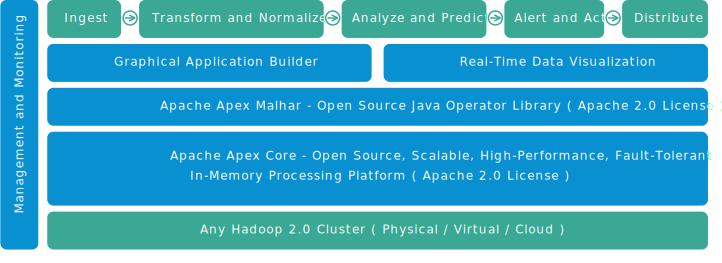

DataTorrent RTS Architecture
================================================================================

DataTorrent RTS is an enterprise product built around Apache Apex, a Hadoop-native unified stream and batch processing platform.  DataTorrent RTS combines Apache Apex engine with a set of enterprise-grade management, monitoring, development, and visualization tools.  

DataTorrent RTS platform enables creation and management of real-time big data applications in a way that is

* **highly scalable and performant** - millions of events per second per node with linear scalability
* **fault tolerant** - automatic recovery with no data or state loss
* **Hadoop native** - installs in seconds and works with all existing Hadoop distributions
* **easily developed** - write and re-use generic Java code
* **easily integrated** - customizable connectors to file, database, and messaging systems
* **easily operable** - full suite of management, monitoring, development, and visualization tools

The system is capable of processing billions of events per second, while automatically recovering without any state or data loss when individual nodes fail.  A simple API enables developers to write new and re-use existing generic Java code, lowering the expertise needed to write big data applications.  A library of existing demos and re-usable operators allows applications to be developed quickly.  Native Hadoop support allows DataTorrent RTS to be installed in seconds on any existing Hadoop cluster.  Application adiminstration can be done from a browser with dtManage, a full suite of management, monitoring, and visualization tools.  New applications can be visually built from existing components using [dtAssemble](dtassemble.md), a graphical application assembly tool.  Application data can be easily visualized with [dtDashboard](dtdashboard.md) real-time data visualizations.

