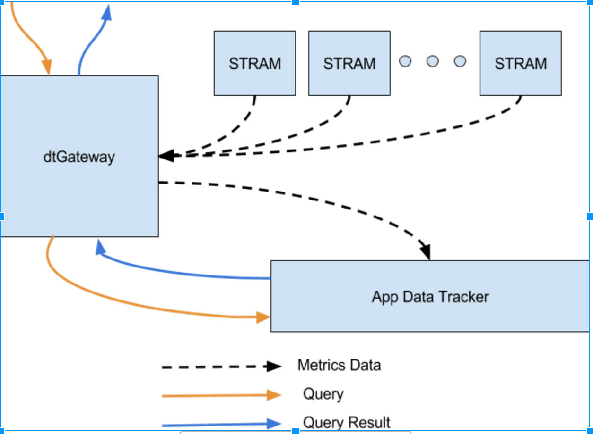
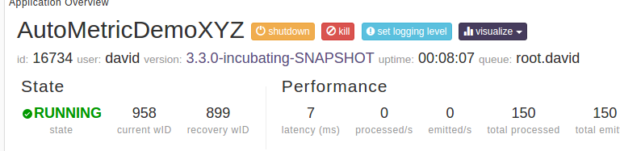
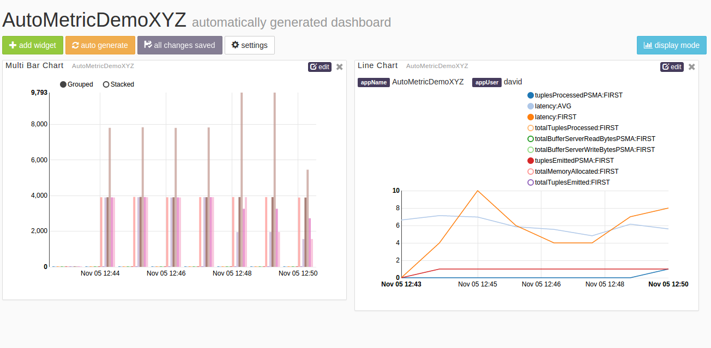

Apache Apex: AutoMetric in a Nutshell
======================================

# Introduction
Metrics help to collect some statistical information about a process which can be very useful for diagnosis. Auto Metrics in Apex help to monitor operators in a DAG. The goal of `AutoMetric` API is to enable operator developer to define relevant metrics for an operator in a simple way which the platform collects and reports automatically.

# Specifying AutoMetrics in an Operator
An `AutoMetric` can be any object. It can be of a primitive type - int, long, etc. or a complex one. A field or a `get` method in an operator can be annotated with `@AutoMetric` to specify that its value is a metric. After every application end window, the platform collects the values of these fields/methods in a map and sends it to application master.

```java
public class LineReceiver extends BaseOperator
{
 @AutoMetric
 long length;

 @AutoMetric
 long count;

 public final transient DefaultInputPort<String> input = new DefaultInputPort<String>()
 {
   @Override
   public void process(String s)
   {
     length += s.length();
     count++;
   }
 };

 @Override
 public void beginWindow(long windowId)
 {
   length = 0;
   count = 0;
 }
}
```

There are 2 auto-metrics declared in the `LineReceiver`. At the end of each application window, the platform will send a map with 2 entries - `[(length, 100), (count, 10)]` to the application master.

# Aggregating AutoMetrics across Partitions
When an operator is partitioned, it is useful to aggregate the values of auto-metrics across all its partitions every window to get a logical view of these metrics. The application master performs these aggregations using metrics aggregators.

The AutoMetric API helps to achieve this by providing an interface for writing aggregators- `AutoMetric.Aggregator`. Any implementation of `AutoMetric.Aggregator` can be set as an operator attribute - `METRICS_AGGREGATOR` for a particular operator which in turn is used for aggregating physical metrics.

## Default aggregators
[`MetricsAggregator`](https://github.com/apache/incubator-apex-core/blob/devel-3/common/src/main/java/com/datatorrent/common/metric/MetricsAggregator.java) is a simple implementation of `AutoMetric.Aggregator` that platform uses as a default for summing up primitive types - int, long, float and double.

`MetricsAggregator` is just a collection of `SingleMetricAggregator`s. There are multiple implementations of `SingleMetricAggregator` that perform sum, min, max, avg which are present in Apex core and Apex malhar.

For the `LineReceiver` operator, the application developer need not specify any aggregator. The platform will automatically inject an instance of `MetricsAggregator` that contains two `LongSumAggregator`s - one for `length` and one for `count`. This aggregator will report sum of length and sum of count across all the partitions of `LineReceiver`.


## Building custom aggregators
Platform cannot perform any meaningful aggregations for non-numeric metrics. In such cases, the operator or application developer can write custom aggregators. Let’s say, if the `LineReceiver` was modified to have a complex metric as shown below.

```java
public class AnotherLineReceiver extends BaseOperator
{
  @AutoMetric
  final LineMetrics lineMetrics = new LineMetrics();

  public final transient DefaultInputPort<String> input = new DefaultInputPort<String>()
  {
    @Override
    public void process(String s)
    {
      lineMetrics.length += s.length();
      lineMetrics.count++;
    }
  };

  @Override
  public void beginWindow(long windowId)
  {
    lineMetrics.length = 0;
    lineMetrics.count = 0;
  }

  public static class LineMetrics implements Serializable
  {
    long length;
    long count;

    private static final long serialVersionUID = 201511041908L;
  }
}
```

Below is a custom aggregator that can calculate average line length across all partitions of `AnotherLineReceiver`.

```java
public class AvgLineLengthAggregator implements AutoMetric.Aggregator
{

  Map<String, Object> result = Maps.newHashMap();

  @Override
  public Map<String, Object> aggregate(long l, Collection<AutoMetric.PhysicalMetricsContext> collection)
  {
    long totalLength = 0;
    long totalCount = 0;
    for (AutoMetric.PhysicalMetricsContext pmc : collection) {
      AnotherLineReceiver.LineMetrics lm = (AnotherLineReceiver.LineMetrics)pmc.getMetrics().get("lineMetrics");
      totalLength += lm.length;
      totalCount += lm.count;
    }
    result.put("avgLineLength", totalLength/totalCount);
    return result;
  }
}
```
An instance of above aggregator can be specified as the `METRIC_AGGREGATOR` for `AnotherLineReceiver` while creating the DAG as shown below.

```java
  @Override
  public void populateDAG(DAG dag, Configuration configuration)
  {
    ...
    AnotherLineReceiver lineReceiver = dag.addOperator("LineReceiver", new AnotherLineReceiver());
    dag.setAttribute(lineReceiver, Context.OperatorContext.METRICS_AGGREGATOR, new AvgLineLengthAggregator());
    ...
  }
```

# Retrieving AutoMetrics
The Gateway REST API provides a way to retrieve the latest AutoMetrics for each logical operator.  For example:

```
GET /ws/v2/applications/{appid}/logicalPlan/operators/{opName}
{
    ...
    "autoMetrics": {
       "count": "71314",
       "length": "27780706"
    },
    "className": "com.datatorrent.autometric.LineReceiver",
    ...
}
```

# System Metrics
System metrics are standard operator metrics provided by the system.  Examples include:

- processed tuples per second
- emitted tuples per second
- total tuples processed
- total tuples emitted
- latency
- CPU percentage
- failure count
- checkpoint elapsed time

The Gateway REST API provides a way to retrieve the latest values for all of the above for each of the logical operators in the application.

```
GET /ws/v2/applications/{appid}/logicalPlan/operators/{opName}
{
    ...
    "cpuPercentageMA": "{cpuPercentageMA}",
    "failureCount": "{failureCount}",
    "latencyMA": "{latencyMA}",  
    "totalTuplesEmitted": "{totalTuplesEmitted}",
    "totalTuplesProcessed": "{totalTuplesProcessed}",
    "tuplesEmittedPSMA": "{tuplesEmittedPSMA}",
    "tuplesProcessedPSMA": "{tuplesProcessedPSMA}",
    ...
}
```

However, just like AutoMetrics, the Gateway only provides the latest metrics.  For historical metrics, we will need the help of App Data Tracker.

# App Data Tracker
As discussed above, STRAM aggregates the AutoMetrics from physical operators (partitions) to something that makes sense in one logical operator.  It pushes the aggregated AutoMetrics values using Websocket to the Gateway at every second along with system metrics for each operator.  Gateway relays the information to an application called App Data Tracker.  It is another Apex application that runs in the background and further aggregates the incoming values by time bucket and stores the values in HDHT.  It also allows the outside to retrieve the aggregated AutoMetrics and system metrics through websocket interface.



App Data Tracker is enabled by having these properties in dt-site.xml:

```xml
<property>
  <name>dt.appDataTracker.enable</name>
  <value>true</value>
</property>
<property>
  <name>dt.appDataTracker.transport</name>
  <value>builtin:AppDataTrackerFeed</value>
</property>
<property>
  <name>dt.attr.METRICS_TRANSPORT</name>
  <value>builtin:AppDataTrackerFeed</value>
</property>
```

All the applications launched after the App Data Tracker is enabled will have metrics sent to it.

**Note**: The App Data Tracker will be shown running in dtManage as a “system app”.  It will show up if the “show system apps” button is pressed.

By default, the time buckets App Data Tracker aggregates upon are one minute, one hour and one day.  It can be overridden by changing the operator attribute `METRICS_DIMENSIONS_SCHEME`.

Also by default, the app data tracker performs all these aggregations: SUM, MIN, MAX, AVG, COUNT, FIRST, LAST on all number metrics.  You can also override by changing the same operator attribute `METRICS_DIMENSIONS_SCHEME`, provided the custom aggregator is known to the App Data Tracker.  (See next section)

# Custom Aggregator in App Data Tracker
Custom aggregators allow you to do your own custom computation on statistics generated by any of your applications. In order to implement a Custom aggregator you have to do two things:

1. Combining new inputs with the current aggregation
2. Combining two aggregations together into one aggregation

Let’s consider the case where we want to perform the following rolling average:

Y_n = ½ * X_n + ½ * X_n-1 + ¼ * X_n-2 + ⅛ * X_n-3 +...

This aggregation could be performed by the following Custom Aggregator:

```java
@Name("IIRAVG")
public class AggregatorIIRAVG extends AbstractIncrementalAggregator
{
  ...

  private void aggregateHelper(DimensionsEvent dest, DimensionsEvent src)
  {
    double[] destVals = dest.getAggregates().getFieldsDouble();
    double[] srcVals = src.getAggregates().getFieldsDouble();

    for (int index = 0; index < destLongs.length; index++) {
      destVals[index] = .5 * destVals[index] + .5 * srcVals[index];
    }
  }

  @Override
  public void aggregate(Aggregate dest, InputEvent src)
  {
    //Aggregate a current aggregation with a new input
    aggregateHelper(dest, src);
  }

  @Override
  public void aggregate(Aggregate destAgg, Aggregate srcAgg)
  {
    //Combine two existing aggregations together
    aggregateHelper(destAgg, srcAgg);
  }
}
```

## Discovery of Custom Aggregators
AppDataTracker searches for custom aggregator jars under the following directories statically before launching:

1. {dt\_installation\_dir}/plugin/aggregators
2. {user\_home\_dir}/.dt/plugin/aggregators

It uses reflection to find all the classes that extend from `IncrementalAggregator` and `OTFAggregator` in these jars and registers them with the name provided by `@Name` annotation (or class name when `@Name` is absent).

# Using `METRICS_DIMENSIONS_SCHEME`

Here is a sample code snippet on how you can make use of `METRICS_DIMENSIONS_SCHEME` to set your own time buckets and your own set of aggregators for certain `AutoMetric`s performed by the App Data Tracker in your application.

```java
  @Override
  public void populateDAG(DAG dag, Configuration configuration)
  {
    ...
    LineReceiver lineReceiver = dag.addOperator("LineReceiver", new LineReceiver());
    ...
    AutoMetric.DimensionsScheme dimensionsScheme = new AutoMetric.DimensionsScheme()
    {
      String[] timeBuckets = new String[] { "1s", "1m", "1h" };
      String[] lengthAggregators = new String[] { "IIRAVG", "SUM" };
      String[] countAggregators = new String[] { "SUM" };

      /* Setting the aggregation time bucket to be one second, one minute and one hour */
      @Override
      public String[] getTimeBuckets()
      {
        return timeBuckets;
      }

      @Override
      public String[] getDimensionAggregationsFor(String logicalMetricName)
      {
        if ("length".equals(logicalMetricName)) {
          return lengthAggregators;
        } else if ("count".equals(logicalMetricName)) {
          return countAggregators;
        } else {
          return null; // use default
        }
      }
    };

    dag.setAttribute(lineReceiver, OperatorContext.METRICS_DIMENSIONS_SCHEME, dimensionsScheme);
    ...
  }
```


# Dashboards
With App Data Tracker enabled, you can visualize the AutoMetrics and system metrics in the Dashboards within dtManage.   Refer back to the diagram in the App Data Tracker section, dtGateway relays queries and query results to and from the App Data Tracker.  In this way, dtManage sends queries and receives results from the App Data Tracker via dtGateway and uses the results to let the user visualize the data.

Click on the visualize button in dtManage's application page.



You will see the dashboard for the AutoMetrics and the system metrics.



The left widget shows the AutoMetrics of `line` and `count` for the LineReceiver operator.  The right widget shows the system metrics.

The Dashboards have some simple builtin widgets to visualize the data.  Line charts and bar charts are some examples.
Users will be able to implement their own widgets to visualize their data.
