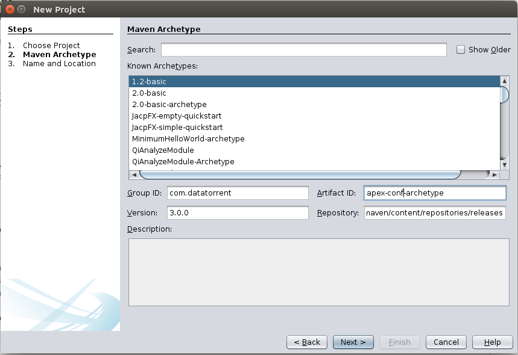

Apache Apex Configuration Packages
==================================

An Apache Apex Application Configuration Package is a zip file that contains
configuration files and additional files to be launched with an
[Application Package](https://www.datatorrent.com/docs/guides/ApplicationPackages.html) using 
DTCLI or REST API.  This guide assumes the reader’s familiarity of
Application Package.  Please read the Application Package document to
get yourself familiar with the concept first if you have not done so.

#Requirements 

You will need have the following installed:

1. Apache Maven 3.0 or later (for assembling the Config Package)
2. Apex 3.0.0 or later (for launching the App Package with the Config
    Package in your cluster)

#Creating Your First Configuration Package 

You can create a Configuration Package using your Linux command line, or
using your favorite IDE.  

## Using Command Line

First, change to the directory where you put your projects, and create a
DT configuration project using Maven by running the following command.
 Replace "com.example", "mydtconfig" and "1.0-SNAPSHOT" with the
appropriate values:

```
 $ mvn archetype:generate                                                
 -DarchetypeRepository=https://www.datatorrent.com/maven/content/reposito 
 ries/releases                                                            
 -DarchetypeGroupId=com.datatorrent                                       
 -DarchetypeArtifactId=apex-conf-archetype -DarchetypeVersion=3.0.0       
 -DgroupId=com.example -Dpackage=com.example.mydtconfig                   
 -DartifactId=mydtconfig -Dversion=1.0-SNAPSHOT                           

```

This creates a Maven project named "mydtconfig". Open it with your
favorite IDE (e.g. NetBeans, Eclipse, IntelliJ IDEA).  Try it out by
running the following command:
```
$ mvn package                                                         
```

The "mvn package" command creates the Config Package file in target
directory as target/mydtconfig.apc. You will be able to use that
Configuration Package file to launch an application in your actual
DataTorrent RTS installation.

## Using IDE 

Alternatively, you can do the above steps all within your IDE.  For
example, in NetBeans, select File -\> New Project.  Then choose “Maven”
and “Project from Archetype” in the dialog box, as shown.


Then fill the Group ID, Artifact ID, Version and Repository entries as
shown below.


Group ID: com.datatorrent
Artifact ID: apex-conf-archetype
Version: 3.0.0 (or any later version)

Repository:
[https://www.datatorrent.com/maven/content/repositories/releases](https://www.datatorrent.com/maven/content/repositories/releases)

[](https://www.datatorrent.com/maven/content/repositories/releases)

Press Next and fill out the rest of the required information. For
example:



Click Finish, and now you have created your own Apex
Configuration Package project.  The procedure for other IDEs, like
Eclipse or IntelliJ, is similar.

#Assembling your own configuration package 

Inside the project created by the archetype, these are the files that
you should know about when assembling your own configuration package:

        ./pom.xml
        ./src/main/resources/classpath
        ./src/main/resources/files

./src/main/resources/META-INF/properties.xml
./src/main/resources/META-INF/properties-{appname}.xml

##pom.xml 

Example:

```
  <groupId>com.example</groupId>
  <version>1.0.0</version>
  <artifactId>mydtconf</artifactId>
  <packaging>jar</packaging>
  <!-- change these to the appropriate values -->
  <name>My DataTorrent Application Configuration</name>
  <description>My DataTorrent Application Configuration Description</description>
  <properties>
    <datatorrent.apppackage.name>mydtapp</datatorrent.apppackage.name>
    <datatorrent.apppackage.minversion>1.0.0</datatorrent.apppackage.minversion>
   <datatorrent.apppackage.maxversion>1.9999.9999</datatorrent.apppackage.maxversion>
    <datatorrent.appconf.classpath>classpath/*</datatorrent.appconf.classpath>
    <datatorrent.appconf.files>files/*</datatorrent.appconf.files>
  </properties> 

```
In pom.xml, you can change the values of  ```<groupId>, <version>, <artifactId>, <name> ```and ```<description>``` to your desired values.  

You can also change the values of ```<datatorrent.apppackage.name>, <datatorrent.apppackage.minversion> <datatorrent.apppackage.maxversion>```
to reflect what app packages should be used with this configuration package.  Apex will use this information to check whether a
configuration package is compatible with the application package when you issue a launch command.

## ./src/main/resources/classpath 

Place any file in this directory that you’d like to be copied to the
compute machines when launching an application and included in the
classpath of the application.  Example of such files are Java properties
files and jar files.

## ./src/main/resources/files 

Place any file in this directory that you’d like to be copied to the
compute machines when launching an application but not included in the
classpath of the application.

## Properties XML file

A properties xml file consists of a set of key-value pairs.  The set of
key-value pairs specifies the configuration options the application
should be launched with.  

Example:
```
<configuration>
  <property>
    <name>some-property-name</name>
    <value>some-property-value</value>
  </property>
   ...
</configuration>
```
Names of properties XML file:

*  **properties.xml:** Properties that are global to the Configuration
Package
*  **properties-{appName}.xml:** Properties that are specific when launching
an application with the specified appName within the Application
Package.

After you are done with the above, remember to do mvn package to
generate a new configuration package, which will be located in the
target directory in your project.

## Zip structure of configuration package 
Apex Application Configuration Package files are zip files.  You
can examine the content of any Application Configuration Package by
using unzip -t on your Linux command line.  The structure of the zip
file is as follow:

```
META-INF
  MANIFEST.MF
  properties.xml
  properties-{appname}.xml
classpath
  {classpath files}
files
  {files} 
```

#Launching with CLI 

`-conf` option of the launch command in CLI supports specifying configuration package in the local filesystem.  Example:

    dt\> launch DTApp-mydtapp-1.0.0.jar -conf DTConfig-mydtconfig-1.0.0.jar

This command expects both the application package and the configuration package to be in the local file system.

#Related REST API 

##POST /ws/v2/configPackages

Payload: Raw content of configuration package zip

Function: Creates or replace a configuration package zip file in HDFS

Curl example:

    $ curl -XPOST -T DTConfig-{name}.jar http://{yourhost:port}/ws/v2/configPackages

## GET /ws/v2/configPackages?appPackageName=...&appPackageVersion=... 

All query parameters are optional

Function: Returns the configuration packages that the user is authorized to use and that are compatible with the specified appPackageName, appPackageVersion and appName. 

## GET /ws/v2/configPackages/``<user>``?appPackageName=...&appPackageVersion=... 

All query parameters are optional

Function: Returns the configuration packages under the specified user and that are compatible with the specified appPackageName, appPackageVersion and appName.

## GET /ws/v2/configPackages/```<user>```/```<name>``` 

Function: Returns the information of the specified configuration package

## GET /ws/v2/configPackages/```<user>```/```<name>```/download 

Function: Returns the raw config package file

Curl example:

```sh
$ curl http://{yourhost:port}/ws/v2/configPackages/{user}/{name}/download \> DTConfig-xyz.jar
$ unzip -t DTConfig-xyz.jar
```

## POST /ws/v2/appPackages/```<user>```/```<app-pkg-name>```/```<app-pkg-version>```/applications/{app-name}/launch?configPackage=```<user>```/```<confpkgname>```

Function: Launches the app package with the specified configuration package stored in HDFS.

Curl example:

```sh
$ curl -XPOST -d ’{}’ http://{yourhost:port}/ws/v2/appPackages/{user}/{app-pkg-name}/{app-pkg-version}/applications/{app-name}/launch?configPackage={user}/{confpkgname}
```