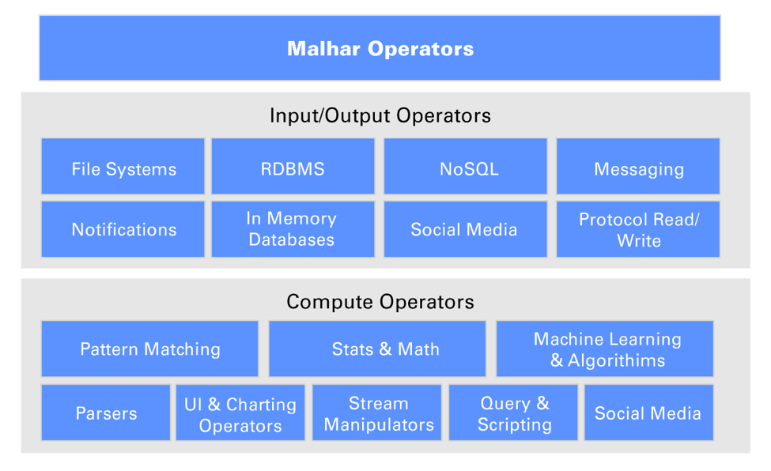

Apache Apex Malhar
================================================================================

Apache Apex Malhar is an open source operator and codec library that can be used with the [Apache Apex](http://apex.apache.org/) platform to build real-time streaming applications.  Enabling users to extract value quickly, Malhar operators help get data in, analyze it in real-time, and get data out of Hadoop.  In addition to the operators, the library contains a number of demos applications, demonstrating operator features and capabilities.

# Capabilities common across Malhar operators

For most streaming platforms, connectors are afterthoughts and often end up being simple ‘bolt-ons’ to the platform. As a result they often cause performance issues or data loss when put through failure scenarios and scalability requirements. Malhar operators do not face these issues as they were designed to be integral parts of Apex. Hence, they have following core streaming runtime capabilities

1.  **Fault tolerance** – Malhar operators where applicable have fault tolerance built in. They use the checkpoint capability provided by the framework to ensure that there is no data loss under ANY failure scenario.
2.  **Processing guarantees** – Malhar operators where applicable provide out of the box support for ALL three processing guarantees – exactly once, at-least once, and at-most once WITHOUT requiring the user to write any additional code.  Some operators, like MQTT operator, deal with source systems that can not track processed data and hence need the operators to keep track of the data.  Malhar has support for a generic operator that uses alternate storage like HDFS to facilitate this.  Finally for databases that support transactions or support any sort of atomic batch operations Malhar operators can do exactly once down to the tuple level.
3.  **Dynamic updates** – Based on changing business conditions you often have to tweak several parameters used by the operators in your streaming application without incurring any application downtime. You can also change properties of a Malhar operator at runtime without having to bring down the application.
4.  **Ease of extensibility** – Malhar operators are based on templates that are easy to extend.
5.  **Partitioning support** – In streaming applications the input data stream often needs to be partitioned based on the contents of the stream. Also for operators that ingest data from external systems partitioning needs to be done based on the capabilities of the external system.  For example with Kafka, the operator can automatically scale up or down based on the changes in the number of Kafka partitions.

# Operator Library Overview

## Input/output connectors

Below is a summary of the various sub categories of input and output operators. Input operators also have a corresponding output operator

*   **File Systems** – Most streaming analytics use cases require the data to be stored in HDFS or perhaps S3 if the application is running in AWS.  Users often need to re-run their streaming analytical applications against historical data or consume data from upstream processes that are perhaps writing to some NFS share.  Apex supports input & output operators for HDFS, S3, NFS & Local Files.  There are also File Splitter and Block Reader operators, which can accelecate processing of large files by splitting and paralellizing the work across non-overlapping sets of file blocks.
*   **Relational Databases** – Most stream processing use cases require some reference data lookups to enrich, tag or filter streaming data. There is also a need to save results of the streaming analytical computation to a database so an operational dashboard can see them. Apex supports a JDBC operator so you can read/write data from any JDBC compliant RDBMS like Oracle, MySQL, Sqlite, etc.
*   **NoSQL Databases** – NoSQL key-value pair databases like Cassandra & HBase are a common part of streaming analytics application architectures to lookup reference data or store results.  Malhar has operators for HBase, Cassandra, Accumulo, Aerospike, MongoDB, and CouchDB.
*   **Messaging Systems** – Kafka, JMS, and similar systems are the workhorses of messaging infrastructure in most enterprises.  Malhar has a robust, industry-tested set of operators to read and write Kafka, JMS, ZeroMQ, and RabbitMQ messages.
*   **Notification Systems** – Malhar includes an operator for sending notifications via SMTP.
*   **In-memory Databases & Caching platforms** - Some streaming use cases need instantaneous access to shared state across the application. Caching platforms and in-memory databases serve this purpose really well. To support these use cases, Malhar has operators for memcached and Redis.
*   **Social Media** - Malhar includes an operator to connect to the popular Twitter stream fire hose.
*   **Protocols** - Malhar provides connectors that can communicate in HTTP, RSS, Socket, WebSocket, FTP, and MQTT.

## Parsers

There are many industry vertical specific data formats that a streaming application developer might need to parse. Often there are existing parsers available for these that can be directly plugged into an Apache Apex application. For example in the Telco space, a Java based CDR parser can be directly plugged into Apache Apex operator. To further simplify development experience, Malhar also provides some operators for parsing common formats like XML (DOM & SAX), JSON (flat map converter), Apache log files, syslog, etc.

## Stream manipulation

Streaming data inevitably needs processing to clean, filter, tag, summarize, etc. The goal of Malhar is to enable the application developer to focus on WHAT needs to be done to the stream to get it in the right format and not worry about the HOW.  Malhar has several operators to perform the common stream manipulation actions like – GroupBy, Join, Distinct/Unique, Limit, OrderBy, Split, Sample, Inner join, Outer join, Select, Update etc.

## Compute

One of the most important promises of a streaming analytics platform like Apache Apex is the ability to do analytics in real-time. However delivering on the promise becomes really difficult when the platform does not provide out of the box operators to support variety of common compute functions as the user then has to worry about making these scalable, fault tolerant, stateful, etc.  Malhar takes this responsibility away from the application developer by providing a variety of out of the box computational operators.

Below is just a snapshot of the compute operators available in Malhar

*   Statistics and math - Various mathematical and statistical computations over application defined time windows.
*   Filtering and pattern matching
*   Sorting, maps, frequency, TopN, BottomN
*   Random data generators

## Languages Support

Migrating to a new platform often requires re-use of the existing code that would be difficult or time-consuming to re-write.  With this in mind, Malhar supports invocation of code written in other languages by wrapping them in one of the library operators, and allows execution of software written in:

* JavaScript
* Python
* R
* Ruby