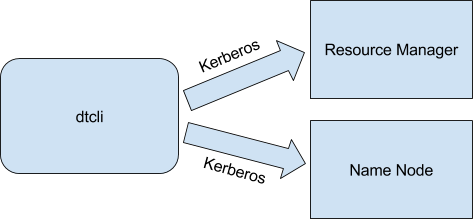
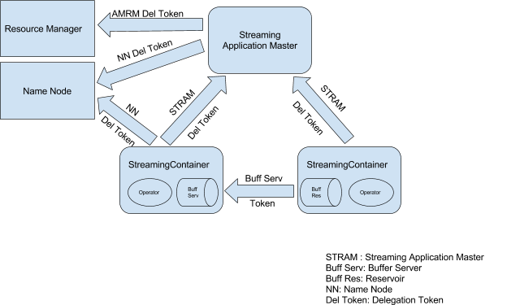
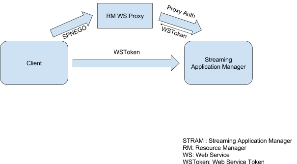

Security
==========

Applications built on Apex run as native YARN applications on Hadoop. The security framework and apparatus in Hadoop apply to the applications. Both authentication and SSL aspects of the security framework are covered here.

# Authentication

The default authentication mechanism in Hadoop is Kerberos.

## Kerberos Authentication

Kerberos is a ticket based authentication system that provides authentication in a distributed environment where authentication is needed between multiple users, hosts and services. It is the de-facto authentication mechanism supported in Hadoop. To use Kerberos authentication, the Hadoop installation must first be configured for secure mode with Kerberos. Please refer to the administration guide of your Hadoop distribution on how to do that. Once Hadoop is configured, some configuration is needed on the Apex side as well.

## Configuring Kerberos

The Apex command line interface (CLI) program, `apex`, is used to launch applications on the Hadoop cluster along with performing various other operations and administrative tasks on the applications. In a secure cluster additional configuration is needed for the CLI program `apex`.

### CLI Configuration

When Kerberos security is enabled in Hadoop, a Kerberos ticket granting ticket (TGT) or the Kerberos credentials of the user are needed by the CLI program `apex` to authenticate with Hadoop for any operation. Kerberos credentials are composed of a principal and either a _keytab_ or a password. For security and operational reasons only keytabs are supported in Hadoop and by extension in Apex platform. When user credentials are specified, all operations including launching application are performed as that user.

#### Using kinit

A Kerberos ticket granting ticket (TGT) can be obtained by using the Kerberos command `kinit`. Detailed documentation for the command can be found online or in man pages. An sample usage of this command is

    kinit -k -t path-tokeytab-file kerberos-principal

If this command is successful, the TGT is obtained, cached and available for other programs. The CLI program `apex` can then be started to launch applications and perform other operations.

#### Using Kerberos credentials

The CLI program `apex` can also use the Kerberos credentials directly without requiring a TGT to be obtained separately. This can be useful in batch mode where `apex` is not launched manually and also in scenarios where running another program like `kinit` is not feasible.

The credentials can be specified in the `dt-site.xml` configuration file. If only a single user is launching applications, the global `dt-site.xml` configuration file in the installation folder can be used. In a multi-user environment the users can use the `dt-site.xml` file in their
home directory. The location of this file will be `$HOME/.dt/dt-site.xml`. If this file does not exist, the user can create a new one.

The snippet below shows the how the credentials can be specified in the configuration file as properties.

```xml
<property>
        <name>dt.authentication.principal</name>
        <value>kerberos-principal-of-user</value>
</property>
<property>
        <name>dt.authentication.keytab</name>
        <value>absolute-path-to-keytab-file</value>
</property>
```

The property `dt.authentication.principal` specifies the Kerberos user principal and `dt.authentication.keytab` specifies the absolute path to the keytab file for the user.

### Web Services security

Alongside every Apex application, there is an application master process called Streaming Container Manager (STRAM) running. STRAM manages the application by handling the various control aspects of the application such as orchestrating the execution of the application on the cluster, playing a key role in scalability and fault tolerance, providing application insight by collecting statistics among other functionality.

STRAM provides a web service interface to introspect the state of the application and its various components and to make dynamic changes to the applications. Some examples of supported functionality are getting resource usage and partition information of various operators, getting operator statistics and changing properties of running operators.

Access to the web services can be secured to prevent unauthorized access. By default it is automatically enabled in Hadoop secure mode environments and not enabled in non-secure environments. How the security actually works is described in `Security architecture` section below.

There are additional options available for finer grained control on enabling it. This can be configured on a per-application basis using an application attribute. It can also be enabled or disabled based on Hadoop security configuration. The following security options are available

* Enable - Enable Authentication
* Follow Hadoop Authentication - Enable authentication if secure mode is enabled in Hadoop, the default
* Follow Hadoop HTTP Authentication - Enable authentication only if HTTP authentication is enabled in Hadoop and not just secure mode.
* Disable - Disable Authentication

To specify the security option for an application the following configuration can be specified in the `dt-site.xml` file

```xml
<property>
        <name>dt.application.name.attr.STRAM_HTTP_AUTHENTICATION</name>
        <value>security-option</value>
</property>
```

The security option value can be `ENABLED`, `FOLLOW_HADOOP_AUTH`, `FOLLOW_HADOOP_HTTP_AUTH` or `DISABLE` for the four options above respectively.

The subsequent sections talk about how security works in Apex. This information is not needed by users but is intended for the inquisitive techical audience who want to know how security works.

#### CLI setup

The CLI program `apex` connects to the web service endpoint of the STRAM for a running application to query for information or to make changes to it. In order to do that, it has to first connect to the YARN proxy web service and get the necessary connection information and credentials to connect to STRAM. The proxy web service may have security enabled and in that case, the CLI program `apex` would first need to authenticate with the service before it can get any information.

Hadoop allows a lot of flexibility in the kind of security to use for the proxy. It allows the user to plug-in their own authentication provider. The authentication provider is specified as a JAVA class name. It also comes bundled with a provider for Kerberos SPNEGO authentication. Some distributions also include a provider for BASIC authentication via SASL.

The CLI `apex`, has built-in functionality for Kerberos SPNEGO, BASIC and DIGEST authentication mechanisms. Because of the way the authentication provider is configured for the proxy on the Hadoop side, there is no reliable way to determine before hand what kind of authentication is being used. Only at runtime, when the CLI connects to the proxy web service will it know the type of authentication that the service is using. For this reason, `apex` allows the user to configure credentials for multiple authentication mechanisms it supports and will pick the one that matches what the service expects.

If the authentication mechanism is Kerberos SPNEGO, the properties listed in the [Using Kerberos credentials](#using-kerberos-credentials) section for general communication with Hadoop above are sufficient. No additional properties are needed.

For BASIC authentication, the credentials can be specified using the following properties

```xml
<property>
        <name>dt.authentication.basic.username</name>
        <value>username</value>
</property>
<property>
        <name>dt.authentication.basic.password</name>
        <value>password</value>
</property>
```

For DIGEST authentication, the credentials can be specified using the following properties

```xml
<property>
        <name>dt.authentication.digest.username</name>
        <value>username</value>
</property>
<property>
        <name>dt.authentication.digest.password</name>
        <value>password</value>
</property>
```

### Token Refresh

Apex applications, at runtime, use delegation tokens to authenticate with Hadoop services when communicating with them as described in the security architecture section below. The delegation tokens are originally issued by these Hadoop services and have an expiry time period which is typically 7 days. The tokens become invalid beyond this time and the applications will no longer be able to communicate with the Hadoop services. For long running applications this presents a problem.

To solve this problem one of the two approaches can be used. The first approach is to change the Hadoop configuration itself to extend the token expiry time period. This may not be possible in all environments as it requires a change in the security policy as the tokens will now be valid for a longer period of time and the change also requires administrator privileges to Hadoop. The second approach is to use a feature available in apex to auto-refresh the tokens before they expire. Both the approaches are detailed below and the users can choose the one that works best for them.

#### Hadoop configuration approach

An Apex application uses delegation tokens to authenticate with Hadoop services, Resource Manager (YARN) and Name Node (HDFS), and these tokens are issued by those services respectively. Since the application is long-running, the tokens can expire while the application is still running. Hadoop uses configuration settings for the maximum lifetime of these tokens. 

There are separate settings for ResourceManager and NameNode delegation tokens. In this approach the user increases the values of these settings to cover the lifetime of the application. Once these settings are changed, the YARN and HDFS services would have to be restarted. The values in these settings are of type `long` and has an upper limit so applications cannot run forever. This limitation is not present with the next approach described below.

The Resource Manager delegation token max lifetime is specified in `yarn-site.xml` and can be specified as follows for a lifetime of 1 year as an example

```xml
<property>
  <name>yarn.resourcemanager.delegation.token.max-lifetime</name>
  <value>31536000000</value>
</property>
```

The Name Node delegation token max lifetime is specified in
hdfs-site.xml and can be specified as follows for a lifetime of 1 year as an example

```xml
<property>
   <name>dfs.namenode.delegation.token.max-lifetime</name>
   <value>31536000000</value>
 </property>
```

#### Auto-refresh approach

In this approach the application, in anticipation of a token expiring, obtains a new token to replace the current one. It keeps repeating the process whenever a token is close to expiry so that the application can continue to run indefinitely.

This requires the application having access to a keytab file at runtime because obtaining a new token requires a keytab. The keytab file should be present in HDFS so that the application can access it at runtime. The user can provide a HDFS location for the keytab file using a setting otherwise the keytab file specified for the `apex` CLI program above will be copied from the local filesystem into HDFS before the application is started and made available to the application. There are other optional settings available to configure the behavior of this feature. All the settings are described below.

The location of the keytab can be specified by using the following setting in `dt-site.xml`. If it is not specified then the file specified in `dt.authentication.keytab` is copied into HDFS and used.

```xml
<property>
        <name>dt.authentication.store.keytab</name>
        <value>hdfs-path-to-keytab-file</value>
</property>
```
The expiry period of the Resource Manager and Name Node tokens needs to be known so that the application can renew them before they expire. These are automatically obtained using the `yarn.resourcemanager.delegation.token.max-lifetime` and `dfs.namenode.delegation.token.max-lifetime` properties from the hadoop configuration files. Sometimes however these properties are not available or kept up-to-date on the nodes running the applications. If that is the case then the following properties can be used to specify the expiry period, the values are in milliseconds. The example below shows how to specify these with values of 7 days.

```xml
<property>
        <name>dt.resourcemanager.delegation.token.max-lifetime</name>
        <value>604800000</value>
</property>

<property>
        <name>dt.namenode.delegation.token.max-lifetime</name>
        <value>604800000</value>
</property>
```

As explained earlier new tokens are obtained before the old ones expire. How early the new tokens are obtained before expiry is controlled by a setting. This setting is specified as a factor of the token expiration with a value between 0.0 and 1.0. The default value is `0.7`. This factor is multipled with the expiration time to determine when to refresh the tokens. This setting can be changed by the user and the following example shows how this can be done

```xml
<property>
        <name>dt.authentication.token.refresh.factor</name>
        <value>0.7</value>
</property>
```

### Impersonation

The CLI program `apex` supports Hadoop proxy user impersonation, in allowing applications to be launched and other operations to be performed as a different user than the one specified by the Kerberos credentials. The Kerberos credentials are still used for authentication. This is useful in scenarios where a system using `apex` has to support multiple users but only has a single set of Kerberos credentials, those of a system user.

#### Usage

To use this feature, the following environment variable should be set to the user name of the user being impersonated, before running `apex` and the operations will be performed as that user. For example, if launching an application, the application will run as the specified user and not as the user specified by the Kerberos credentials.

```
HADOOP_USER_NAME=<username>
```

#### Hadoop Configuration

For this feature to work, additional configuration settings are needed in Hadoop. These settings would allow a specified user, such as a system user, to impersonate other users. The example snippet below shows these settings. In this example, the specified user can impersonate users belonging to any group and can do so running from any host. Note that the user specified here is different from the user specified above in usage, there it is the user that is being impersonated and here it is the impersonating user such as a system user.

```xml
<property>
  <name>hadoop.proxyuser.<username>.groups</name>
  <value>*</value>
</property>

<property>
  <name>hadoop.proxyuser.<username>.hosts</name>
  <value>*</value>
</property>
```

#### Application Root Directory under HDFS

A running Apex application uses a 'root' directory under HDFS where runtime artifacts are saved or read from. For example, with default configuration an Apex application 
would use the HDFS path `/user/dtadmin/datatorrent` as the application root directory. If the application's Hadoop assigned application ID is `application_1487803614053_10222` 
then the full HDFS path for saving and reading application package contents,  events, checkpoint and recovery data is 
`/user/dtadmin/datatorrent/apps/application_1487803614053_10222`.

This root directory determination involves using the 'current' user, and in case of impersonation Apex treats either the impersonating user or the impersonated 
user as the 'current' user depending on the value of the configuration propery `dt.authentication.impersonation.path.enable`. You should set its value to `true` to 
treat the impersonated user as the current user, or `false` (the default value) to treat the impersonating user as the current user.

Apex also uses the configuration property `apex.app.dfsRootDirectory` to determine the application root directory when `dt.authentication.impersonation.path.enable`
is set to `true` i.e. treating the impersonated user as the 'current' user. When `dt.authentication.impersonation.path.enable` is set to `false`, Apex will use
the configuration property `dt.dfsRootDirectory` to determine the application root directory.

As an example, let's assume the following values:

- `apex.app.dfsRootDirectory` is set to `/user/%USER_NAME%/apex`.

- `dt.dfsRootDirectory` is set to `/user/%USER_NAME%/datatorrent`.


Also assume the impersonating user is `apexadmin` and the impersonated user is `peter` when the application is launched. In this scenario, when
`dt.authentication.impersonation.path.enable` is set to `true`, the application root directory is `/user/peter/apex`. When it is set to `false`, the application
root directory is `/user/apexadmin/datatorrent`. As you can see, Apex replaces the string `%USER_NAME%` with the 'current' user as described above. If you do not use
an absolute path (i.e. path starting with `/`) as the value of `apex.app.dfsRootDirectory` then the evaluated path is prepended with the current user's home directory.
For example, when the value of `apex.app.dfsRootDirectory` is set to `apex/%USER_NAME%/myDir` and `dt.authentication.impersonation.path.enable` is set to `true` then
the application root directory in the above example is `/user/peter/apex/peter/myDir`.

All of the configuration properties mentioned above can be set using any one of the methods mentioned [here](application_packages/#adding-configuration-properties).
For example, you can use the `dt-site.xml` file, or use the `-D` option in the Apex CLI launch command as described [here](application_packages/#launching-an-application-package).

Security architecture
----------------------

In this section we will see how security works for applications built on Apex. We will look at the different methodologies involved in running the applications and in each case we will look into the different components that are involved. We will go into the architecture of these components and look at the different security mechanisms that are in play.

### Application Launch

To launch applications in Apache Apex the command line client `apex` can be used. The application artifacts such as binaries and properties are supplied as an application package. The client, during the various steps involved to launch the application needs to communicate with both the Resource Manager and the Name Node. The Resource Manager communication involves the client asking for new resources to run the application master and start the application launch process. The steps along with sample Java code are described in Writing YARN Applications. The Name Node communication includes the application artifacts being copied to HDFS so that they are available across the cluster for launching the different application containers.

In secure mode, the communications with both Resource Manager and Name Node requires authentication and the mechanism is Kerberos. Below is an illustration showing this.




The client `apex` supports Kerberos authentication and will automatically enable it in a secure environment. To authenticate, some Kerberos configuration namely the Kerberos credentials, are needed by the client. There are two parameters, the Kerberos principal and keytab to use for the client. These can be specified in the dt-site.xml configuration file. The properties are shown below

        <property>
                <name>dt.authentication.principal</name>
                <value>kerberos-principal-of-user</value>
        </property>
        <property>
                <name>dt.authentication.keytab</name>
                <value>absolute-path-to-keytab-file</value>
        </property>

Refer to document Operation and Installation Guide section Multi Tenancy and Security subsection CLI Configuration in the documentation for more information. The document can also be accessed here client configuration

There is another important functionality that is performed by the client and that is to retrieve what are called delegation tokens from the Resource Manager and Name Node to seed the application master container that is to be launched. This is detailed in the next section. 

### Runtime Security

When the application is completely up and running, there are different components of the application running as separate processes possibly on different nodes in the cluster as it is a distributed application. These components interactwould be interacting with each other and the Hadoop services. In secure mode, all these interactions have to be authenticated before they can be successfully processed. The interactions are illustrated below in a diagram to give a complete overview. Each of them is explained in subsequent sections.




#### STRAM and Hadoop

Every Apache Apex application has a master process akin to any YARN application. In our case it is called STRAM (Streaming Application Master). It is a master process that runs in its own container and manages the different distributed components of the application. Among other tasks it requests Resource Manager for new resources as they are needed and gives back resources that are no longer needed. STRAM also needs to communicate with Name Node from time-to-time to access the persistent HDFS file system. 

In secure mode, STRAM has to authenticate with both Resource Manager and Name Node before it can send any requests and this is achieved using Delegation Tokens. Since STRAM runs as a managed application master, it runs in a Hadoop container. This container could have been allocated on any node based on what resources were available. Since there is no fixed node where STRAM runs, it does not have Kerberos credentials. Unlike launch client `apex`, it cannot authenticate with Hadoop services Resource Manager and Name Node using Kerberos. Instead, Delegation Tokens are used for authentication.

##### Delegation Tokens

Delegation tokens are tokens that are dynamically issued by the source and clients use them to authenticate with the source. The source stores the delegation tokens it has issued in a cache and checks the delegation token sent by a client against the cache. If a match is found, the authentication is successful else it fails. This is the second mode of authentication in secure Hadoop after Kerberos. More details can be found in the Hadoop security design document. In this case the delegation tokens are issued by Resource Manager and Name Node. STRAM would use these tokens to authenticate with them. But how does it get them in the first place? This is where the launch client `apex` comes in.

The client `apex`, since it possesses Kerberos credentials as explained in the Application Launch section, is able to authenticate with Resource Manager and Name Node using Kerberos. It then requests for delegation tokens over the Kerberos authenticated connection. The servers return the delegation tokens in the response payload. The client in requesting the resource manager for the start of the application master container for STRAM seeds it with these tokens so that when STRAM starts it has these tokens. It can then use these tokens to authenticate with the Hadoop services.

#### Streaming Container

A streaming container is a process that runs a part of the application business logic. It is a container deployed on a node in the cluster. The part of business logic is implemented in what we call an operator. Multiple operators connected together make up the complete application and hence there are multiple streaming containers in an application. The streaming containers have different types of communications going on as illustrated in the diagram above. They are described below.

##### STRAM Delegation Token

The streaming containers periodically communicate with the application master STRAM. In the communication they send what are called heartbeats with information such as statistics and receive commands from STRAM such as deployment or un-deployment of operators, changing properties of operators etc. In secure mode, this communication cannot just occur without any authentication. To facilitate this authentication special tokens called STRAM Delegation Tokens are used. These tokens are created and managed by STRAM. When a new streaming container is being started, since STRAM is the one negotiating resources from Resource Manager for the container and requesting to start the container, it seeds the container with the STRAM delegation token necessary to communicate with it. Thus, a streaming container has the STRAM delegation token to successfully authenticate and communicate with STRAM.

##### Buffer Server Token

As mentioned earlier an operator implements a piece of the business logic of the application and multiple operators together complete the application. In creating the application the operators are assembled together in a direct acyclic graph, a pipeline, with output of operators becoming the input for other operators. At runtime the stream containers hosting the operators are connected to each other and sending data to each other. In secure mode these connections should be authenticated too, more importantly than others, as they are involved in transferring application data.

When operators are running there will be effective processing rate differences between them due to intrinsic reasons such as operator logic or external reasons such as different resource availability of CPU, memory, network bandwidth etc. as the operators are running in different containers. To maximize performance and utilization the data flow is handled asynchronous to the regular operator function and a buffer is used to intermediately store the data that is being produced by the operator. This buffered data is served by a buffer server over the network connection to the downstream streaming container containing the operator that is supposed to receive the data from this operator. This connection is secured by a token called the buffer server token. These tokens are also generated and seeded by STRAM when the streaming containers are deployed and started and it uses different tokens for different buffer servers to have better security.

##### NameNode Delegation Token

Like STRAM, streaming containers also need to communicate with NameNode to use HDFS persistence for reasons such as saving the state of the operators. In secure mode they also use NameNode delegation tokens for authentication. These tokens are also seeded by STRAM for the streaming containers.

#### Stram Web Services

Clients connect to STRAM and make web service requests to obtain operational information about running applications. When security is enabled we want this connection to also be authenticated. In this mode the client passes a web service token in the request and STRAM checks this token. If the token is valid, then the request is processed else it is denied.

How does the client get the web service token in the first place? The client will have to first connect to STRAM via the Resource Manager Web Services Proxy which is a service run by Hadoop to proxy requests to application web services. This connection is authenticated by the proxy service using a protocol called SPNEGO when secure mode is enabled. SPNEGO is Kerberos over HTTP and the client also needs to support it. If the authentication is successful the proxy forwards the request to STRAM. STRAM in processing the request generates and sends back a web service token similar to a delegation token. This token is then used by the client in subsequent requests it makes directly to STRAM and STRAM is able to validate it since it generated the token in the first place.



# SSL Configuration

The STRAM Web services component described above can be configured with SSL to enable HTTPS. To achieve this you need to enable SSL in YARN as described [here](http://hadoop.apache.org/docs/current/hadoop-project-dist/hadoop-common/SecureMode.html#Data_Encryption_on_HTTP), specifically set `yarn.http.policy` to `HTTPS_ONLY` in `yarn-site.xml`. You also need to make keystore and other SSL material available to the Web services component for HTTPS to work. There are 3 approaches to achieve this:

#### Approach 1: Using Default Hadoop-YARN SSL
If the default Hadoop-YARN SSL material is uniformly available in the local file system of each node in your Hadoop cluster, STRAM can use it provided the STRAM process has access to the files. Use your Hadoop/YARN configuration procedures to enable SSL in YARN to use this approach, so all YARN applications including Apex applications will be SSL-enabled. However if the SSL material is not present, or not accessible to the STRAM process (for example, if STRAM is not running as `root`), then you will have to use one of the following two approaches.

#### Approach 2: Pre-installing SSL Files on Hadoop Cluster Nodes
With this approach, your own SSL files are pre-installed on each node in the Hadoop cluster, so the STRAM can access them regardless of the node it runs on. Each node will have 2 files: `ssl-server.xml` is the master SSL configuration file and the SSL keystore file (a JKS file) whose name and location are specified in `ssl-server.xml`. Decide on a location for each of these files and follow the steps below.

- Create an SSL keystore as described [here](http://docs.oracle.com/cd/E19509-01/820-3503/ggfen/index.html). Assume this file is named `myapex-keystore.jks` and will reside at `/opt/apex/keystore/` on each Hadoop node and the keystore password is `storepass1` and the keystore key-password is `keypass2`. 

- Create the SSL configuration file with the following content. Typically the file is called `ssl-server.xml` but you can use any other name.

```
<configuration>
  <property>
    <name>ssl.server.keystore.location</name>
    <value>/opt/apex/keystore/myapex-keystore.jks</value>
    <description></description>
  </property>
  <property>
    <name>ssl.server.keystore.keypassword</name>
    <value>keypass2</value>
    <description></description>
  </property>
  <property>
    <name>ssl.server.keystore.password</name>
    <value>storepass1</value>
    <description></description>
  </property>
</configuration>
```

Let's assume this file will reside on each node as `/opt/apex/sslConfig/my-apex-ssl-server.xml` .

- Copy the keystore file and the SSL configuration file on each Hadoop node to their designated locations and make sure they are readable by your Apex application.

- Using the Apex CLI, pass the SSL configuration file location to your Apex application using the SSL_CONFIG attribute as follows:
```
launch -Dapex.attr.SSL_CONFIG="{\"configPath\":\"/opt/apex/sslConfig/my-apex-ssl-server.xml\"}"  <apa file>
```

- Alternatively you can use configuration files to supply the value of `apex.attr.SSL_CONFIG` attribute as described [here](http://apex.apache.org/docs/apex/application_packages/#application-packages)

#### Approach 3: Using Apex CLI to Copy the Keystore
If you cannot pre-install the SSL files on all your cluster nodes, you can use the SSL_CONFIG attribute in such a way that Apex CLI copies the keystore file from the client node to the server node and also passes on the keystore password values to the STRAM. The keystore file needs to be accessible on the Apex CLI machine so Apex CLI can copy it. Let's assume this location is `/opt/apexCli/ssl/myapex-keystore.jks`. Use the Apex CLI launch command as follows:
```
launch -Dapex.attr.SSL_CONFIG="{\"keyStorePath\":\"/opt/apexCli/ssl/myapex-keystore.jks\",\"keyStorePassword\":\"storepass1\",\"keyStoreKeyPassword\":\"keypass2\"}"  <apa file>
```

Apec CLI will copy the keystore file `/opt/apexCli/ssl/myapex-keystore.jks` to the destination STRAM node and also pass on the keystore password values to the STRAM. As mentioned above, you can also use configuration files to supply the value of `apex.attr.SSL_CONFIG`.

#### Updating Trust-store for the App Proxy

You need to ensure that all end-points connecting to the STRAM Web service trust the SSL certificate when SSL is enabled.
This is especially true for the [Web Application Proxy](https://hadoop.apache.org/docs/current/hadoop-yarn/hadoop-yarn-site/WebApplicationProxy.html) which connects to the STRAM Web service whenever you access the service through the App Master Proxy HTTPS URL. 
If you use a self-signed or untrusted certificate, you will need to add that certificate to the trust-store used by the RM Web Application Proxy as described [here](https://www.cloudera.com/documentation/enterprise/5-8-x/topics/cm_sg_create_key_trust.html#concept_u35_w2m_l4) and update `ssl-client.xml` to use the trust-store as described [here](http://hadoop.apache.org/docs/current/hadoop-project-dist/hadoop-common/SecureMode.html#Data_Encryption_on_HTTP)


#### Dependencies
The use of the attribute `apex.attr.SSL_CONFIG` described in the last 2 approaches is dependent on an [enhancement](https://issues.apache.org/jira/browse/YARN-6457) made in YARN, which is available in the following versions: 
2.9.0, 2.7.4, 3.0.0-alpha4, 2.8.2. 
