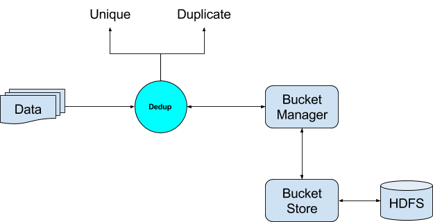
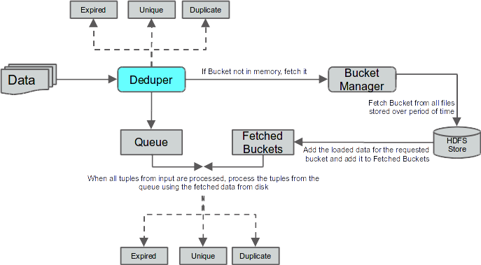
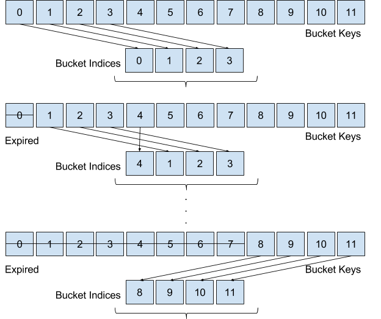
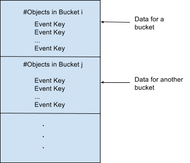

# Dedup - Operator Documentation


Introduction
============

About this document
-------------------

This document is intended as a guide for understanding and using the
Dedup operator/module.

Overview
========

Dedup - “What” in a Nutshell
----------------------------

Dedup is actually a shortened form of Deduplication. Duplicates are
omnipresent and can be found in almost any kind of data. Most of the
times it is essential to discard, or at the very least separate out the
data into unique and duplicate components. The entire purpose of this
operator is to de-duplicate data. In other words, when data passes
through this operator, it will be segregated into two different data
sets, one containing all unique tuples, and the other containing duplicates.


Dedup - “How” in a Nutshell
---------------------------

In order to quickly decide whether an incoming tuple is duplicate or
unique, it has to store each incoming tuple (or a signature, like key
for example) to be used for comparison later. A plain storage for such a
huge data is hardly scalable. Deduper employs a large scale distributed
hashing mechanism (known as the Bucket Store) which allows it to
identify if a particular tuple is duplicate or unique. Each time it
identifies a tuple as a unique tuple, it also stores it into a
persistent store called the Bucket Store for lookup in the future.


-----------------------

Following are the different components of the Deduper Operator

1.  **Dedup Operator** - This is responsible for the overall functionality
    of the operator. This in turn makes use of other components to
    establish the end goal of deciding whether a tuple is a duplicate of
    some earlier tuple, or is a unique tuple.
2.  **Bucket Store** - This is responsible for storing the unique tuples as
    supplied by the Deduper and storing them into Buckets in HDFS.
3.  **Bucket Manager** - Since, all of the data cannot be stored in memory,
    this component is responsible for loading and unloading of the
    buckets to and from the memory as requested by the Deduper.

This was a very small introduction to the functioning of the Deduper.
Following sections will go into more detail on each of the components.

Use case - Basic Dedup
==============================================================================================================================================

Dedup Key
---------

A dedup key is a set of one or more fields in the data tuple which acts
as the key for the tuples. This is used by the deduper to compare tuples
to arrive at the conclusion on whether two tuples are duplicates.

Consider an example schema and two sample tuples
``` java
{Name, Phone, Email, Date, State, Zip, Country}

Tuple 1:
{
  Austin U. Saunders,
  +91-319-340-59385,
  ausaunders@semperegestasurna.com,
  2015-11-09 13:38:38,
  Texas,
  73301,
  United States
}

Tuple 2:
{
  Austin U. Saunders,
  +91-319-340-59385,
  austin@semperegestasurna.com,
  2015-11-09 13:39:38,
  Texas,
  73301,
  United States
}
```
Let us assume that the Dedup Key is
``` java
{Name, Phone}
```
In this case, the two
tuples are duplicates because the key fields are same in both the
tuples. However, if we plan to make the Dedup Key as
``` java
{Phone, Email}
```
then in this case, the two are unique tuples as the keys of both tuples
do not match.

Use case Details
----------------

Consider the case of de-duplicating a master data set which is stored in
a file. Further also consider the following schema for tuples in the
data set.
``` java
{Name, Phone, Email, Date, City, Zip, Country}
```
Also consider that we need to identify unique customers from the master
data set. So, ultimately the output needed for the use case is two data
sets - Unique Records and Duplicate Records.

As part of configuring the operator for this use case, we need to set
the following parameters:

Dedup Key - This can be set as the primary key which can be used to uniquely identify a Customer. For example, we can set it to
``` java
{Name,Email}
```

The above configuration is sufficient to resolve the use case.

* * * * *

Use case - Dedup with Expiry
============================

Motivation
----------

The Basic Dedup use case is the most straightforward and is usually
applied when the amount of data to be processed is not huge. However, if
the incoming data is huge, or even never-ending, it is usually not
necessary to keep storing all the data. This is because in most real
world use cases, the duplicates occur only a short distance apart.
Hence, after a while, it is usually okay to forget the part of the
history and consider only limited history for identifying duplicates, in
the interest of efficiency. In other words, we expire some tuples which
are (or were supposed to be) delivered long back. Doing so, reduces the
load on the Bucket Store which effectively deletes part of the history,
thus making the whole process more efficient. We call this use case,
Dedup with expiry.

Expiry Key
----------

The easiest way to understand this use case is to consider time as the
criteria of expiring tuples. Time is a natural expiry key and is in line
with the concept of expiry. Formally, an expiry field is a field in the
input tuple which can be used to discard incoming tuples as expired.
This expiry key usually works with another parameter called Expiry
Period defined next.

Expiry Period
-------------

The expiry period is the value supplied by the user to define the extent
of history which should be considered while expiring tuples.

Use case Details
----------------

Consider an incoming stream of system logs. The use case requires us to
identify duplicate log messages and pass on only the unique ones.
Another relaxation in the use case is that the log messages which are
older than a day, may not be considered and must be filtered out as
expired. The expiry must be measured with respect to the time stamp in
the logs. For example, if the timestamp in the incoming message is
“30-12-2014 00:00:00” and the latest message that the system has
encountered had the time stamp “31-12-2014 00:00:00”, then the incoming
message must be considered as expired. However, if the incoming message
had any timestamp like “30-12-2014 00:11:00”, it must be accepted into
the system and check for a possible duplicate.

The expiry facet in the use case above gives us an advantage in that we
do not have to compare the incoming record with all the data to check if
it is a duplicate. At the same time, all the data need not be stored.
Just a day worth of data needs to be stored in order to address the
above use case.

Configuring the below parameters will solve the problem for this use
case:

-   **Dedup Key** - This is the dedup key for the incoming tuples (similar
    to the Basic Dedup use case). This can be any key which can uniquely
    identify a record. For log messages this can be a serial number
    attached in the log.
-   **Expiry Key** - This is the key which can help identify the expired
    records, as explained above. In this particular use case, it can be
    a timestamp field which indicates when the log message was
    generated.
-   **Expiry Period** - This is the period of expiry as explained above. In
    our particular use case this will be 24 hours.

Configuration of these parameters would resolve this use case.

Use cases - Summary
-------------------

* **Basic Dedup** - Deduplication of bounded datasets. Data is assumed to be bounded. This use case is not meant for never ending streams of data. For example: Deduplication of master data like customer records, product catalogs etc.
* **Dedup with Expiry** - Deduplication of unlimited streams of data. This use case handles unbounded streams of data and can run forever. An expiry key and criterion is expected as part of the input which helps avoid storing all the unique data. This helps speed up performance. Following expiry keys are supported:
 + **Time based** - Timestamp fields, system date, creation date, load date etc. are examples of the fields that can be used as a time based expiry key. Additionally an option can be provided so as to maintain time with respect to System time, or Tuple time
   - _With respect to system time_ - Time progresses with system time. Any expiry criterions are executed with this notion of system time.
   - _With respect to tuple time_ - Time progresses based on the time in the incoming tuples. Expiry criterions are executed with the notion of time indicated by the incoming tuple.
 + **Any Ordered Key** - Similar to time, any non-time field can also be used as an expiry key, provided the key is also ordered (analogous to the time field). Examples include Transaction ids, Sequence Ids etc. The expiry criterion must also be in the domain of the key.
* **Categorical Key** - Any categorical key can be used for expiry, provided that data is grouped by the key. Examples include City name, Circle Id etc. In case of City name, for example, the records tend to appear for City 1 first, followed by City 2, then City 3 and so on. Any out of order cities may be considered as expired based on the configuration of the expiry criterion.


* * * * *

Technical Architecture
======================

Block Diagram
-------------


-----------------------

The deduper has a single input port and multiple output ports.

-   _input_ - This is the input port through which the tuples arrive at
    the Deduper.
-   _unique_ - This is the output port on which unique tuples are sent out
    by the Deduper.
-   _duplicate_ - This is the output port on which duplicate tuples are
    sent out by the Deduper.
-   _expired_ - This is the output port on which expired tuples are sent
    out by the Deduper.
-   _error_ - This is the output port on which the error tuples are sent
    out by the Deduper.

* * * * *

Concepts
--------

### Dedup Key

A dedup key is a set of one or more fields in the data tuple which acts
as the key for the tuples. This is used by the deduper to compare tuples
to arrive at the conclusion on whether two tuples are duplicates. If
Dedup Key of two tuples match, then they are duplicates, else they are
unique.

### Expiry Key

A tuple may or may not have an Expiry Key. Dedup operator cannot keep
storing all the data that is flowing into the operator. At some point it
becomes essential to discard some of the historical tuples in interest
of memory and efficiency.

At the same time, tuples are expected to arrive at the Dedup operator
within some time after they are generated. After this time, the tuples
may be considered as stale or obsolete.

In such cases, the Deduper chooses to consider these tuples expired and
takes no action but to separate out these tuples on a different port in
order to be processed by some other operator or offline analysis.

In order to create a criterion for discarding such tuples, we introduce
an Expiry Key. Looking at the value of the Expiry Key in each tuple, we
can decide whether or not to discard this tuple as expired.

The easiest way to understand this use case is to consider time as the
criteria of expiring tuples. Time is a very good and general example of
an expiry key and is in line with the concept of expiry. Formally, an
expiry field is a field in the input tuple which can be used to discard
incoming tuples as expired. There are some criteria for a field to be
considered an Expiry Field. At-least one of the following must hold for
an Expiry Key.

1.  The domain of the key must be ordered. Example - Timestamp field
2.  The domain of the key must be categorical and sorted. Example - City
    names grouped together

This expiry key usually works with another parameter called Expiry
Period defined next.

### Expiry Period

The Expiry Period is the value supplied by the user which decides when a
particular tuple expires.

### Time Points

For every dataset that the deduper processes, it maintains a set of time
points:

1.  **Latest Point** - This is the maximum time point observed in all the
    processed tuples.
2.  **Expiry Point** - This is given by: _Expiry Point = Latest Point -
    Expiry Period_

These points help the deduper to make decisions related to expiry of a
tuple.

### Example - Expiry

[](#)[](#)

<table>
<col width="20%" />
<col width="20%" />
<col width="20%" />
<col width="20%" />
<col width="20%" />
<tbody>
<tr class="odd">
<td align="left"><p>Tuple Id</p></td>
<td align="left"><p>Expiry Key</p>
<p>(Expiry Period = 10)</p></td>
<td align="left"><p>Latest Point</p></td>
<td align="left"><p>Expiry Point</p></td>
<td align="left"><p>Decision for Tuple</p></td>
</tr>
<tr class="even">
<td align="left"><p>1</p></td>
<td align="left"><p>10</p></td>
<td align="left"><p>10</p></td>
<td align="left"><p>1</p></td>
<td align="left"><p>Not Expired</p></td>
</tr>
<tr class="odd">
<td align="left"><p>2</p></td>
<td align="left"><p>20</p></td>
<td align="left"><p>20</p></td>
<td align="left"><p>11</p></td>
<td align="left"><p>Not Expired</p></td>
</tr>
<tr class="even">
<td align="left"><p>3</p></td>
<td align="left"><p>25</p></td>
<td align="left"><p>25</p></td>
<td align="left"><p>16</p></td>
<td align="left"><p>Not Expired</p></td>
</tr>
<tr class="odd">
<td align="left"><p>4</p></td>
<td align="left"><p>40</p></td>
<td align="left"><p>40</p></td>
<td align="left"><p>31</p></td>
<td align="left"><p>Not Expired</p></td>
</tr>
<tr class="even">
<td align="left"><p>5</p></td>
<td align="left"><p>21</p></td>
<td align="left"><p>40</p></td>
<td align="left"><p>31</p></td>
<td align="left"><p>Expired</p></td>
</tr>
<tr class="odd">
<td align="left"><p>6</p></td>
<td align="left"><p>35</p></td>
<td align="left"><p>40</p></td>
<td align="left"><p>31</p></td>
<td align="left"><p>Not Expired</p></td>
</tr>
<tr class="even">
<td align="left"><p>7</p></td>
<td align="left"><p>45</p></td>
<td align="left"><p>45</p></td>
<td align="left"><p>36</p></td>
<td align="left"><p>Not Expired</p></td>
</tr>
<tr class="odd">
<td align="left"><p>8</p></td>
<td align="left"><p>57</p></td>
<td align="left"><p>57</p></td>
<td align="left"><p>48</p></td>
<td align="left"><p>Not Expired</p></td>
</tr>
</tbody>
</table>

### Buckets

One of the requirements of the Deduper is to store all the unique tuples
(actually, just the dedup keys of tuples). Keeping an ever growing cache
in memory is not scalable. So what we need was a limited cache backed by
a persistent store. Now to reduce cache misses, we load a chunk of data
(called Buckets), together into memory. Buckets help narrow down the
search of duplicates for incoming tuples. A Bucket is an abstraction for
a collection of tuples all of which share a common hash value based on
some hash function. A bucket is identified using a Bucket Key, defined
below. A Bucket has a span called Bucket Span.

### Bucket Span

Bucket span is simply the range of the domain that is covered by the
Bucket. This span is specified in the domain of the Expiry key. If the
Expiry Key is time,  then the Bucket span will be specified in seconds.
It is only defined in case tuples have an Expiry Key.

### Bucket Key

Bucket Key acts as the identifier for a Bucket. It is derived using the
Dedup Key or Expiry Key of the tuple along with the Bucket Span.

We define Bucket Key differently in case of Basic Dedup and Dedup with
Expiry.

In case of Basic Dedup:
``` java
Bucket Key = Hash(Dedup Key) % Number of Buckets
```
In case of Dedup with Expiry:
``` java
Bucket Key = Expiry Key / Bucket Span
```

### Number of Buckets

The number of buckets can be given by
``` java
Num Buckets = Expiry Period / Bucket Span.
```

This is because at any point of time, we need only store Expiry Period
worth of data. As soon as we get a new tuple, we can forget about the
least recent tuple in our store, since this tuple will be expired due to
the most recent tuple.

### Bucket Index

A Bucket Index iterates over number of buckets. In contrast to Bucket
Key, which continuously keeps on increasing, Bucket Index will loop
around to 0, once it has reached value (Number of Buckets - 1).

### Example - Buckets



Assumptions
-----------

### Assumption 1

This assumption is only applicable in case of Dedup with Expiry.

``` java
For any two tuples, t1 and t2 having dedup keys d1 and d2, and expiry
keys e1 and e2, respectively, the following holds:
If d1 = d2, then e1 = e2
```
In other words, there may never be two tuples t1 and t2 such that
``` java
Tuple 1: d1, e1
Tuple 2: d2, e2
d1 = d2 and e1 != e2
```

This assumption was made with respect to certain use cases. These use
cases follow this assumption in that the records which are duplicates
are exactly identical. An example use case is when log messages are
replayed erroneously, and we want to identify the duplicate log
messages. In such cases, we need not worry about two different log
messages having the same identifier but different timestamps. Since its
a replay of the same data, the duplicate records are assumed to be
exactly identical.

The reason for making this assumption was to simplify and architect the
operator to suit only such use cases. The backend architecture for use
cases where this assumption does not hold, is very different from the
one where this assumption holds. Hence handling the generic case could
have been much more complicated and inefficient.

Flow of a Tuple through Dedup Operator
--------------------------------------

Tuples flow through the Dedup operator one by one. Deduper may choose to
process a tuple immediately, or store it in some data structure for
later processing. We break down the processing of the Deduper by various
stages as follows.

### Deduper View

A tuple always arrives at the input port of the Dedup operator. Once
arrived, the Deduper does the following tasks.

#### Identify Bucket Key

Identify the Bucket Key of the tuple. Bucket key identifies the Bucket
to which this tuple belongs. In case of the basic dedup use case, the
Bucket Key will be calculated as follows:
``` java
Bucket Key = Hash(Dedup Key) % Number of Buckets
```
In case of Dedup with expiry, we calculate the Bucket key as
``` java
Bucket Key = Expiry Key / Bucket Span
```
#### Check if tuple is Expired

This is only applicable in case of Dedup with expiry. The following
condition can be used to check if the tuple is expired.
``` java
if ( Latest Point - Expiry Key < Expiry Point ) then Expired
```
If the tuple is expired, then put it out to the expired port.

#### Check if tuple is a Duplicate or Unique

Once a tuple passes the check of expiry, we proceed to check if the
tuple already has a duplicate tuple which is not expired. Note that if
the tuple in question is not expired, the duplicate will also not have
expired due to the assumption listed [here](#h.e86ql4538fly).

Duplicates of the tuple being processed, if any, will be available only
in the bucket identified by the Bucket Key identified in the [first
step](#h.vf5efvivx96o). The amount of physical memory available with the
Dedup operator may not be sufficient to hold all the buckets in memory.
Hence at any given point in time, only a configured maximum number of
buckets can be kept in memory. The Deduper follows different paths
depending on the availability of the required bucket in memory.

##### Case I - Bucket available in memory

In case the bucket with key Bucket Key is available in memory, the
Deduper simply checks if there is a tuple in the bucket with the same
Dedup Key as the one currently being processed. If, so, then the tuple
being processed is deemed to be a duplicate and put out on the
Duplicate port. If not, then the tuple being processed is deemed to be
unique and put out on the Unique port. If the tuple is unique,
additionally it is also added to the bucket for future references.

##### Case II - Bucket not in memory

In case the bucket with key Bucket Key is not available in memory, the
Deduper requests the Bucket Manager to load the bucket with key Bucket
Key from the Bucket Store. This request is processed by the Bucket
Manager in a separate asynchronous thread as detailed
[here](#h.jya4xevoxnj5). Additionally the Deduper also inserts the tuple
being processed into a waiting events queue for later processing. After
this, the Deduper cannot proceed until the bucket is loaded by the
Bucket Manager and hence proceeds to process another tuple. Next section
details the process after the bucket is loaded by the Bucket Manager.

#### Handling tuples after Buckets are loaded

The Bucket Manager would load all the buckets requested by the Deduper
and add them to a fetched buckets queue. During the span of one
application window of the Deduper, it will process all the tuples on its
input port. Processing here could mean one of the below:

1.  The bucket for a tuple was already available in memory and hence the
    deduper could conclude whether a tuple is a duplicate or unique.
2.  The bucket for a tuple was not available in memory and a request was
    made to the Bucket Manager for asynchronously loading that
    particular bucket in memory.

After processing all the tuples as above, the Deduper starts processing
the tuples in the waiting events queue as mentioned in section [Case II
- Bucket not in memory](#h.trvu59iwvmaz). For each of these waiting
tuples, a corresponding bucket is loaded by the Bucket Manager in the
fetched buckets queue. Using these fetched buckets, the Deduper can
resolve the pending tuples as duplicate or unique. This is done in the
same way as for [Buckets available in memory](#h.tlai55z63i76).

### Bucket Manager

Bucket manager is responsible for loading and unloading of buckets to
and from memory. Bucket manager maintains a requested buckets queue
which holds the requests (in form of bucket keys) from the Deduper,
indicating which buckets need to be loaded from the Bucket Store. The
requests are processed by the Bucket Manager one by one. The first step
is to identify the Bucket Index for bucket key.

#### Identify Bucket Index

Bucket index is discussed [here](#h.sx5qolgc8zhg). Bucket index can be
calculated as follows:
``` java
Bucket Index = Requested Bucket Key % Number of Buckets,
```
where Number of Buckets is as defined [here](#h.tttkdmaf2y4t).

#### Request Bucket Load from Store

Once we have the Bucket Index, the Bucket Store is requested to fetch
the corresponding bucket  and load it into memory. This is a blocking
call and the Bucket Manager waits while the Bucket Store fetches the
data from the store. Once the data is available, the Bucket Manager
bundles the data into a bucket and adds it to the fetched buckets queue
mentioned [here](#h.38byu3bcq4b1). We detail the process of fetching the
bucket data from the store in [this](#h.lij5tgjltr7e) section.

#### Bucket Eviction

It may not be efficient or even possible in some cases to keep all the
buckets into memory. This is the reason the buckets are persisted to the
HDFS store every window. This makes it essential to off load some of the
buckets from memory so that new buckets can be loaded. The policy
followed by the Bucket Manager is the least recently used policy.
Whenever the Bucket Manager needs to load a particular bucket into
memory, it identifies a bucket in memory which has been accessed least
recently and unloads it from memory. No other processing has to be done
in this case. Upon unloading, it informs the listeners (the Deduper
thread) that the particular bucket has been off loaded from memory and
is no longer available.

### Bucket Store

The Bucket Store is responsible for fetching and storing the data from a
persistent store. In this case, HDFS is used as the persistent store and
HDFSBucketStore is responsible for interacting with the store.

#### Data Format

Bucket store persists the buckets onto the HDFS. This is typically done
every window, although this can be configured to be done every
checkpoint window. This data is stored as files on HDFS. Every write
i.e. new unique records generated per window (or per checkpoint window)
is written into a new file on HDFS. The format of the file is given
below.



All the unique records (actually, just keys, since dedup requires just
storage of keys) that are received in a window, are collected in a set
of buckets and written one after the other serially in a file on HDFS.
This data is indexed in case it needs to be read back. Index structures
are described in the [Data Structures](#h.x1f9a63utgnh) section.

#### Data Structures

HDFS Bucket Store keeps the information about the buckets and their
locations in various data structures.

1.  **Bucket Positions** - This data structure stores for each bucket index,
    the files and the offset within those files where the data for the
    bucket is stored. Since the data for a single bucket may be spread
    across multiple files, the number of files and their offsets may be
    multiple.
2.  **Window To Buckets** - This data structure keeps track of what buckets
    were modified in which window. This is essentially a multi map of
    window id to the set of bucket indexes that were written in that
    window.
3.  **Window to Timestamp** - This data structure keeps track of the maximum
    timestamp within a particular window file. This gives an indication
    as to how old is the data in the window file and helps in
    identifying window files that can be deleted entirely.

### Bucket Fetch

For fetching a particular bucket, a bucket index is passed to the HDFS
bucket store. Using the bucket index, a list of window files is
identified which contains the data for this index. The bucket positions
data structure is used for this purpose. For each such window file, the
Bucket Store forks off a thread to fetch that particular window file
from HDFS. Effectively all the window files which contain data for a
particular bucket index, are fetched in parallel from the HDFS. Once
fetched, the data is bundled together and returned to the calling
function i.e. the Bucket Manager.
