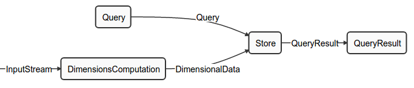
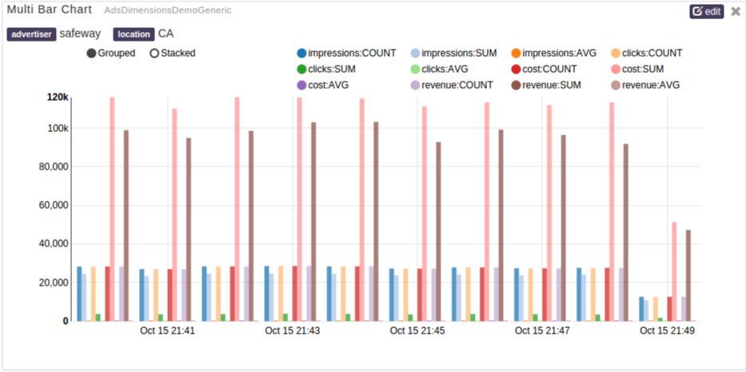

#Dimensions Computation tutorial

## About this document
The *Dimensions Computation Tutorial* contains a brief introduction of the Dimension Computation usecase. This tutorial provides detailed steps for performing dimensions computation. Additionally, this tutorial contains instructions for using DataTorrent's out-of-the-box operators to easily add dimensions computation to an application.

## Getting to know Dimensions Computations
Big data scenarios often have usecase where huge volumes of data flowing through the big data systems need to be observed for historical trends.
Big data applications will greatly benefit if they are equipped with the functionality of viewing  historical data aggregated across time buckets. The process of receiving individual events, aggregating them over a duration, and using parameters to observe trends  is called *Dimensions Computation*.


## Overview

### What is Dimensions Computation?
Dimensions Computation is a powerful mechanism that allows for spotting trends in streaming data in real-time. This tutorial will cover the concepts behind Dimensions Computation and provide details on the process of performing Dimensions Computation. We will also show you how to use Data Torrent's out of the box operators to easily add Dimensions Computation to an application.

*Dimensions Computation* provides a way for businesses to perform aggregations on configured numeric data. The *DimensionsComputation* operator works along with the *DimensionStore* operator, which provides the capability for applications to display historical data and trends.

## Key Concepts
#### Key set
A key set is a set of fields in the incoming tuple that is used to combine data for aggregation.

#### Value set
A value set is the set of fields in the incoming tuple on which *Aggregator*(s)  are applied.

#### Aggregator
An aggregator is a mathematical function that is  applied on value fields in an incoming tuple. Examples of aggregators are SUM, COUNT, MAX, MIN, and AVERAGE.

#### Aggregates
Aggregates are objects containing the aggregated values for a configured value set and key combination.

#### Time buckets
Time buckets indicate the duration for which the floor time is calculated. For example, a for a time bucket of 1 minute, the floor time-value for both * 12:**01:34** PM * and * 12:**01:59** PM * will be * 12:**01:00** PM*. Similarly, for an hourly time bucket, floor time-value for * **15**:02:34 PM* and * **15**:34:00 PM* will be * **15:00:00** PM*.

After calculating the floor value for a duration, the time-value becomes a key. Currently supported time buckets are:  1 second, 1 minute, 1 hour, and 1 day.

#### Combinations
Combinations indicate a group of the keys that are used for aggregate computations.

#### Incremental *Aggregators*
Incremental aggregators are aggregate functions for which computations are possible only by using previous aggregate value and the new value. For example,
```
SUM = {Previous_SUM} + {Current_Value}
COUNT = {Previous_COUNT}  + 1
MIN = ( {Current_Value} < {Previous_MIN} ) ? {Current_Value} : {Previous_MIN}
```

#### On-the-fly *Aggregators* (OTF Aggregators)
On-the-fly aggregators are the aggregate functions that use the result of multiple incremental aggregators, and can be calculated on-the-fly if necessary. For example,
```
AVERAGE = {Current_SUM} / {Current_COUNT}
```

#### DimensionsComputation operator
The DimensionsComputation operator  is an Operator that performs intermediate aggregations using incremental aggregators.

#### DimensionsStore operator
The DimensionsStore operator  is an Operator that performs transient and final aggregations on the data generated by the Dimensions Computations operator. It maintains the historical data for aggregates to ensure a meaningful  historical view.


## Dimensions Computation use cases
Consider the case of a digital advertising publisher who receives thousands of click events every second. The history of individual clicks and impressions doesn't divulge details about users and the advertisements. A technique for deriving meaning out of such data is to observe the total number of clicks and impressions every second, minute, hour, and day. Such a technique might be  helpful for determining global trends in the advertising system, but may not provide enough granularity for localized trends. For example, the total clicks and impressions over a duration might lack in usefulness, however, the total clicks and impressions for a particular advertiser, a particular geographical area, or a combination of the two can provide actionable insight.


## Architecture

Dimensions Computation requires 4 operators working in sync: DimensionsComputation, DimensionsStore, Query, and QueryResult. Given [DAG](#dag) is for a complete Dimensions Computation application.

The operators within Dimensions Computation are described in detail.

#### DimensionsComputation
The DimensionsComputation operator works only with incremental aggregates. The incoming data stream contains tuples that are Plain Old Java Objects (POJO), which contain data required for aggregations.
Depending on the [configuration](#configuration), the DimensionsComputation operator applies incremental aggregators on the value set of the tuple data within a boundary of an application window. At the end of the application window, the aggregate value is reset to calculate the new aggregates. Thus, discrete aggregates are generated by DimensionsComputation operator for every application window. This output is used by the DimensionStore operator (labeled as Store in [DAG](#dag)) for calculating cumulative aggregates.

#### DimensionsStore
The DimensionsStore operator uses the discrete aggregates generated by the DimensionsComputation operator to generate cumulative aggregates in turn. Because the aggregates generated by the DimensionsComputation operator are incremental aggregates, the sum of multiple such aggregates provides cumulative aggregates as follows:

```
SUM1 = SUM(Value11, Value12, ...)
SUM2 = SUM(Value21, Value22, ...)

{Cumulative_SUM} = SUM1 + SUM2
```

The DimensionsStore operator also stores transient aggregates in a persistent proprietary store called HDHT. The DimensionsStore operator uses HDHT to present the requested historical data.

#### Query
The Query operator interfaces with the *pubsub server* of *DataTorrent Gateway*. The browser creates a websocket connection with the  pubsub server hosted by DataTorrent Gateway. The Dashboard UI Widgets send queries to the pubsub server via this connection. The Query operator subscribes to the configured pubsub topic for receiving queries. These queries are parsed by the Query operator and passed onto DimensionsStore to fetch data from HDHT Store.

#### QueryResult
The QueryResult operator gets the result from the DimensionsStore operator for a given query. The results are reconstructed into a format that is understood by a widget. After the results are reconstructed into the required format, they are sent to the *pubsub server* for publishing to UI widgets.


<a link="dag">
### DAG



<a name="configuration">
## Dimensions Computation Configuration

### Configuration Definitions
The configuration of Dimensions Computation is divided into: Dimensions Computation Schema Configuration and Operator Configurations as follows:

#### Dimensions Computation Schema Configuration
The Dimensions Computation Schema provides the Dimensions Computation operator with information about the aggregations. The schema looks like this:

```json
{"keys":[{"name":"publisher","type":"string","enumValues":["twitter","facebook","yahoo"]},
         {"name":"advertiser","type":"string","enumValues":["starbucks","safeway","mcdonalds"]},
         {"name":"location","type":"string","enumValues":["N","LREC","SKY","AL","AK"]}],
 "timeBuckets":["1m","1h","1d"],
 "values":
  [{"name":"impressions","type":"long","aggregators":["SUM","COUNT","AVG"]},
   {"name":"clicks","type":"long","aggregators":["SUM","COUNT","AVG"]},
   {"name":"cost","type":"double","aggregators":["SUM","COUNT","AVG"]},
   {"name":"revenue","type":"double","aggregators":["SUM","COUNT","AVG"]}],
 "dimensions":
  [{"combination":[]},
   {"combination":["location"]},
   {"combination":["advertiser"], "additionalValues":["impressions:MIN", "clicks:MIN", "cost:MIN", "revenue:MIN", "impressions:MAX", "clicks:MAX", "cost:MAX", "revenue:MAX"]},
   {"combination":["publisher"], "additionalValues":["impressions:MIN", "clicks:MIN", "cost:MIN", "revenue:MIN", "impressions:MAX", "clicks:MAX", "cost:MAX", "revenue:MAX"]},
   {"combination":["advertiser","location"]},
   {"combination":["publisher","location"]},
   {"combination":["publisher","advertiser"]},
   {"combination":["publisher","advertiser","location"]}]
}
```

The schema configuration is a JSON string that contains the following information:
1. **keys:**
This contains the set of keys derived from an input tuple.
The *name* field stands for the name of the field from input tuple. The *type* can be defined for individual keys. The probable values for individual keys can be provided using *enumValues*.

1. **values:**
This contains the set of fields from an input tuple on which aggregates are calculated.
The *name* field stands for the name of the field from an input tuple. The *type* can be defined for individual keys. The *aggregators* can be defined separately for individual values. Only configured aggregator functions are executed on values.

1. **timeBuckets:** This can be used to specify the time bucket over which aggregations occur. Possible values for timeBuckets are ***"1m", "1h", "1d"***

1. **dimensions:** This defines the combinations of keys that are used for grouping data for aggregate calculations. This can be mentioned in *combination* with the JSON key. *additionalValues* can be used for mentioning additional aggregators for any *value*. For example, **impressions:MIN** indicates that for a given combination, calculate "*MIN*" for value "*impression*" as well.
By default, the down time rounded off to the next value as per time bucket is always considered as one of the keys.

#### Operator Configurations

Operator configurations is another set of configuration that can be used to configure individual operators.

##### Properties
1. **dt.operator.QueryResult.topic:**
This is the name of the topic on which UI widgets listen for results.
1. **dt.operator.Query.topic:**
his is the name of the topic on which Query operator listen for queries.
1. **dt.operator.QueryResult.numRetries**
This property indicates the maximum number of times the QueryResult operator should retry sending data. This value is usually high.

##### Attributes
1. **dt.operator.DimensionsComputation.attr.PARTITIONER:**
This attribute determines the number of  partitions for DimensionsComputation. Adding more partitions means data is  processed in parallel. If this attribute is not provided, a single partition is created. Refer to the [Partitioning](#partitioning) section for details on partitioning.
1. **dt.operator.DimensionsComputation.attr.MEMORY_MB:**
This attribute determines the  memory that should be assigned to the DimensionsComputations operator. If this attribute is not provided, the default value of  1 GB is used.
1. **dt.operator.Store.attr.MEMORY_MB:**
This attribute determines the memory that should be assigned to DimensionsStore operator. If this attribute is not provided, the default value of 1 GB is used.
1. **dt.port.*.attr.QUEUE_CAPACITY**
This attribute determines the number of tuples the buffer server can cache without blocking the input stream to the port. For peak activity, we  recommend increasing QUEUE_CAPACITY to a higher value such as 32000. If this attribute is not provided, the default value of 1024 is used.


## Visualizing Dimensions Computation
When Dimension Computation  is launched, the visualization of aggregates over a duration can be seen by adding a widget to a dtDashboard. dtDashboard is the self-service real-time and historical data visualization interface. Rapidly gaining insight and reducing time to action provides the greatest value to an organization. DataTorrent RTS provides self-service data visualization for the business user enabling them to not only see dashboards and reports an order of magnitude faster, but to also create and share customer reports.To derive more value out of dashboards, you can add widgets to the dashboards. Widgets are charts in addition to the default charts that you can see on the dashboard.

And example of a Dashboard UI Widget is as follows:




## Creating Dimensions Computation application

Consider an example of the advertising publisher. Typically, an advertising publisher receives a packet of information for every event related to their  advertisements.

### Sample publisher event

An event might look like this:
```java
public class AdEvent
{
  //The name of the company that is advertising
  public String advertiser;
  //The geographical location of the person initiating the event
  public String location;
  //How much the advertiser was charged for the event
  public double cost;
  //How much revenue was generated for the advertiser
  public double revenue;
  //The number of impressions the advertiser received from this event
  public long impressions;
  //The number of clicks the advertiser received from this event
  public long clicks;
  //The timestamp of the event in milliseconds
  public long time;

  public AdEvent() {}

  public AdEvent(String advertiser, String location, double cost, double revenue,
                 long impressions, long clicks, long time)
  {
    this.advertiser = advertiser;
    this.location = location;
    this.cost = cost;
    this.revenue = revenue;
    this.impressions = impressions;
    this.clicks = clicks;
    this.time = time;
  }

  /* Getters and setters go here */
}
```

### Creating an Application using out-of-the-box operators
Dimensions Computation can be created using out-of-the-box operators from the Megh and Malhar library. A sample is given below:

```java
@ApplicationAnnotation(name="AdEventDemo")
public class AdEventDemo implements StreamingApplication
{
  public static final String EVENT_SCHEMA = "adsGenericEventSchema.json";

  @Override
  public void populateDAG(DAG dag, Configuration conf)
  {
    //This loads the eventSchema.json file which is a jar resource file.
    // eventSchema.json contains the Dimensions Schema using which aggregations is configured.
    String eventSchema = SchemaUtils.jarResourceFileToString("eventSchema.json");

    // Operator that receives Ad Events
    // This can be coming from any source as long as the operator can convert the data into AdEventReceiver oject.
    AdEventReceiver receiver = dag.addOperator("Event Receiver", AdEventReceiver.class);

    //Adding Dimensions Computation operator into DAG.
    DimensionsComputationFlexibleSingleSchemaPOJO dimensions = dag.addOperator("DimensionsComputation", DimensionsComputationFlexibleSingleSchemaPOJO.class);

    // This defines the name present in input tuple to the name of the getter method to be used to get the value of the field.
    Map<String, String> keyToExpression = Maps.newHashMap();
    keyToExpression.put("advertiser", "getAdvertiser()");
    keyToExpression.put("location", "getLocation()");
    keyToExpression.put("time", "getTime()");

    // This defines value to expression mapping for value field name to the name of the getter method to get the value of the field.
    Map<String, String> valueToExpression = Maps.newHashMap();
    valueToExpression.put("cost", "getCost()");
    valueToExpression.put("revenue", "getRevenue()");
    valueToExpression.put("impressions", "getImpressions()");
    valueToExpression.put("clicks", "getClicks()");

    dimensions.setKeyToExpression(keyToExpression);
    dimensions.setAggregateToExpression(aggregateToExpression);
    dimensions.setConfigurationSchemaJSON(eventSchema);

    // This configures the unifier. The purpose of this unifier is to combine the partial aggregates from different partitions of DimensionsComputation operator into single stream.
    dimensions.setUnifier(new DimensionsComputationUnifierImpl<InputEvent, Aggregate>());

    // Add Dimension Store operator to DAG.
    AppDataSingleSchemaDimensionStoreHDHT store = dag.addOperator("Store", AppDataSingleSchemaDimensionStoreHDHT.class);

    // This configure the Backend HDHT store of DimensionStore operator. This backend will be used to persist the Historical Aggregates Data.
    TFileImpl hdsFile = new TFileImpl.DTFileImpl();
    hdsFile.setBasePath("dataStorePath");
    store.setFileStore(hdsFile);
    store.setConfigurationSchemaJSON(eventSchema);

    // This configures the Query and QueryResult operators to the gateway address. This is needs for pubsub communication of queries/results between operators and pubsub server.
    String gatewayAddress = dag.getValue(DAG.GATEWAY_CONNECT_ADDRESS);
    URI uri = URI.create("ws://" + gatewayAddress + "/pubsub");
    PubSubWebSocketAppDataQuery wsIn = dag.addOperator("Query", PubSubWebSocketAppDataQuery.class);
    wsIn.setUri(uri);
    PubSubWebSocketAppDataResult wsOut = dag.addOperator("QueryResult", PubSubWebSocketAppDataResult.class);
    wsOut.setUri(uri);

    // Connecting all together.
    dag.addStream("Query", wsIn.outputPort, store.query);
    dag.addStream("QueryResult", store.queryResult, wsOut.input);
    dag.addStream("InputStream", receiver.output, dimensions.input);
    dag.addStream("DimensionalData", dimensions.output, store.input);
  }
}
```


### Configuration for Sample Predefined Use Cases
The following configuration can be used for the predefined use case of the advertiser-publisher.

#### Dimensions Schema Configuration
```json
{"keys":[{"name":"advertiser","type":"string"},
         {"name":"location","type":"string"}],
 "timeBuckets":["1m","1h","1d"],
 "values":
  [{"name":"impressions","type":"long","aggregators":["SUM","MAX","MIN"]},
   {"name":"clicks","type":"long","aggregators":["SUM","MAX","MIN"]},
   {"name":"cost","type":"double","aggregators":["SUM","MAX","MIN"]},
   {"name":"revenue","type":"double","aggregators":["SUM","MAX","MIN"]}],
 "dimensions":
  [{"combination":[]},
   {"combination":["location"]},
   {"combination":["advertiser"]},
   {"combination":["advertiser","location"]}]
}
```

#### Operator Configuration

**Note:** This operator configuration is used for an application where the input data rate is high. To sustain the load, the Dimensions Computation operator is partitioned 8 times, and the queue capacity is increased.

```xml
<?xml version="1.0" encoding="UTF-8" standalone="no"?>
<configuration>
  <property>
    <name>dt.operator.DimensionsComputation.attr.PARTITIONER</name>
    <value>com.datatorrent.common.partitioner.StatelessPartitioner:8</value>
  </property>
  <property>
    <name>dt.operator.DimensionsComputation.attr.MEMORY_MB</name>
    <value>16384</value>
  </property>
  <property>
     <name>dt.port.*.attr.QUEUE_CAPACITY</name>
     <value>32000</value>
  </property>
  <property>
    <name>dt.operator.Query.topic</name>
    <value>AdsEventQuery</value>
  </property>
  <property>
    <name>dt.operator.QueryResult.topic</name>
    <value>AdsEventQueryResult</value>
  </property>
</configuration>
```

The above operator configuration is to be used for a highly loaded application where the input rate is quite high. To sustain the load, the Dimensions Computation operator is partitioned 8 times and the queue capacity is also increased.


## Advanced Concepts

<a link="partitioning">
### Partitioning

The Dimensions Computation operator can be statically partitioned for higher processing throughput. This can be done by adding the following attributes in the **properties.xml** file, or in the **dt-site.xml** file.

```xml
<property>
  <name>dt.operator.DimensionsComputations.attr.PARTITIONER</name>
  <value>com.datatorrent.common.partitioner.StatelessPartitioner:8</value>
</property>
```
This adds the PARTITIONER attribute. This attribute creates a StatelessPartitioner for the DimensionsComputation operator. The parameter of ***8*** is going to partition the operator 8 times.
The StatelessPartitioner ensures that the operators are clones of each other. The tuples passed to individual clones of operators are decided based on the hashCode of the tuple.

Along with partitioned DimensionsComputation, there also comes a unifier which combines all the intermediate results from individual DimensionsComputation operators into a single stream. This stream is then passed to Dimensions Store.
Following code needs to be added in populateDAG for adding an Unifier:

```java
DimensionsComputationFlexibleSingleSchemaPOJO dimensions = dag.addOperator("DimensionsComputation", DimensionsComputationFlexibleSingleSchemaPOJO.class);
dimensions.setUnifier(new DimensionsComputationUnifierImpl<InputEvent, Aggregate>());
```

Here the unifier used is *DimensionsComputationUnifierImpl* which is an out-of-the-box operator present in the DataTorrent distribution.

## Conclusion
Aggregating huge amounts of data in real time is a major challenge that many enterprises face today. Dimension Computation provides a valuable way in which to think about the problem of aggregating data, and Data Torrent provides an implementation of of Dimension Computation that allows users to integrate data aggregation with their applications with minimal effort.
