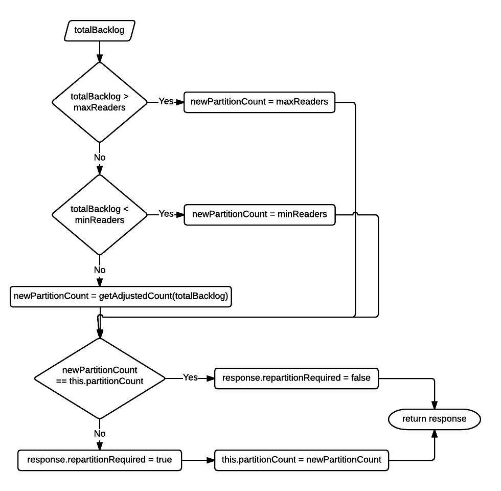

Block Reader
=============

This is a scalable operator that reads and parses blocks of data sources into records.

##Why is it needed?
Block reader is needed to parallelize reading and parsing of a single data source, for example a file. Simple parallelism of reading data sources can be achieved by multiple partitions reading different source of same type (for files see [AbstractFileInputOperator](https://github.com/apache/incubator-apex-malhar/blob/devel-3/library/src/main/java/com/datatorrent/lib/io/fs/AbstractFileInputOperator.java)) but Block reader partitions can read blocks of same source in parallel and parse it for records ensuring that no record is duplicated or missed.

##Class Diagram


##AbstractBlockReader
This is the abstract implementation that serves as the base for different types of data sources. It defines how a block metadata is processed. The flow diagram   describes the processing of a block metadata.


###Ports
- blocksMetadataInput: input port on which block metadata are received.

- blocksMetadataOutput: output port on which block metadata are emitted if the port is connected. This port is useful when a downstream operator that receives records from block reader may also be interested to know the details of the corresponding blocks.

- messages: output port on which tuples of type `com.datatorrent.lib.io.block.AbstractBlockReader.ReaderRecord`. This class encapsulates a `record` and the `blockId` of the corresponding block.

###`readerContext`
This is one of the most important field in the block reader. It is of type `com.datatorrent.lib.io.block.ReaderContext` and is responsible for fetching bytes that make a record. It also lets the reader know how many total bytes were consumed which may not be equal to the total bytes in a record.
 
Once the reader creates an input stream for the block (or uses the previous opened stream if the current block is successor of the previous block) it initializes the reader context by invoking `readerContext.initialize(stream, blockMetadata, consecutiveBlock);`. Initialize method is where any implementations of `ReaderContext` can create any state which can be used during the lifetime of reading of a block.

Once the initialization is done, `readerContext.next()` is called repeatedly until it returns `null`. It is left to the `ReaderContext` implementations to decide when a block is completely processed. In cases when a record is split across adjacent blocks, reader context may decide to read ahead of the current block boundary to completely fetch the split record (examples- `LineReaderContext` and `ReadAheadLineReaderContext`). In other cases when there isn't a possibility of split record (example- `FixedBytesReaderContext`), it returns `null` immediately when the block boundary is reached. The return type of `readerContext.next()` is of type `com.datatorrent.lib.io.block.ReaderContext.Entity` which is just a wrapper for a `byte[]` that represents the record and total bytes used in fetching the record.

###Abstract methods
- `STREAM setupStream(B block)`: Creating a stream for a block is dependent on the type of source which is not known to AbstractBlockReader. Sub-classes which deal with a specific data source provide this implementation.

- `R convertToRecord(byte[] bytes)`<a name="convertToRecord"></a>: this converts the array of bytes into the actual instance of record type.

###Auto-scalability
Block reader can auto-scale, that is, depending on the backlog (total number of all the blocks which are waiting in the 'blocksMetadataInput' port queue of all partitions) it can create more partitions or reduce them. Details are discussed in the last section which covers the [partitioner and stats-listener](#partitioning).

###Configuration
1. **maxReaders**: when auto-scaling is enabled, this controls the maximum number of block reader partitions that can be created.
2. **minReaders**: when auto-scaling is enabled, this controls the minimum number of block reader partitions that should always exist.
3. **collectStats**: this enables or disables auto-scaling. When it is set to `true` the stats (number of blocks in the queue) are collected and this triggers partitioning; otherwise auto-scaling is disabled.
4. **intervalMillis**: when auto-scaling is enabled, this specifies the interval at which the reader will trigger the logic of computing the backlog and auto-scale.

##<a name="AbstractFSBlockReader"></a>AbstractFSBlockReader
This abstract implementation deals with files. Different types of file systems that are implementations of hadoop's `org.apache.hadoop.fs.FileSystem` are supported. The user can override `getFSInstance()` method to create an instance of a specific `FileSystem`. By default, filesystem instance is created from the filesytem uri that comes from the default hadoop configuration.

```java
  protected FileSystem getFSInstance() throws IOException
  {
    return FileSystem.newInstance(configuration);
  }
```
It uses this filesystem instance to setup a stream of type `org.apache.hadoop.fs.FSDataInputStream` to read the block.

```java
  @Override
  protected FSDataInputStream setupStream(BlockMetadata.FileBlockMetadata block) throws IOException
  {
    return fs.open(new Path(block.getFilePath()));
  }
```
All the ports and configurations are derived from the super class. It doesn't provide implementation of [`convertToRecord(byte[] bytes)`](#convertToRecord) method which is delegated to concrete sub-classes.

###Example Application
This simple dag demonstrates how any concrete implementation of `AbstractFSBlockReader` can be plugged into an application. 


In the above application, file splitter creates block metadata for files which are sent to block reader. Block reader parses the file blocks for records which are filtered, transformed and then persisted to a file (created per block). Therefore block reader is parallel partitioned with the 2 downstream operators - filter/converter and record output operator. 

```java
public class ExampleApplication implements StreamingApplication
{
  @Override
  public void populateDAG(DAG dag, Configuration configuration)
  {
    FileSplitterInput input = dag.addOperator("File-splitter", new FileSplitterInput());
    //any concrete implementation of AbstractFSBlockReader based on the use-case can be added here.
    LineReader blockReader = dag.addOperator("Block-reader", new LineReader());
    Filter filter = dag.addOperator("Filter", new Filter());
    RecordOutputOperator recordOutputOperator = dag.addOperator("Record-writer", new RecordOutputOperator());

    dag.addStream("file-block metadata", input.blocksMetadataOutput, blockReader.blocksMetadataInput);
    dag.addStream("records", blockReader.messages, filter.input);
    dag.addStream("filtered-records", filter.output, recordOutputOperator.input);
  }

  /**
   * Concrete implementation of {@link AbstractFSBlockReader} for which a record is a line in the file.
   */
  public static class LineReader extends AbstractFSBlockReader.AbstractFSReadAheadLineReader<String>
  {

    @Override
    protected String convertToRecord(byte[] bytes)
    {
      return new String(bytes);
    }
  }

  /**
   * Considers any line starting with a '.' as invalid. Emits the valid records.
   */
  public static class Filter extends BaseOperator
  {
    public final transient DefaultOutputPort<AbstractBlockReader.ReaderRecord<String>> output = new DefaultOutputPort<>();
    public final transient DefaultInputPort<AbstractBlockReader.ReaderRecord<String>> input = new DefaultInputPort<AbstractBlockReader.ReaderRecord<String>>()
    {
      @Override
      public void process(AbstractBlockReader.ReaderRecord<String> stringRecord)
      {
        //filter records and transform
        //if the string starts with a '.' ignore the string.
        if (!StringUtils.startsWith(stringRecord.getRecord(), ".")) {
          output.emit(stringRecord);
        }
      }
    };
  }

  /**
   * Persists the valid records to corresponding block files.
   */
  public static class RecordOutputOperator extends AbstractFileOutputOperator<AbstractBlockReader.ReaderRecord<String>>
  {
    @Override
    protected String getFileName(AbstractBlockReader.ReaderRecord<String> tuple)
    {
      return Long.toHexString(tuple.getBlockId());
    }

    @Override
    protected byte[] getBytesForTuple(AbstractBlockReader.ReaderRecord<String> tuple)
    {
      return tuple.getRecord().getBytes();
    }
  }
}
```
Configuration to parallel parttion block reader with its downstream operators.

```xml
  <property>
    <name>dt.operator.Filter.port.input.attr.PARTITION_PARALLEL</name>
    <value>true</value>
  </property>
  <property>
    <name>dt.operator.Record-writer.port.input.attr.PARTITION_PARALLEL</name>
    <value>true</value>
  </property>
```
##AbstractFSReadAheadLineReader
This extension of [`AbstractFSBlockReader`](#AbstractFSBlockReader) parses lines from a block and binds the `readerContext` field to an instance of `ReaderContext.ReadAheadLineReaderContext`.

It is abstract because it doesn't provide implementation of [`convertToRecord(byte[] bytes)`](#convertToRecord) since the user may want to convert the bytes that make a line into some other type. 

###ReadAheadLineReaderContext
In order to handle a line split across adjacent blocks, ReadAheadLineReaderContext always reads beyond the block boundary and ignores the bytes till the first end-of-line character of all the blocks except the first block of the file. This ensures that no line is missed or incomplete.

This is one of the most common way of handling a split record. It doesn't require any further information to decide if a line is complete. However the cost of this consistent way to handle line split is that it always reads from the successive block.

##AbstractFSLineReader
Similar to `AbstractFSReadAheadLineReader`, even this parses lines from a block. However, it binds the `readerContext` field to an instance of `ReaderContext.LineReaderContext`.

###LineReaderContext
This handles the line split differently from `ReadAheadLineReaderContext`. It doesn't always read from the successive block. If the end of the last line is aligned with the block boundary then it stops processing the block. It does read from the successive block when the boundaries are not aligned, that is, last line extends beyond the block boundary. The result of this is an inconsistency in reading the successive block.

When the boundary of the last line of the previous block was aligned with its block, then the first line of the current block is a valid line. However, in the other case the bytes from the block start offset to the first end-of-line character needs to be ignored. Therefore, this means that any record formed by this reader context has to be validated. For example, if the lines are of fixed size then size of each record can be validated or if each line begins with a special field then that knowledge can be used to check if a record is complete.

If the validations of completeness fails for a line then [`convertToRecord(byte[] bytes)`](#convertToRecord) should return null.

##FSSliceReader
A concrete extension of [`AbstractFSBlockReader`](#AbstractFSBlockReader) that reads fixed-size `byte[]` from a block and emits the byte array wrapped in `com.datatorrent.netlet.util.Slice`.

This operator binds the `readerContext` to an instance of `ReaderContext.FixedBytesReaderContext`.

###FixedBytesReaderContext
This implementation of `ReaderContext` never reads beyond a block boundary which can result in the last `byte[]` of a block to be of a shorter length than the rest of the records.

###Configuration
1. **readerContext.length**: length of each record. By default, this is initialized to the default hdfs block size.

##<a name="partitioning"></a>Partitioner and StatsListener
The logical instance of the block reader acts as the Partitioner (unless a custom partitioner is set using the operator attribute - `PARTITIONER`) as well as a StatsListener. This is because the 
`AbstractBlockReader` implements both the `com.datatorrent.api.Partitioner` and `com.datatorrent.api.StatsListener` interfaces and provides an implementation of `definePartitions(...)` and `processStats(...)` which make it auto-scalable.

###<a name="processStats"></a>`Response processStats(BatchedOperatorStats stats)`
The application master invokes this method on the logical instance with the stats (`tuplesProcessedPSMA`, `tuplesEmittedPSMA`, `latencyMA`, etc.) of each partition. The data which this operator is interested in is the `queueSize` of the input port `blocksMetadataInput`.

Usually the `queueSize` of an input port gives the count of waiting control tuples plus data tuples. However, if a stats listener is interested only in the count of data tuples then that can be expressed by annotating the class with `@DataQueueSize`. In this case `AbstractBlockReader` itself is the `StatsListener` which is why it is annotated with `@DataQueueSize`.

The logical instance caches the queue size per partition and at regular intervals (configured by `intervalMillis`) sums these values to find the total backlog which is then used to decide whether re-partitioning is needed. The flow-diagram below describes this logic.


The goal of this logic is to create as many partitions within bounds to quickly reduce this backlog or if the backlog is small then remove any idle partitions.

###`Collection<Partition<AbstractBlockReader<...>>> definePartitions(Collection<Partition<AbstractBlockReader<...>>> partitions, PartitioningContext context)`
Based on the `repartitionRequired` field of the `Response` object which is returned by [`processStats(...)`](#processStats) method, the application master invokes `definePartitions(...)` on the logical instance which is also the partitioner instance. 

The implementation here calculates the difference between required partitions and the existing count of partitions. If this difference is negative then equivalent number of partitions are removed otherwise new partitions are created. 


 
