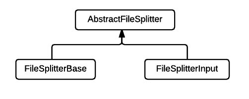
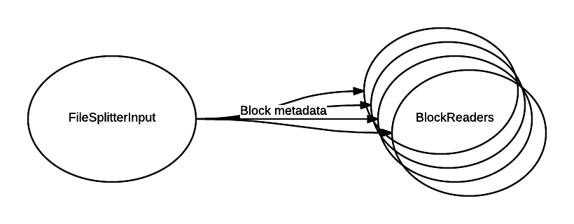

File Splitter
===================

This is a simple operator whose main function is to split a file virtually and create metadata describing the files and the splits. 

##Why is it needed?
It is a common operation to read a file and parse it. This operation can be parallelized by having multiple partitions of such operators and each partition operating on different files. However,  at times when a file is large then a single partition reading it can become a bottleneck.
In these cases, throughput can be increased if instances of the partitioned operator can read and parse non-overlapping sets of file blocks. This is where file splitter comes in handy. It creates metadata of blocks of file which serves as tasks handed out to downstream operator partitions. 
The downstream partitions can read/parse the block without the need of interacting with other partitions.

##Hierarchy


##AbstractFileSplitter
The abstract implementation defines the logic of processing `FileInfo`. This comprises of following tasks -  

- building `FileMetadata` per file and emitting it. This metadata contains the file information such as filepath, no. of blocks in it, length of the file, all the block ids, etc.
  
- creating `BlockMetadataIterator` from `FileMetadata`. The reason to create an iterator for block metadata is because the no. of blocks in a file can be huge if the block size is small. Therefore holding all the blocks in memory may cause out of memory errors.
 
- retrieving `BlockMetadata.FileBlockMetadata` from the block metadata iterator and emitting it. The FileBlockMetadata contains the block id, start offset of the block, length of file in the block, etc. The number of block metadata emitted per window are controlled by `blocksThreshold` setting which by default is 1.  

The main utility method that performs all the above tasks is the `process()` method. Concrete implementations can invoke this method whenever they have data to process.

###Abstract methods

- `getFileInfo()`: called from within the `process()` and provides the next file to process.  
```java
  protected void process()
  {
    if (blockMetadataIterator != null && blockCount < blocksThreshold) {
      emitBlockMetadata();
    }

    FileInfo fileInfo;
    while (blockCount < blocksThreshold && (fileInfo = getFileInfo()) != null) {
      if (!processFileInfo(fileInfo)) {
        break;
      }
    }
  }
```
- `getDefaultBlockSize()`: provides the block size which is used when user hasn't configured the size.

- `getFileStatus(Path path)`: provides the `org.apache.hadoop.fs.FileStatus` instance for a path.  

###Ports
Declares only output ports on which file metadata and block metadata are emitted.

- filesMetadataOutput: metadata for each file is emitted on this port. 
- blocksMetadataOutput: metadata for each block is emitted on this port.  

###Configuration
1. **blockSize**: size of a block.
2. **blocksThreshold**<a name="blocksThreshold"></a>: threshold on the number of blocks emitted by file splitter every window. This setting is used for throttling the work for downstream operators.


##FileSplitterBase
Simple operator that receives tuples of type `FileInfo` on its `input` port. `FileInfo` contains the information (currently just the file path) about the file which this operator uses to create file metadata and block metadata.
###Example application


###Ports
Declares an input port on which it receives tuples from upstream operator. Output ports are inherited from AbstractFileSplitter.
 
- input: non optional port on which tuples of type `FileInfo` are received.

###Configuration
1. **file**: path of the file from which the filesystem is inferred. FileSplitter creates an instance of `org.apache.hadoop.fs.FileSystem` which is why this path is needed.  
```
FileSystem.newInstance(new Path(file).toUri(), new Configuration());
```
The fs instance is then used to fetch the default block size and `org.apache.hadoop.fs.FileStatus` for each file path.

##FileSplitterInput
This is an input operator that discovers files itself. The scanning of the directories is asynchronous which is handled by `TimeBasedDirectoryScanner`. The function of TimeBasedDirectoryScanner is to periodically scan specified directories and find files which were newly added or modified. The interaction between the operator and the scanner is depicted in the diagram below.


###Example application


###Ports
Since it is an input operator there are no input ports and output ports are inherited from AbstractFileSplitter.

###Configuration
1. **scanner**: the component that scans directories asynchronously. It is of type `com.datatorrent.lib.io.fs.FileSplitter.TimeBasedDirectoryScanner`. The basic implementation of TimeBasedDirectoryScanner can be customized by users.  
  a. files: comma separated list of directories to scan.  
  b. recursive: flag that controls whether the directories should be scanned recursively.  
  c. scanIntervalMillis: interval specified in milliseconds after which another scan iteration is triggered.  
  d. filePatternRegularExp: regular expression for accepted file names.  
  e. trigger: a flag that triggers a scan iteration instantly. If the scanner thread is idling then it will initiate a scan immediately otherwise if a scan is in progress, then the new iteration will be triggered immediately after the completion of current one.
2. **idempotentStorageManager**: by default FileSplitterInput is idempotent. 
Idempotency ensures that the operator will process the same set of files/blocks in a window if it has seen that window previously, i.e., before a failure. For eg. let's say the operator completed window 10 and failed somewhere between window 11. If the operator gets restored at window 10 then it will process the same file/block again in window 10 which it did in the previous run before the failure. Idempotency is important but comes with higher cost because at the end of each window the operator needs to persist some state with respect to that window. Therefore, if one doesn't care about idempotency then they can set this property to be an instance of `com.datatorrent.lib.io.IdempotentStorageManager.NoopIdempotentStorageManager`.


