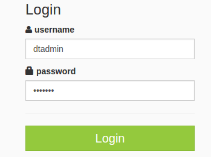

Introduction
============
The Top N words application handbook is a tutorial on building a word counting
application using:

-   The Apache  Apex (Apex)
    streaming platform
-   Malhar, an associated library of operators

-   Other related tools

Note: Before you begin, ensure that you have internet connectivity
because, in order to complete this tutorial, you will need to download
the Apex and Malhar code.

The Top N words application monitors an input directory for new
files. When the application detects a new file, it reads its lines,
splits them into words, and computes the word-frequency for that specific file,
as well as across all files that are processed. The top N words (by
frequency) and their frequencies are output to a corresponding file in
an output directory. Simultaneously, the word-frequency pairs are also
updated on **dtDashboard**   the browser-based dashboard of DataTorrent RTS.

A simple word counting exercise was chosen because the goal of this tutorial is to focus on the use of:

-   The Apex platform
-   The operator library
-   The tools required for developing and deploying
    applications on a cluster
-   **dtcli** &ndash; the command-line tool for managing
    application packages and the constituent applications
-   **dtManage** &ndash; for monitoring the applications
-   **dtDashboard** &ndash; for visualizing the output
-   **dtAssemble** &ndash; for  visual application assembly

In the context of such an application, a number of questions arise:

-   What operators do we need ?
-   How many are present in the Malhar library ?
-   How many need to be written from scratch ?
-   How are operators wired together ?
-   How do we monitor the running application ?
-   How do we display the output data in an aesthetically pleasing way ?

The answers to these and other questions are explored in the sections below.

For this tutorial, use the Data Torrent RTS Sandbox; it comes pre-installed
with Apache Hadoop and DataTorrent RTS 3.1.1 configured as a single-node
cluster and includes a time-limited enterprise license. If you've already installed the RTS Enterprise Edition (evaluation or production license), you
can use that setup instead.

---

Setting up your development environment
=======================================
This section describes how you can set up your development environment
including starting the sandbox and downloading some sample input files for
testing the application.

Sample input files
------------------
For this tutorial, you need some sample text files to use as input application.
Binary files such as PDF or DOCX files are not suitable since they contain a
lot of meaningless strings that look like words (for example,  Wqgi ).
Similarly, files using markup languages such as XML or HTML files are also not
suitable since the tag names such as  div ,  td  and  p  dominate the word
counts. The RFC (Request for Comment) files that are used as de-facto
specifications for internet standards are good candidates since they contain
pure text; download a few of them as follows:

Open a terminal and run the following commands to create a directory named
`data` under your home directory and download 3 files there:

    cd; mkdir data; cd data  
    wget http://tools.ietf.org/rfc/rfc1945.txt  
    wget https://www.ietf.org/rfc/rfc2616.txt  
    wget https://tools.ietf.org/rfc/rfc4844.txt

Validation for third-party applications
---------------------------------------

If you are using your own installation of DataTorrent RTS instead
of Sandbox, make sure that you have Java JDK (version 1.7.0\_79 or
later), Maven (version 3.0.5 or later), and Git (version 1.7.1 or later)
by running the following commands:

<table>
<colgroup>
<col width="22%" />
<col width="78%" />
</colgroup>
<tbody>
<tr class="odd">
<td align="left">
<b>Command</b>
</td>
<td align="left">
<b>Expected output</b>
</td>
</tr>
<tr class="even">
<td align="left">
<tt>java -version</tt>
</td>
<td align="left">
java version &quot;1.7.0_79&quot;

Java(TM) SE Runtime Environment (build 1.7.0_79-b15) 

Java HotSpot(TM) 64-Bit Server VM (build 24.79-b02, mixed mode)
</td>
</tr>
<tr class="odd">
<td align="left">
<tt>mvn --version</tt>
</td>
<td align="left">
Apache Maven 3.0.5 

Maven home: /usr/share/maven 

Java version: 1.7.0_79, vendor: Oracle Corporation 

Java home: /home/&lt;user&gt;/Software/java/jdk1.7.0_79/jre 

Default locale: en_US, platform encoding: UTF-8 

OS name: &quot;linux&quot;, version: &quot;3.16.0-44-generic&quot;, arch: &quot;amd64&quot;, family: &quot;unix&quot; 
</td>
</tr>
<tr class="even">
<td align="left">
<tt>git --version</tt>
</td>
<td align="left">
git version 1.7.1
</td>
</tr>
</tbody>
</table>

------------------------------------------------------------------------

Set up the sandbox
--------------
At the time of writing, the sandbox corresponds to version 3.1.1 of DataTorrent
RTS, which, as noted above, includes a complete, stand-alone, instance of the
Enterprise Edition configured as a single-node Hadoop cluster.

Before you begin, ensure that you have Oracle VM VirtualBox version 4.3 or
later on your development machine. The sandbox is a virtual appliance bundled
along with Ubuntu 12.0.4 (or later) that needs to be imported into VirtualBox.

These steps describe how to download, import, and start the sandbox.

1.  Download Sandbox:
    1. Open <https://www.datatorrent.com/download/> in a web browser.
    2. Under _DataTorrent RTS Sandbox_, click **DOWNLOAD NOW** button.
    3. On the contact details form that appears, provide your name, email, and
       your organization s name, and click _Submit_.
    4. Click the link named _click here_ (scroll the page down if necessary to
       see the link).
    5. On the Sandbox downloads page that appears, click **Download** under
        _Requirements_.

2. Import the sandBox into Oracle VirtualBox:
    1. Open the VirtualBox Manager.
    2. In the _File_ menu, choose _Import Appliance_.  
    3. On the _Appliance to import_ dialog box, type or select the full path to
        the OVA template file that you downloaded and click _Next_.
    4. Click _Import_.

3. After the import completes, click the `Start` button on the VirtualBox
    Manager. If this is a first-time start, select the default operating
    system and wait till the virtual machine initializes.

    After the virtual machine initializes, wait for a few minutes to allow all
    Hadoop and Sandbox processes to start.

4. Log on to Sandbox.

    1. In the browser that appears displaying the Readme, click DataTorrent
        Console. You can also click the **DataTorrent Console** button on the toolbar of your virtual machine.

    1. Type the username and password (dtadmin/dtadmin), and click **Login**.

You should see a welcome page with a diagram illustrating the components in the
platform stack; each block of the diagram is a clickable link for exploring
that component.

Validate the Sandbox setup
--------------------------
After setting up the sandbox, validate the installation:

1.  On the top navigation bar, look for links named _Configure_, _Develop_,
   _Monitor_, _Visualize_ and _Learn_.

2.  If Visualize is not present, click _Configure_, and then _License
    Information_.

  A page showing license details including the text: _License Edition:
  enterprise_ appears.

+ If the license details display   _community_ instead of _enterprise_, wait
  for a few minutes, refresh the page, and check again.
+ If that does not work, navigate to the other tabs, and repeat these steps
  again. The license edition should be _enterprise_ and you should see the
  _Visualize_ link on the top navigation bar.

Note: The enterprise license is present on the Hadoop HDFS file system. To
retrieve details of this license, the HDFS servers need to be up and running,
which can take a few minutes.
