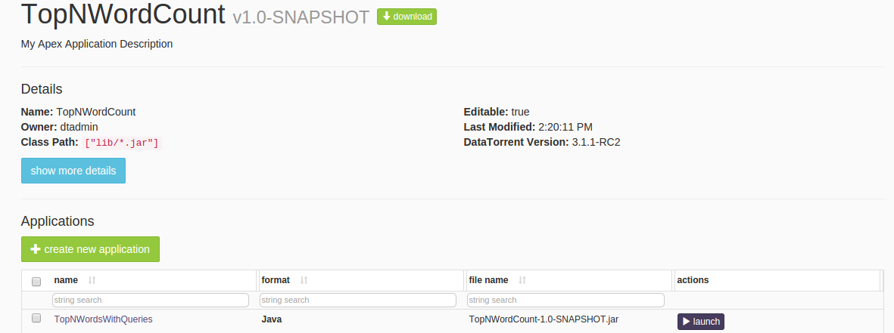
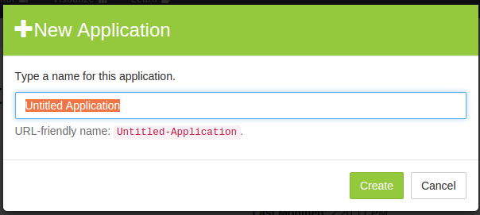
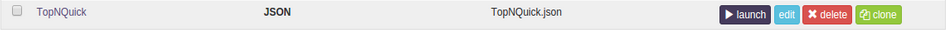
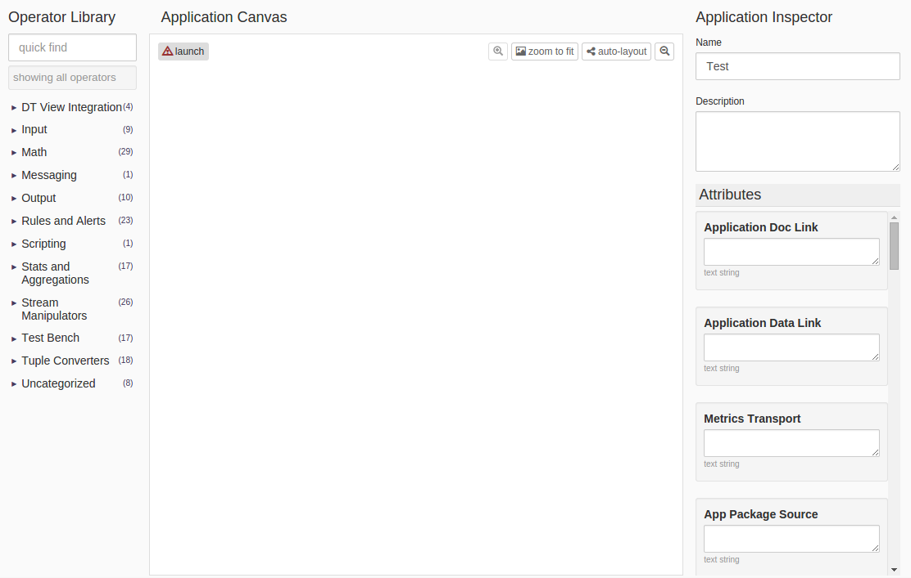
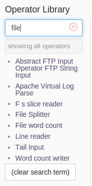
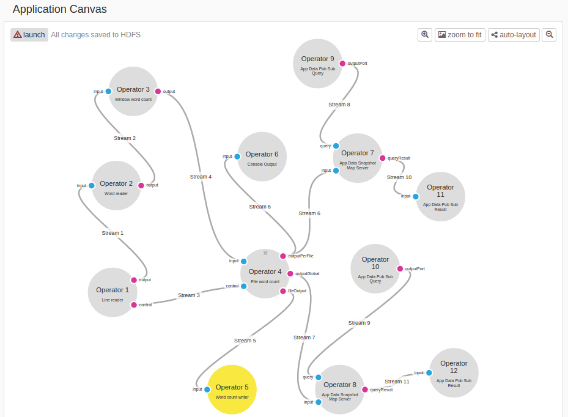
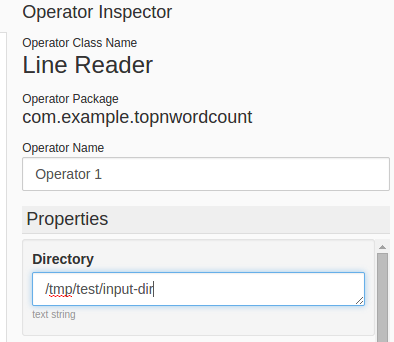
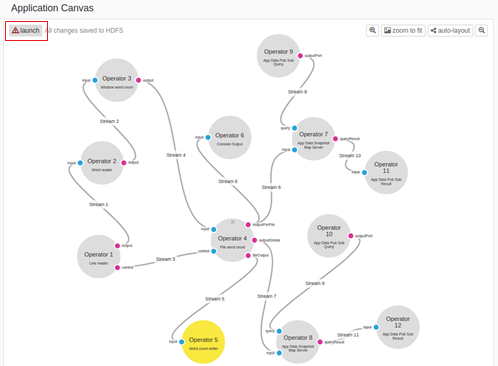
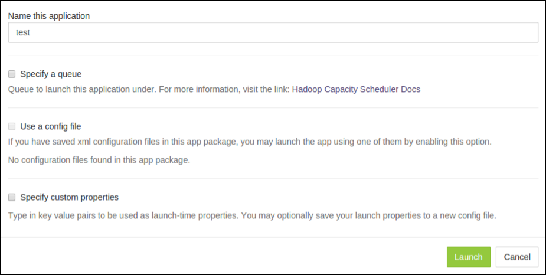
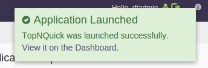

Building top N words using dtAssemble
===
You can build top N words using dtAssemble &ndash; the graphical drag-and-drop
application builder.

_Note_: This tool is not available with the Community edition license.

Using the application builder, you can manually drag and drop participating operators on to the application canvas and connect them to build the DAG for
the top N words application. You can move the application canvas in any
direction using your mouse. You can also try the auto-layout and zoom-to-fit
buttons at the top-right of the canvas to create an initial arrangement.

_Note_: You cannot undo the auto-layout or zoom-to-fit operations.

Prerequisites

To use **dtAssemble**, you should have uploaded an application package that
contains all the operators you intend to use. The new application will reside
in that package. For this exercise, we will use the package that you built and
uploaded in the earlier chapter.

To ensure that the full complement of sandbox resources are available for
running the current application, ensure that no other applications are running
by clicking the _Monitor_ tab, and under _DataTorrent Applications_, kill any
running applications.

Step I: Create top N words using dtAssemble
---

1. Log on to the DataTorrent RTS console (default username and password are
   both `dtadmin`).
2. On the DataTorrent RTS console, click _Develop_ &#x21e8; _App Packages_.
3. Make sure that the top N words package that you built following the
   instructions of the previous chapter is uploaded.
4. Click _TopNWordCount_ in the name column to see the application details.
  
5. Click _create new application_ button.
  
6. Type a name for your application, for example, _Top N words_, and click
   _Create_. The **Application Canvas** should open.

The existing application is a JAVA application. Applications that you create
using dtAssemble are JSON applications. For each JSON application, there are
three additional buttons that allow editing, deleting, and cloning operations.
These operations are not supported for JAVA applications.

Step II: Drag operators to the application canvas
---

1. Wait till the Application Canvas opens.
  
2. From the Operator Library list on the left, locate the desired
   operators by either:
3. Exploring the categories.

    -or-

4. Using the _quick find_ feature by typing the first few letters of the name of
   the implementing class or related terms in the search box. For example, to
   find the file reader, type _file_  into the search box to see a list of
   matching operators. For example, the first operator is _LineReader_.
    
4. Drag the operator onto the canvas.
5. Repeat this process for all the operators described in Appendix entitled
    _Operators in Top N words application_, and arrange them on the canvas.
6. To magnify or shrink the operators, use the buttons in the top-right corner.
   You can also use the scroll wheel of your mouse to zoom in or out. The
   entire canvas can also be moved in any direction with the mouse.

Step III: Connect the operators
---

Observe that each operator shows output ports in pink and input ports in blue.
The names of the operators and the corresponding JAVA classes are also shown.
You can change the operator name by clicking it, and then changing the name in
the Operator Name box in the Operator Inspector panel.

Connect the operators as shown in the diagram below. Note the following points about
the _FileWordCount_ operator which has the largest number of connections:

- The control port is connected to the control port of _LineReader_.
- The input port is connected to the output port of _WindowWordCount_.
- The _fileOutput_ port emits the final top N pairs to the corresponding
  output file and so is connected to the input port of _WordCountWriter_.
- The _outputGlobal_ port emits the global top N pairs and so is connected to
  the input port of _AppDataSnapshotMapServer_.
- The _outputPerFile_ port emits the top N pairs for the current file (while
  the file is still being read) and so it is connected to _ConsoleOutput_ as
  well as to _AppDataSnapshotMapServer_.

_Note_: As you make changes, the top left corner displays _All
changes saved to HDFS_. No explicit save step is needed.

After you connect all the operators, the canvas looks like this.
Although presented differently, it is the same as the logical DAG for
the Java application.

Step IV: Configure the operator properties
---
The last step before running this application is to configure
properties of the operators.

1. Click the first operator (_LineReader_) in the canvas to see the list of
   configurable properties in the right panel.
2. Locate the property labelled _Directory_ and enter the path to the input
   directory: `/tmp/test/input-dir`:

    

3. Configure the properties of the remaining operators using this table for
   reference. The table contains the same values that we set in the properties
   file for the Java application.

    <table>
    <colgroup>
    <col width="10%" />
    <col width="30%" />
    <col width="60%" />
    </colgroup>
    <tbody>
    <tr class="odd">
    <td align="left">
**Operator**
</td>
    <td align="left">
**Property Name**
</td>
    <td align="left">
**Value**
</td>
    </tr>
    <tr class="even">
    <td align="left">
5
</td>
    <td align="left">
File Path
</td>
    <td align="left">
/tmp/test/output-dir
</td>
    </tr>
    <tr class="odd">
    <td align="left">
2
</td>
    <td align="left">
Non Word Str
</td>
    <td align="left">
[\p{Punct}\s]+
</td>
    </tr>
    <tr class="even">
    <td align="left">
9
</td>
    <td align="left">
Topic
</td>
    <td align="left">
TopNWordsQueryFile
</td>
    </tr>
    <tr class="odd">
    <td align="left">
10
</td>
    <td align="left">
Topic
</td>
    <td align="left">
TopNWordsQueryGlobal
</td>
    </tr>
    <tr class="even">
    <td align="left">
11
</td>
    <td align="left">
Topic
</td>
    <td align="left">
TopNWordsQueryFileResult
</td>
    </tr>
    <tr class="odd">
    <td align="left">
12
</td>
    <td align="left">
Topic
</td>
    <td align="left">
TopNWordsQueryGlobalResult
</td>
    </tr>
    <tr class="even">
    <td align="left">
7, 8
</td>
    <td align="left">
Snapshot Schema JSON
</td>
    <td align="left">
{ &quot;values&quot;: [{&quot;name&quot;: &quot;word&quot;, &quot;type&quot;: &quot;string&quot;},

    
{&quot;name&quot;: &quot;count&quot;, &quot;type&quot;: &quot;integer&quot;}] }
</td>
    </tr>
    <tr class="odd">
    <td align="left">
4
</td>
    <td align="left">
Top N
</td>
    <td align="left">
10
</td>
    </tr>
    </tbody>
    </table>

4. Click Stream 8 and Stream 9, and change _Stream Locality_ from
  `AUTOMATIC` to `CONTAINER_LOCAL` to match our earlier properties file.
  After you perform this step, the line for the stream will change
  from a solid line to a dotted line.

5. Click the blank area of the canvas to see the
   application attributes in the right panel. Scroll to _Master Memory Mb_, and
   change its value to 500.

6. Click each operator, navigate to the _Memory Mb_ attribute in the
   _Attributes_ section, and change the value to 200 except for _Operator
    4_ for which the value is 512.

7. Click _launch_ in the top-left corner. _Note_: Before launching the
   application, shut down the IDE; if it is running at the time of a launch,
   the sandbox might hang due to resource exhaustion.
  

8. On the launch application dialog window, type a name for your application.
  

9. (Optional) To configure the application using a configuration file, select
    _Use a config file_ checkbox. To specify individual properties, select
    _Specify custom properties_ checkbox.
10.  Click _Launch_.

A transient pop-up at the top-right indicating that the launch was successful
should appear.

After a successful launch, monitor the application following
instructions in the Chapter entitled _Monitoring with dtManage_.
