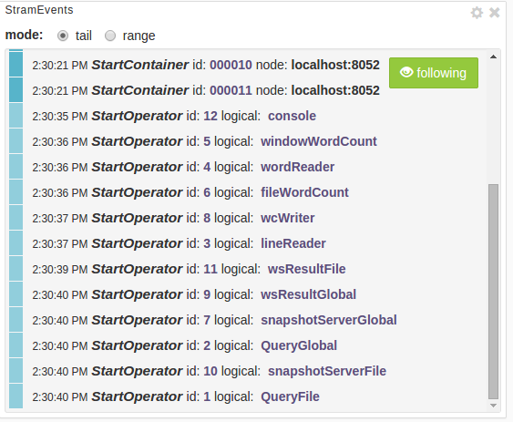
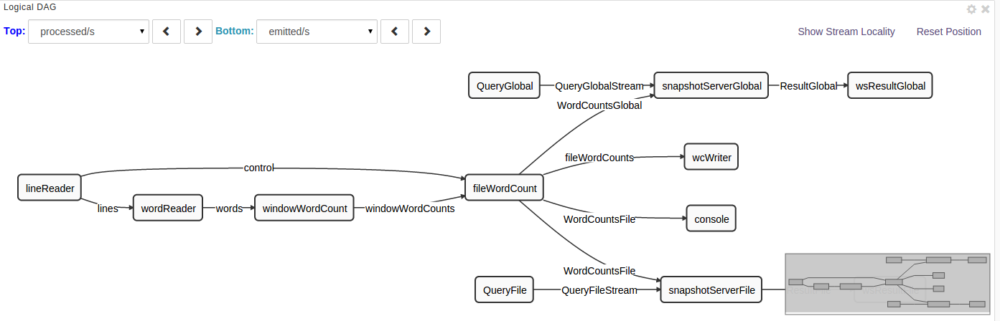
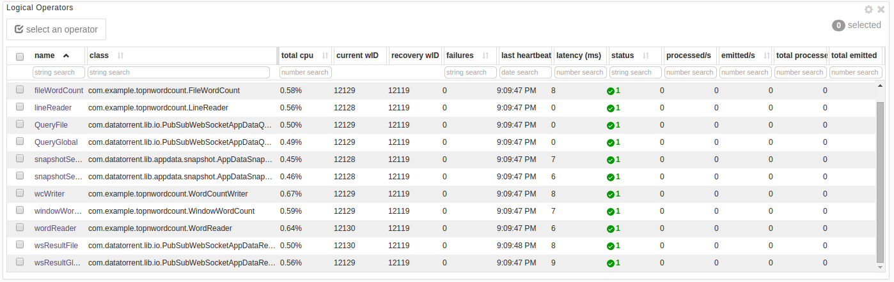
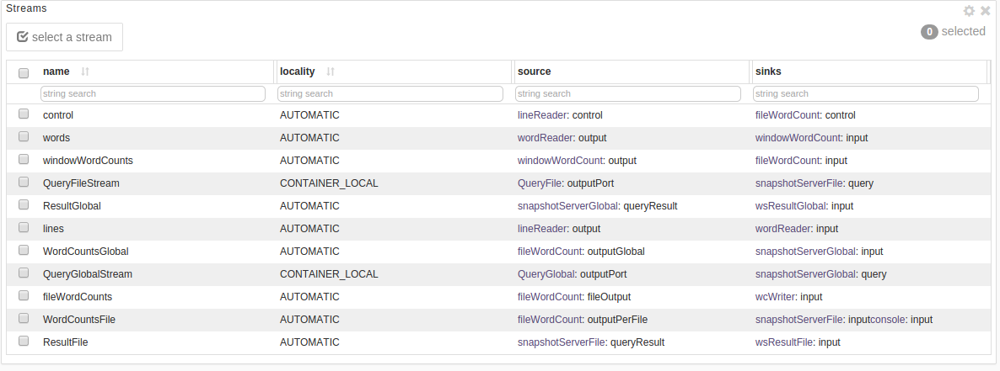
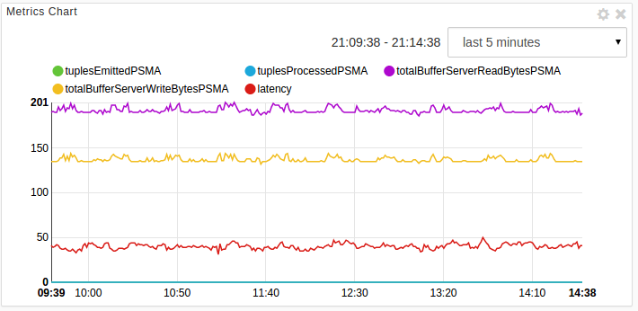
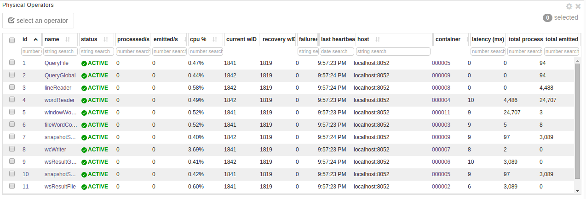
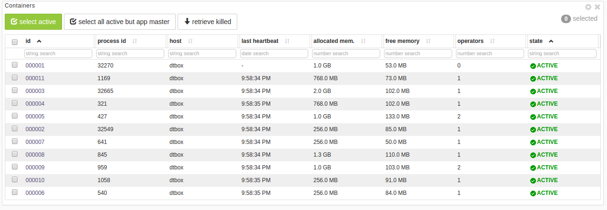

Monitoring top N words using dtManage
===
**dtManage** is an invaluable tool for monitoring the state of a running
application as well as for troubleshooting problems.

Monitor the Application
---
To monitor the top N words application

1. Log on to the Datatorrent Console (the default username and password
   are both `dtadmin`).
2. On the top navigation bar, click _Monitor_.
3. Under _Datatorrent Applications_, check if the application started.
4. Wait till the state entry changes to **RUNNING**.
4. Click _TopNWordsWithQueries_ to see a page with four tabs: _logical_,
   _physical_, _physical-dag-view_, and _metric-view_.
5.  Under _StramEvents_, ensure that all the operators have started.
    

DAGs and widgets
---
When monitoring an application, the logical view is selected by default, with
the following six panels, also called widgets: _Stram Events_, _Application
Overview_, _Logical DAG_, _Logical Operators_, _Streams_, and _Metrics Chart_.
These panels can be resized, moved around, configured (using the gear wheel
icon in the top-right corner), or removed (using the delete button in the
top-right corner).

Logical view and associated widgets (panels)

This section describes the widgets that you see when you select the logical
tab.

**Stram Events**

As shown in the screenshot above, this panel shows the lifecycle events of all
the operators. If one of the operators fails, a white button labelled _details_
appears next to the event; click on it for additional details about the
failure.

**Application Overview**

This panel displays application properties such as state, number of operators,
allocated memory, and the number of tuples processed. You can use the kill
button to terminate the application. The _visualize_ button allows you to
create one or more custom dashboards to visualize the application output.

**Logical DAG**

The logical DAG illustrates operators and their interconnections. You can
customize the logical DAG view by selecting operator properties that are
displayed above and below each operator.

To customize these properties

1. Click an operator for which you want to display additional details.
2. To display a detail on the top of this operator, click the Top list and
   select a metric.
3. To display a detail at the bottom of this operator, click the Bottom list
   and select a metric.

**Logical Operators**

This panel displays a table with detailed information about each operator such
as its name, the associated JAVA class, the number of tuples processed, and
the number of tuples emitted.

**Streams**

This panel displays details of each stream such as the name, locality, source,
and sinks.

**Metrics Chart**

This panel displays the number tuples processed and the number of bytes
processed by some internal components. Since this application has not processed
any tuples so far (no input file was provided), the green and blue lines
coincide with the horizontal axis:

Physical view and associated widgets

The physical tab displays the _Application Overview_ and _Metrics Chart_
discussed above along with additional panels: _Physical Operators_ and
_Containers_. The _Physical Operators_ table shows one row per physical
operator. When partitioning is enabled, some operators can be replicated to
achieve better resource utilization and hence better throughput so a single
logical operator may correspond to multiple physical operators.

**Physical Operators**

**Containers**

For each operator, a crucial piece of information is the process
(the Java Virtual Machine) running that operator. It is also called a
container, and shown in a column with that name. Additional information about
the container (such as the host on which it is running) can be gleaned from the
matching row in the _Containers_ table.

If the state of all the physical operators and containers is **ACTIVE**
and green   this is a healthy state. If the memory requirements for all the
operators in the application exceeds the available memory in the cluster,
you'll see these status values changing continually from ACTIVE to PENDING.
This is an unhealthy state and, if it does not stabilize, your only option is
to kill the application and reduce the memory needs or acquire more cluster
resources.

The physical-dag-view

The _physical-dag-view_ tab displays the Physical DAG widget, which
shows all the partitioned copies of operators and their interconnections.

The metric-view

The metric-view tab displays only the _Metrics Chart_ widget.

View application logs
---
When debugging applications, we are often faced with the task of examining
log files. This can be cumbersome, especially in a distributed environment
where logs can be scattered across multiple machines. **dtManage** simplifies
this task by making all relevant logs accessible from the console.

For example, to examine logs for the _FileWordCount_ operator, go to the physical
tab of the application monitoring page and check the physical operator table to
find the corresponding container. An example value might be 000010.

The numeric values in the _container_ column are links that open a page
containing a table of all physical operators running in that container.
In the _Container Overview_ panel, you should see a blue _logs_ dropdown
button; click on it to see a menu containing three entries: `dt.log`, `stderr`,
and `stdout`.

All messages output using **log4j** classes will appear in `dt.log`
whereas messages written directly to the standard error or standard
output streams will appear in the other two entries. Choose the entry
you want to view.
