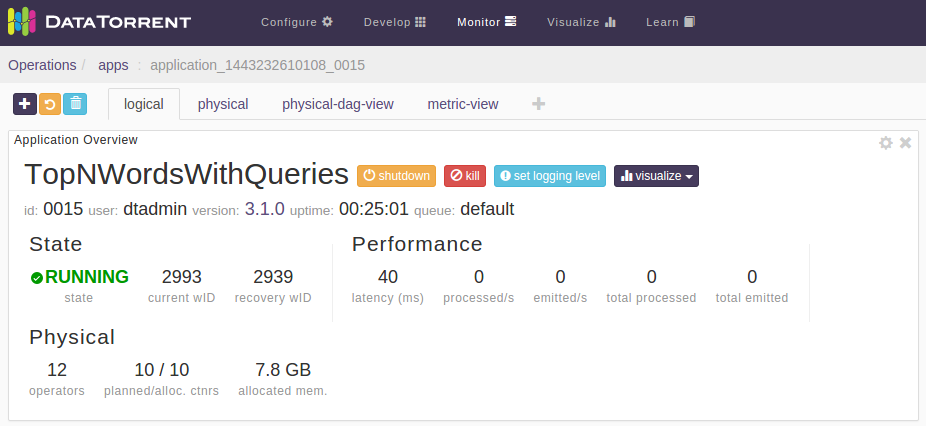
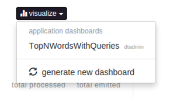
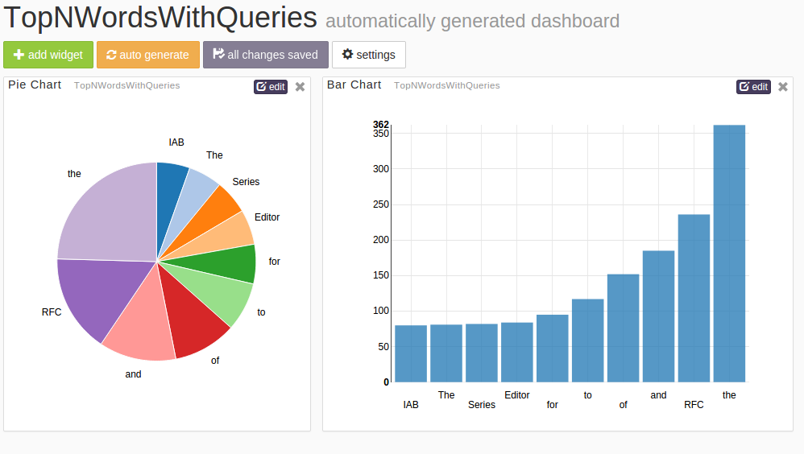
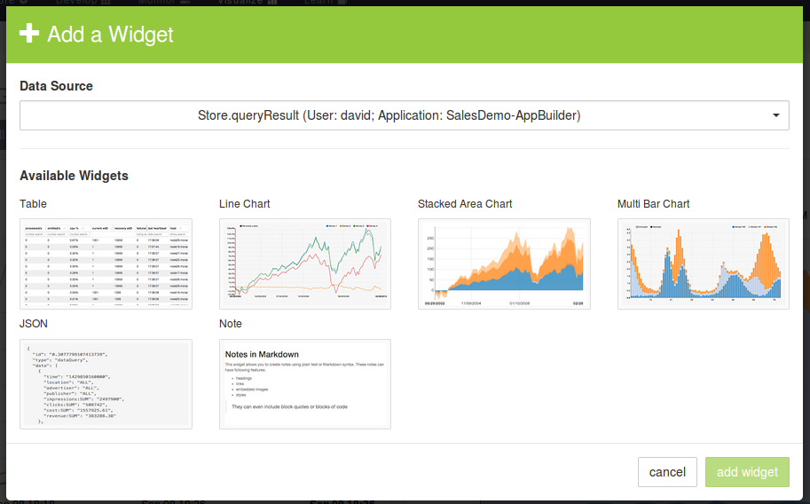
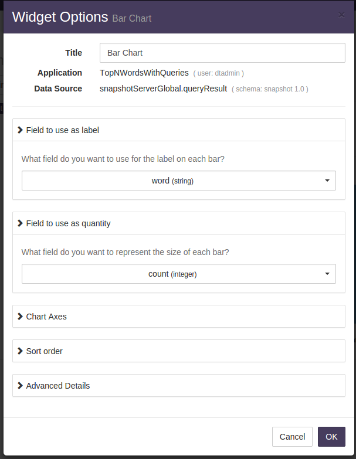
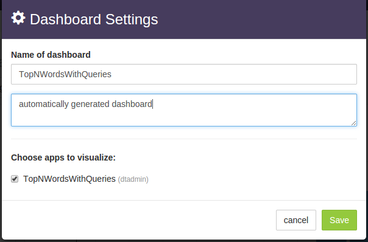
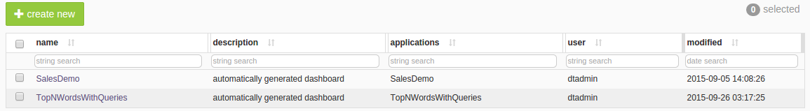
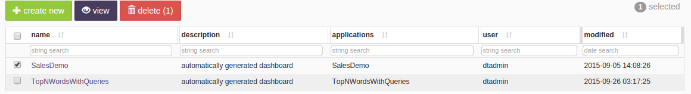

Visualizing the application output using dtDashboard
===
This chapter covers how to add input files to the monitored input directory and
visualize the output.

When adding files, it is important to add only one file at a time to the
monitored input directory; the application, as it stands, cannot handle
simultaneous addition of files at a time into the input directory. This
issue is discussed in more detail in the Appendix entitled _Further Explorations_.

Step 1: Add files to the monitored directory
---
To add the files to the monitored input directory

1. Log on to the Datatorrent Console (the default username and password are
   both `dtadmin`).
2. On the top navigation bar, click _Monitor_.
3. Click TopNWordsWithQueries to see a page with four tabs: _logical_,
   _physical_, _physical-dag-view_, and  _metric-view_.
4. Click the _logical_ tab and make sure that the DAG is visible.
5. Create the input and output directories in HDFS and drop a file into the
   input directory by running the following commands:

        hdfs dfs -mkdir -p /tmp/test/input-dir
        hdfs dfs -mkdir -p /tmp/test/output-dir
        hdfs dfs -put ~/data/rfc4844.txt /tmp/test/input-dir

You should now see some numbers above and below some of the operators as the
lines of the file are read and tuples start flowing through the DAG.

You can view the top 10 words and the frequencies for each input file by
examining the corresponding output file in the output directory, for example:

    hdfs dfs -cat /tmp/test/output-dir/rfc4844.txt

For operating on these input and output directories, you may find the following
shell aliases and functions useful:

    in=/tmp/test/input-dir
    out=/tmp/test/output-dir
    alias ls-input="hdfs dfs -ls $in"
    alias ls-output="hdfs dfs -ls $out"
    alias clean-input="hdfs dfs -rm $in/\*"
    alias clean-output="hdfs dfs -rm $out/\*"
    function put-file ( ) {
        hdfs dfs -put "$1" "$in"
    }
    function get-file ( ) {
        hdfs dfs -get "$out/$1" "$1".out
    }

Put them in a file called, say, `aliases` and read them into your shell with:
`source aliases`.

Thereafter, you can list contents of the input and output directories with
`ls-input` and `ls-output`, remove all files from them with `clean-input` and
`clean-output`, drop an input file `foo.txt` into the input directory with
`put-file foo.txt` and finally, retrieve the corresponding output file with
`get-file foo.txt`.

_Note_: When you list files in the output directory, their sizes might show as
0 but if you retrieve them with get-file or catenate them, the expected output
will be present.

Step II: Visualize the results by generating dashboards
---
To generate dashboards

1. Perform step I above.
2. Make sure that the logical tab is selected and the _Application Overview_
  panel is visible.  
    
3. Click _visualize_ to see a dropdown containing previously created dashboards
 (if any), as well as the _generate new dashboard_ entry.  
    
4. Select the _generate new dashboard_ entry.

    You should now see panels with charts where one chart displays the data for
    the current file and a second chart displays the cumulative global data
    across all files processed so far.
    

5. Add more files, one at a time, to the input directory as described in
  step I above.
6. Observe the charts changing to reflect the new data.

You can create multiple dashboards in this manner for visualizing the output
from different applications or from the same application in different ways.

Step III: Add widgets
---
To derive more value out of application dashboards, you can add widgets to the
dashboards. Widgets are charts in addition to the default charts that you can see on the dashboard. DataTorrent RTS Sandbox supports 5 widgets: _bar chart_,
_pie chart_, _horizontal bar chart_, _table_, and _note_.

To add a widget

1. Generate a dashboard by following instructions of Step II above.
2. Click the _add widget_ button below the name of the dashboard.
3. In the _Data Source_ list, select a data source for your widget.
4. Select a widget type under _Available Widgets_.

    

5. Click _add widget_.

The widget is added to your dashboard.

Step IV: Configure a widget
---
After you add a widget to your dashboard, you can configure it at any
time. Each widget has a title that appears in gray. If you hover over
the title, the pointer changes to a hand.

To configure a widget

1. To change the size of the widget, click the border of the widget, and
  resize it.
2. To move the widget around, click the widget, and drag it to the desired
  position.
3. To change the title and other properties, click the _edit_ button in the
  top-right corner of the widget.
    
  You can now enter a new title in the _Title_ box or configure the rest of the
  options in any suitable way.
4.  Click _OK_.
5.  To remove a widget, click the delete button in the top-right corner.

Perform additional tasks on dashboards
---
At any time, you can change the name and the description of a dashboard. You
can also delete dashboards.

To perform additional tasks

1. Ensure that you generated a dashboard as described in Step II above and
   select it.
2.  Click _settings_ button (next to buttons named _add widget_,
   _auto generate_, and _save settings_), below the name of the dashboard to see the _Dashboard Settings_ dialog:
    
3.  Type a new name for the dashboard in the _Name of dashboard_ box.
4.  Type a suitable description in the box below.
5.  Make sure that _TopNWordsWithQueries_ is selected under _Choose apps to
    visualize_.
6.  Click _Save_.

Delete a dashboard
---
You can delete a dashboard at any time.

1. Log on to the DataTorrent Console (default username and password are both
  `dtadmin`)
2. On the top navigation bar, click _Visualize_.
3. Select a dashboard.

    

4.  Click delete.

    

  Note: The delete button becomes visible only if one or more rows are selected.
